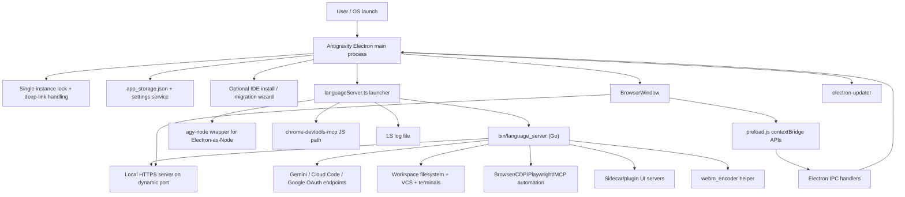
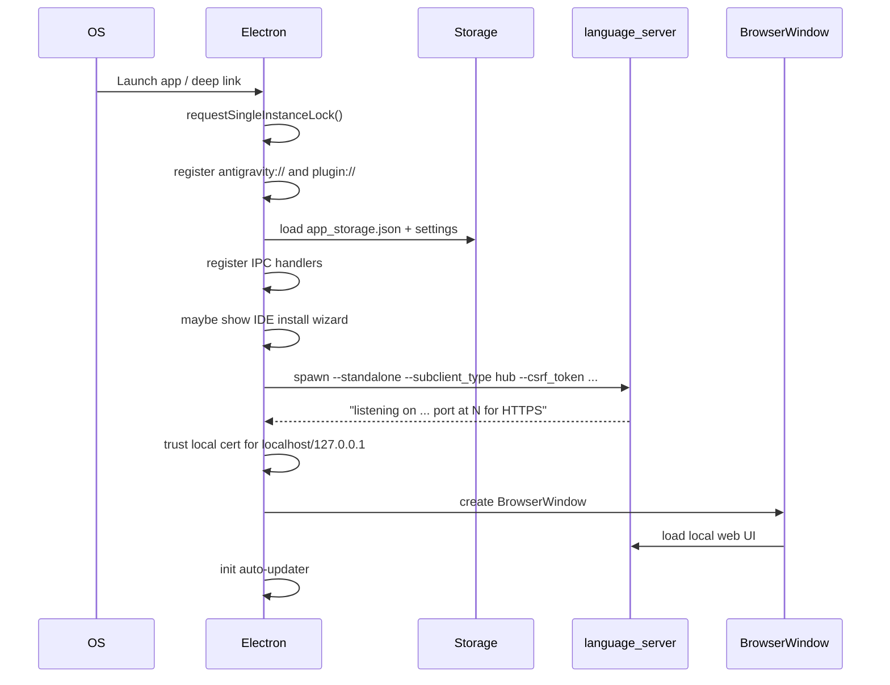
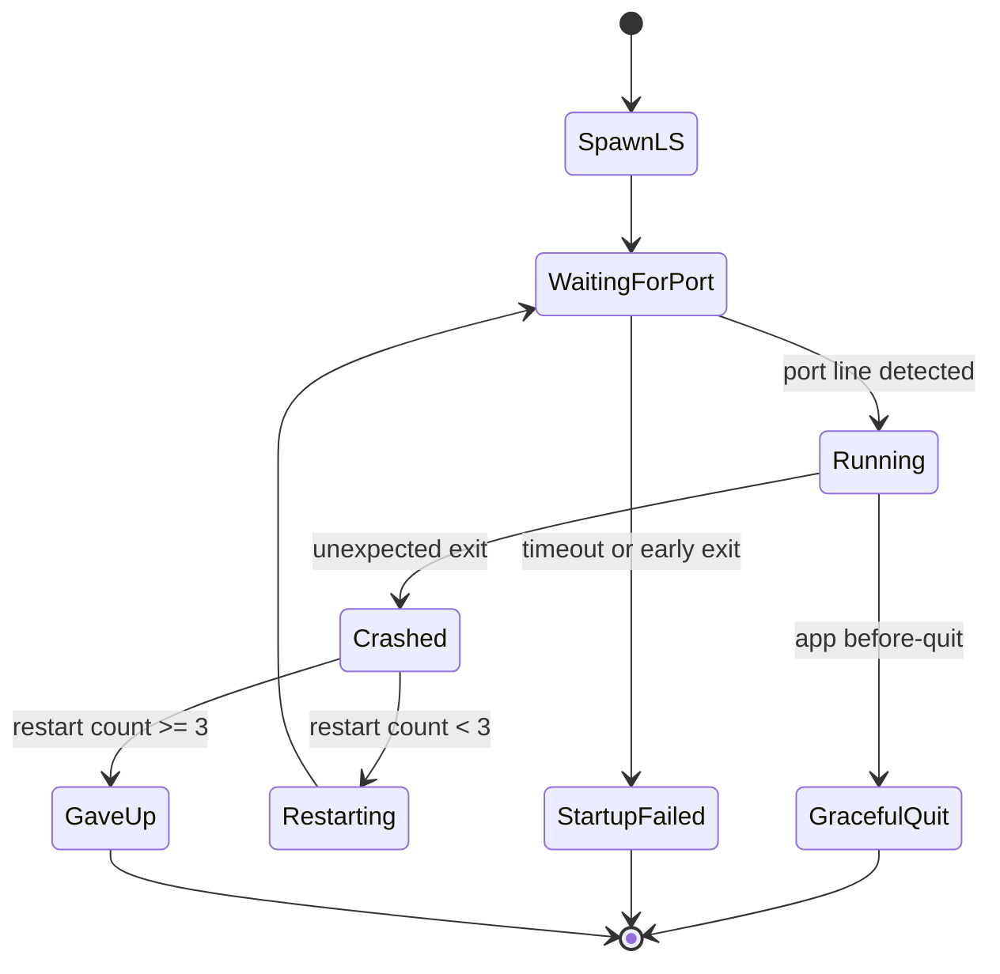
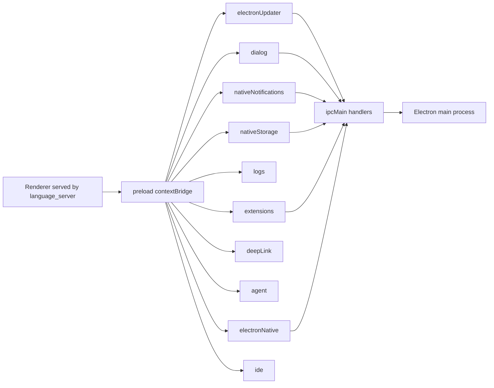
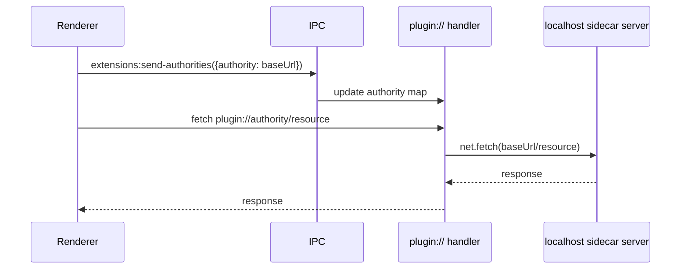
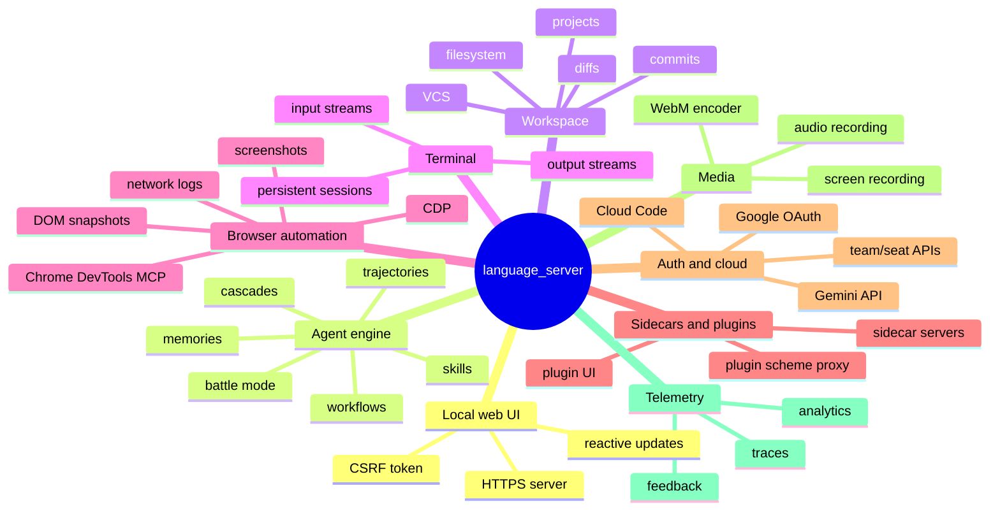
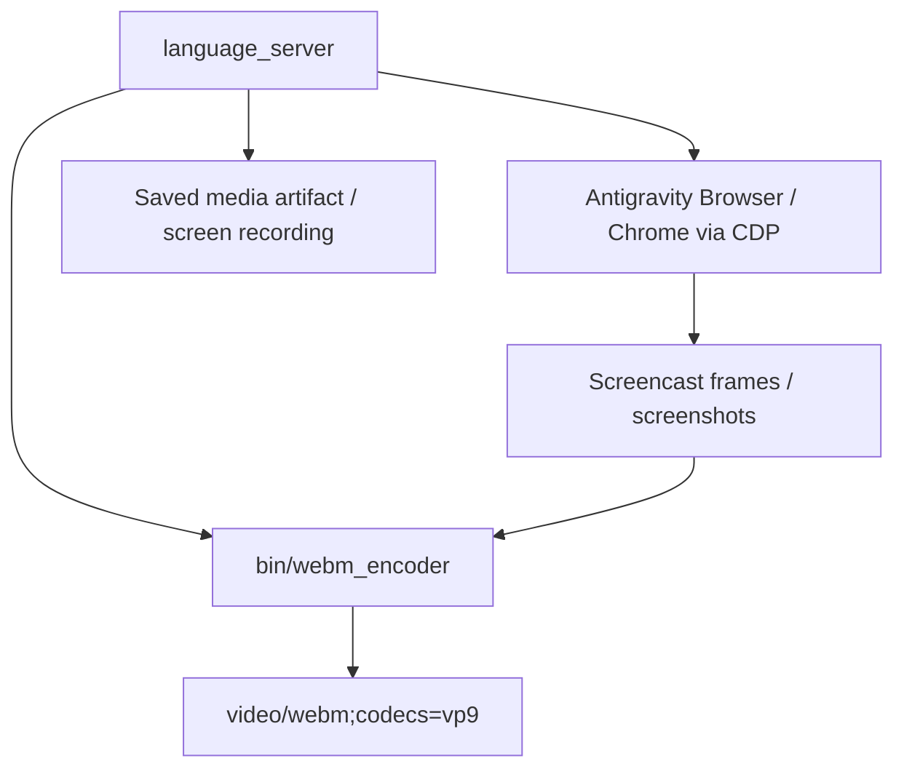
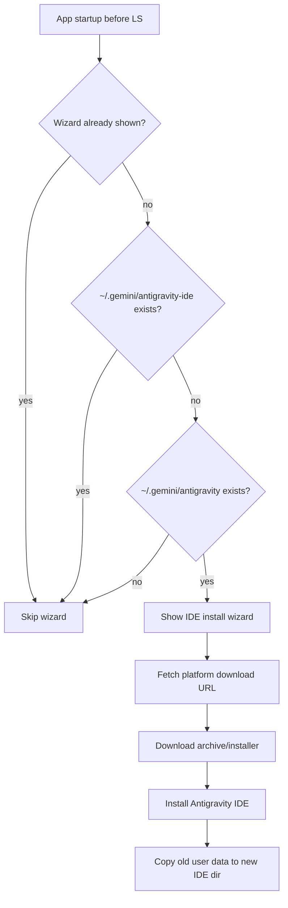
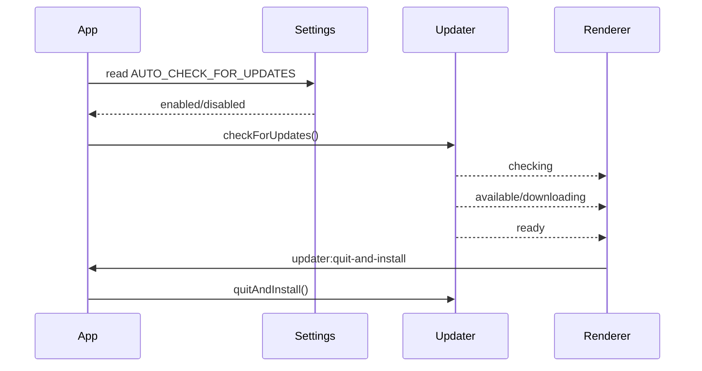
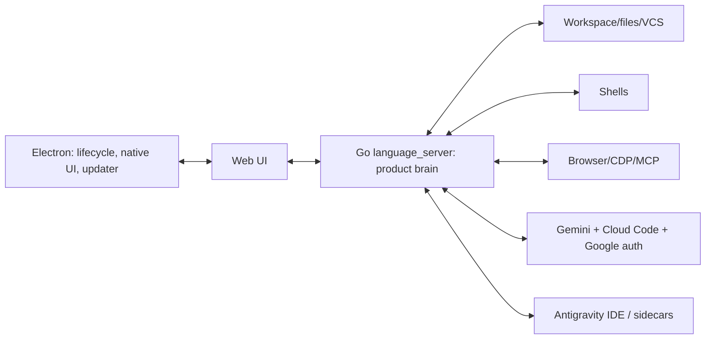

# Antigravity.app Reverse-Engineering Notes

Date: 2026-07-04

Target inspected:

- `/Applications/Antigravity.app` (`com.google.antigravity`, version `2.2.1`)
- Related companion app: `/Applications/Antigravity IDE.app` (`com.google.antigravity-ide`, version `2.1.1`)
- Local workspace copy: `/Users/kain/Developments/research/Antigravity.app`

## Executive Summary

`Antigravity.app` is an Electron shell around a native Go `language_server` binary. The Electron main process does not contain the primary UI application. Instead, it starts the bundled language server in standalone hub mode, waits until the server reports its dynamic local HTTPS port, then opens a `BrowserWindow` pointed at that local server.

The native language server is the real application core. It appears to host the web UI, manage projects/workspaces, run agent/cascade workflows, handle terminal and browser automation, integrate with Gemini/Cloud Code services, manage MCP servers, serve sidecar/plugin UIs, store trajectories/conversations, and expose a large protobuf/gRPC-style service surface.

The separate `Antigravity IDE.app` is a VS Code-derived Electron IDE. `Antigravity.app` includes an installer/migration wizard for it, checks for `/Applications/Antigravity IDE.app`, and migrates old IDE data from `~/.gemini/antigravity` to `~/.gemini/antigravity-ide`.

## Bundle Anatomy

Main app:

```text
/Applications/Antigravity.app
└── Contents
    ├── MacOS/Antigravity                 # Electron executable, arm64 Mach-O
    ├── Resources/app.asar                # Electron main-process JS bundle
    ├── Resources/app.asar.unpacked/
    │   └── node_modules/chrome-devtools-mcp
    ├── Resources/bin/language_server     # Go binary, ~114 MB
    ├── Resources/bin/webm_encoder        # Go binary, ~13 MB
    ├── Resources/app-update.yml
    └── Info.plist
```

Important metadata:

- App name: `Antigravity`
- Bundle id: `com.google.antigravity`
- URL scheme: `antigravity://`
- Copyright: Google, 2026
- Electron ASAR integrity hash is present in `Info.plist`
- Auto-update manifest URL: `https://antigravity-hub-auto-updater-974169037036.us-central1.run.app/manifest/`
- ATS allows arbitrary loads and explicitly allows local HTTP for `localhost` and `127.0.0.1`

Companion IDE:

```text
/Applications/Antigravity IDE.app
└── Contents/Resources/app
    ├── out/main.js
    ├── out/workbench*.js/css
    ├── extensions/
    ├── node_modules.asar
    ├── package.json
    └── product.json
```

The IDE reports `package.json` version `1.107.0`, `main: ./out/main.js`, and Electron `39.2.3`. Its `product.json` identifies `applicationName: antigravity-ide`, alias `agy-ide`, and includes Antigravity/Jetski-specific workbench assets.

## High-Level Architecture



## Startup Flow

The Electron main process does the following:

1. Acquires a single-instance lock. If another instance is running, it quits.
2. Registers the `antigravity://` deep-link scheme based on the app name.
3. Registers a privileged `plugin://` custom scheme.
4. Initializes `electron-log`, app storage, and settings.
5. Registers IPC handlers for updater, storage, notifications, logs, window controls, deep links, extension authorities, and IDE checks.
6. Runs the IDE install wizard if needed and not in headless mode.
7. Spawns the native `language_server`.
8. Watches combined stdout/stderr until it sees a line matching `listening on <proto> port at <N> for HTTP(S)`.
9. Trusts local certificates for `localhost` and `127.0.0.1`.
10. Opens the UI window at `https://127.0.0.1:<port>/` or equivalent configured `WINDOW_ORIGIN`.
11. Starts auto-update checks.



## Language Server Launch Contract

`dist/languageServer.js` starts the bundled binary with these notable arguments:

```text
--standalone
--override_ide_name antigravity
--subclient_type hub
--override_ide_version <Electron app version>
--override_user_agent_name antigravity
--https_server_port <dynamic or JETSKI_LS_PORT>
--csrf_token <random UUID>
--app_data_dir <antigravity app data dir>
--api_server_url https://generativelanguage.googleapis.com
--cloud_code_endpoint https://daily-cloudcode-pa.googleapis.com
--enable_sidecars
--headless              # only in headless mode
```

Environment setup:

- Merges the user shell environment via `shell-env`.
- Writes `AGY_BROWSER_ACTIVE_PORT_FILE` pointing to Electron user data `DevToolsActivePort`.
- Creates an `agy-node` wrapper under Electron user data so the Go server can run Node scripts using Electron with `ELECTRON_RUN_AS_NODE=1`.
- Exposes `CHROME_DEVTOOLS_MCP_JS` pointing to the unpacked `chrome-devtools-mcp` CLI.

Crash behavior:

- Startup timeout: 60 seconds.
- Crash trigger phrases include `panic:`, `fatal error:`, `runtime:`, `panic serving`.
- Restarts up to 3 times inside a 60-second window with a 2-second cooldown.
- On quit, sends `SIGTERM`, waits 5 seconds, then sends `SIGKILL` if needed.



## Electron Renderer Boundary

The BrowserWindow is created with:

- `nodeIntegration: false`
- `contextIsolation: true`
- a preload script at `dist/preload.js`
- DevTools disabled in packaged mode
- external links opened through `shell.openExternal`

The preload exposes only these APIs into the renderer:

- `electronUpdater`: update state, apply, quit/install, check
- `dialog`: open workspace directory picker
- `nativeNotifications`: send notifications and open system notification settings
- `nativeStorage`: get/update app storage and observe changes
- `logs`: read Electron logs
- `extensions`: send plugin authority mappings
- `deepLink`: receive/read `antigravity://` links
- `agent`: update active agent count in tray
- `electronNative`: window controls, zoom, external URL opening
- `ide`: check whether the companion IDE is installed



## Custom `plugin://` Scheme

The main process registers `plugin://` as a privileged, secure, standard scheme with Fetch API, CORS, service workers, and code cache enabled.

Renderer-side extension code sends an authority map through IPC:

```text
authority hash -> original localhost URL
```

Then requests like:

```text
plugin://<authority>/path?query
```

are proxied by Electron to:

```text
http://localhost:<sidecar-port>/path?query
```



## Native Language Server Capabilities

The Go binary is not decompiled into source, but strings and embedded protobuf/gRPC names expose its major functional areas. Confidence is high that these surfaces exist; exact implementation details are inferred from symbols and user-facing strings.

Observed service/method themes include:

- Workspace/project management: `CreateProject`, `UpdateProject`, `DeleteProject`, `ResolveFolder`, workspace infos, tracked workspaces, working directories, repo infos, version control state.
- Filesystem operations: `StatUri`, `ReadDir`, `DeleteFileOrDirectory`, patch/code-change generation, read/write artifact/media paths.
- Terminal operations: `ListTerminals`, `OpenTerminal`, `CloseTerminal`, `SendTerminalInput`, `StreamTerminalOutput`, persistent terminal support.
- Agent/cascade flows: `StartCascade`, `SendUserCascadeMessage`, `CancelCascadeSteps`, `ForceStopCascadeTree`, `RevertToCascadeStep`, trajectory summaries/panels/reactive updates, cascade memories, customizations, workflows, skills, NUX state.
- Browser automation: browser page state, screenshots, console logs, network requests, DOM reads, clicks, text input, CDP discovery, Chrome DevTools MCP hooks, browser allowlist.
- MCP: server templates, server states, resource listing, OAuth completion/disconnect, config read/write, tool/prompt/resource handling.
- Sidecars/plugins: sidecar subscriptions, static sidecar servers, plugin install/delete, sidecar event records.
- Auth/account/team: Google OAuth, user status, API key migration, team metadata, SSO, terms of service, subscriptions, roles, preapprovals.
- Model/backend access: Gemini/Cloud Code endpoints, model configs/statuses, inference server start/stop/list, quota/status calls.
- Telemetry/analytics: completion logs, trajectory analytics, chat panel sessions, context refresh, error traces, feedback.
- Recording/media: screen recording start/handle/save, audio recording/transcription, `webm_encoder`, animated WebP generation.



## Browser And Recording Flow

`webm_encoder` is a separate Go helper. Strings indicate it works with browser/CDP screencast frames and emits `video/webm;codecs=vp9`. The main process only passes `AGY_BROWSER_ACTIVE_PORT_FILE`; the language server appears to invoke the encoder when browser recording is active.



## IDE Installation And Migration

`dist/ideInstall/*` implements a wizard and installer:

- It checks whether the wizard has already been shown in app storage.
- It shows only if `~/.gemini/antigravity-ide` does not exist and `~/.gemini/antigravity` does exist.
- It fetches IDE download metadata from `https://antigravity-ide-auto-updater-974169037036.us-central1.run.app/api/update/<platform>/stable/latest`.
- On macOS, it downloads a zip, unzips a `.app`, replaces `/Applications/Antigravity IDE.app`, and copies user data.
- On Linux, it extracts a tarball under `~/.local/share/antigravity-ide`.
- On Windows, it runs the downloaded installer silently.



## Update Flow

The app uses `electron-updater`.

- Config file: `Resources/app-update.yml`
- Provider: generic
- Channel: `latest-<arch>` on macOS/Linux, `latest-<arch>-win` on Windows
- Initial check delay: 10 seconds
- Periodic check: every hour, controlled by the `AUTO_CHECK_FOR_UPDATES` setting
- Auto-download is enabled
- Packaged apps auto-install on app quit
- Headless Linux has a special post-quit replacement/relaunch script



## Persistence And Local Paths

Observed local paths:

- Core app data: `~/.gemini/<app-name-without-spaces>`
- Packaged app data dir name: `antigravity`
- Dev app data dir name: `antigravity-dev`
- Global settings JSON: `~/.gemini/config/config.json`
- Lightweight Electron UI storage: Electron `userData/app_storage.json`
- Active browser debug port file: Electron `userData/DevToolsActivePort`
- Language server log: Electron logs directory plus `language_server.log`
- Old IDE data: `~/.gemini/antigravity`
- New IDE data: `~/.gemini/antigravity-ide`
- IDE backup data: `~/.gemini/antigravity-backup`

## Security-Relevant Observations

- The renderer is isolated from Node and communicates through a defined preload bridge.
- The local language server is protected at launch with a random CSRF token argument.
- Electron trusts local certificates only for `localhost` and `127.0.0.1`.
- `shell:open-external` allows only `https://`, `http://`, and `antigravity-ide://`.
- `plugin://` is powerful: it is secure, CORS-enabled, service-worker-enabled, and proxies to registered local sidecar origins.
- The language server has broad local authority: filesystem, terminal, browser automation, MCP, OAuth, and cloud model access.
- The binary contains explicit workspace-boundary and permission-related strings, suggesting it enforces workspace validation and command/file permissions internally.

## Evidence Table

| Area | Evidence | Confidence |
|---|---|---|
| Electron shell starts native LS | `dist/main.js`, `dist/languageServer.js` | High |
| UI served by local LS | BrowserWindow loads local server URL from LS-reported port | High |
| Gemini/Cloud Code integration | LS launch args and binary strings | High |
| MCP/Chrome DevTools integration | unpacked `chrome-devtools-mcp`, `CHROME_DEVTOOLS_MCP_JS`, LS strings | High |
| Companion IDE role | `ideInstall` code, IDE bundle metadata | High |
| Agent/cascade internals | LS protobuf strings and user-facing messages | Medium |
| Exact Go implementation | Not decompiled to source; inferred from strings/symbols | Low/Medium |

## Practical Mental Model

Think of `Antigravity.app` as a local orchestration hub:



The Electron bundle is mostly plumbing. The Go language server is the product. The IDE is a separate VS Code-derived editor surface that the hub can install, detect, and integrate with.

