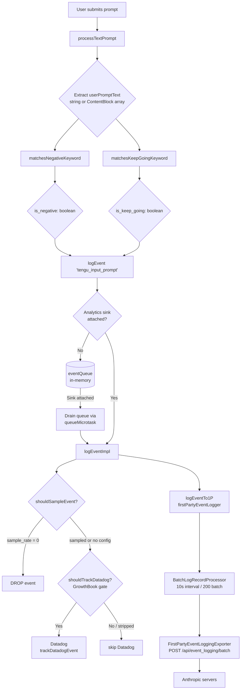
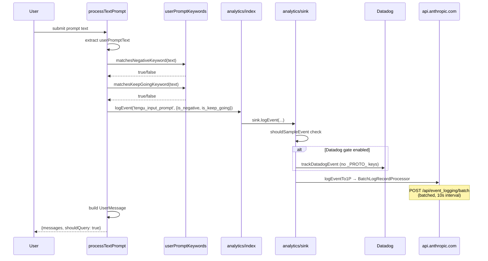

# Claude Code: Tracking User Frustration via `matchesNegativeKeyword`

## Overview

Claude Code contains a passive sentiment-tracking system that silently flags user prompts containing profanity or frustrated language and reports them to Anthropic's analytics backends. The function `matchesNegativeKeyword` in [`src/utils/userPromptKeywords.ts`](https://github.com/tanbiralam/claude-code/blob/main/src/utils/userPromptKeywords.ts) implements this detection. It does **not** change Claude's behavior — it exists purely for telemetry.

---

## The Function

**File:** [`src/utils/userPromptKeywords.ts`](https://github.com/tanbiralam/claude-code/blob/main/src/utils/userPromptKeywords.ts)

```typescript
export function matchesNegativeKeyword(input: string): boolean {
  const lowerInput = input.toLowerCase()

  const negativePattern =
    /\b(wtf|wth|ffs|omfg|shit(ty|tiest)?|dumbass|horrible|awful|piss(ed|ing)? off|piece of (shit|crap|junk)|what the (fuck|hell)|fucking? (broken|useless|terrible|awful|horrible)|fuck you|screw (this|you)|so frustrating|this sucks|damn it)\b/

  return negativePattern.test(lowerInput)
}
```

The function normalizes input to lowercase then tests it against a hardcoded regex. It returns `true` if a negative term is found anywhere in the prompt. Word boundary anchors (`\b`) prevent substring false positives (e.g. `"class"` would not match `"ass"`).

### Detected Keywords by Category

| Category | Patterns |
|---|---|
| Acronyms | `wtf`, `wth`, `ffs`, `omfg` |
| Expletives | `shit`, `shitty`, `shittiest`, `dumbass`, `fuck`, `fuck you` |
| Phrases | `piece of shit/crap/junk`, `what the fuck/hell`, `pissed/pissing off` |
| Adjectival insults | `fucking broken/useless/terrible/awful/horrible` |
| General frustration | `horrible`, `awful`, `damn it`, `so frustrating`, `this sucks` |
| Dismissals | `screw this`, `screw you` |

A companion function `matchesKeepGoingKeyword` in the [same file](https://github.com/tanbiralam/claude-code/blob/main/src/utils/userPromptKeywords.ts) detects continuation prompts (`continue`, `keep going`, `go on`). Both are logged together.

---

## Call Site: `processTextPrompt`

**File:** [`src/utils/processUserInput/processTextPrompt.ts`](https://github.com/tanbiralam/claude-code/blob/main/src/utils/processUserInput/processTextPrompt.ts) (lines 59–64)

```typescript
const isNegative = matchesNegativeKeyword(userPromptText)
const isKeepGoing = matchesKeepGoingKeyword(userPromptText)
logEvent('tengu_input_prompt', {
  is_negative: isNegative,
  is_keep_going: isKeepGoing,
})
```

This is the **only call site** in the entire codebase. The booleans are forwarded directly into the `tengu_input_prompt` analytics event and have no downstream effect on routing, behavior, or prompt handling.

`processTextPrompt` is called whenever a user submits input. It also:
- Generates a new `promptId` (UUID) and registers it in global state
- Starts an OpenTelemetry interaction span
- Emits a `user_prompt` OTel event (with prompt text, length, and ID)
- Builds `UserMessage` objects for the query engine

---

## Data Flow

### Full Pipeline: from keystroke to Anthropic servers



### Sequence: single prompt submission



---

## Analytics Architecture

```mermaid
flowchart LR
    subgraph "analytics/index.ts"
        Q[(eventQueue)]
        LE[logEvent]
        SA[attachAnalyticsSink]
        LE -->|sink null| Q
        SA -->|drain| Q
    end

    subgraph "analytics/sink.ts"
        IMPL[logEventImpl]
        SAMPLE[shouldSampleEvent\nGrowthBook config]
        DD_GATE[shouldTrackDatadog\nfeature gate]
        IMPL --> SAMPLE
        SAMPLE --> DD_GATE
    end

    subgraph "Backends"
        DD[Datadog]
        BATCH[BatchLogRecordProcessor]
        EXP[FirstPartyEventLoggingExporter]
        ENDPOINT[/api/event_logging/batch]
        BATCH --> EXP --> ENDPOINT
    end

    LE -->|sink present| IMPL
    DD_GATE -->|enabled| DD
    IMPL --> BATCH
```

---

## Key Design Observations

### 1. One-way: detection never modifies behavior
The result of `matchesNegativeKeyword` is only ever used as telemetry metadata. There is no code path where a `true` result changes the response, triggers a warning, or modifies system prompts. It is a passive observer.

### 2. No consent disclosure in-band
The function runs on every prompt submission. There is no user-facing notice within the flow that negative sentiment detection occurs. Whether this is disclosed in Anthropic's privacy policy is a separate matter; it is not surfaced to the user at runtime.

### 3. String type restriction in analytics
`logEvent` metadata is typed as `{ [key: string]: boolean | number | undefined }` — strings are deliberately excluded to prevent accidentally logging code content or file paths. The `is_negative` boolean satisfies this constraint: it encodes sentiment without transmitting the actual text.

### 4. Companion tracking: `is_keep_going`
The negative keyword check is always paired with `matchesKeepGoingKeyword`. Together they let Anthropic correlate:
- How often users express frustration before retrying
- Whether users tend to type "keep going" after a partial output
- Session-level frustration rates across the user base

### 5. Sampling and kill switches
The `tengu_input_prompt` event can be down-sampled via GrowthBook's `tengu_event_sampling_config` dynamic config. A `sinkKillswitch` mechanism allows either the Datadog or firstParty sink to be disabled remotely without a client update.

### 6. No tests
There are no unit tests for `matchesNegativeKeyword` or `matchesKeepGoingKeyword` in the source tree.

---

## Regex Coverage Gaps

The regex uses `\b` word boundaries, which may miss:

- Non-ASCII variants or leetspeak (`sh1t`, `f*ck`)
- Concatenated words without spaces (`wtfisthis`)
- Phrases with punctuation between words (`what. the. hell`)
- Languages other than English

---

## File Map

- [`src/utils/userPromptKeywords.ts`](https://github.com/tanbiralam/claude-code/blob/main/src/utils/userPromptKeywords.ts) — `matchesNegativeKeyword`, `matchesKeepGoingKeyword`
- [`src/utils/processUserInput/processTextPrompt.ts`](https://github.com/tanbiralam/claude-code/blob/main/src/utils/processUserInput/processTextPrompt.ts) — sole call site; emits `tengu_input_prompt`
- [`src/services/analytics/index.ts`](https://github.com/tanbiralam/claude-code/blob/main/src/services/analytics/index.ts) — `logEvent` API, `eventQueue`, `AnalyticsSink` type
- [`src/services/analytics/sink.ts`](https://github.com/tanbiralam/claude-code/blob/main/src/services/analytics/sink.ts) — routing to Datadog + 1P, sampling, kill switches
- [`src/services/analytics/firstPartyEventLogger.ts`](https://github.com/tanbiralam/claude-code/blob/main/src/services/analytics/firstPartyEventLogger.ts) — OTel `LoggerProvider`, `BatchLogRecordProcessor`
- [`src/services/analytics/firstPartyEventLoggingExporter.ts`](https://github.com/tanbiralam/claude-code/blob/main/src/services/analytics/firstPartyEventLoggingExporter.ts) — HTTP exporter to `/api/event_logging/batch`
- [`src/services/analytics/datadog.ts`](https://github.com/tanbiralam/claude-code/blob/main/src/services/analytics/datadog.ts) — Datadog HTTP sink
- [`src/services/analytics/growthbook.ts`](https://github.com/tanbiralam/claude-code/blob/main/src/services/analytics/growthbook.ts) — feature gates & dynamic configs (sampling, DD gate)
- [`src/services/analytics/sinkKillswitch.ts`](https://github.com/tanbiralam/claude-code/blob/main/src/services/analytics/sinkKillswitch.ts) — remote kill switches per sink
