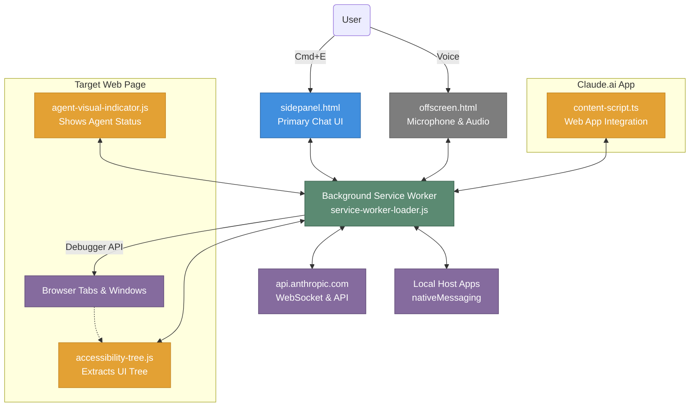

# Claude Chrome Extension Architecture

Based on an analysis of the extension repository (`Claude` version v1.0.62), we can break down its architecture into a modern Manifest V3 extension explicitly designed to perform complex browser automations and integrate seamlessly with `claude.ai`.

## 1. High-Level Architecture Overview

The extension utilizes several interconnected environments (Service Worker, UI Pages, Offscreen Documents, and Content Scripts) to coordinate user interaction and agent actions (like browsing).

## 2. Core Components

### 2.1 UI & Entry Points
* **Side Panel ([sidepanel.html](file:///Users/kain/Developments/chrome-extensions/claude/1.0.62_0/sidepanel.html))**: The primary interface for users to chat with Claude, triggered via `Cmd+E` (Mac) or `Ctrl+E` (Windows).
* **New Tab ([newtab.html](file:///Users/kain/Developments/chrome-extensions/claude/1.0.62_0/newtab.html))**: Optional custom new tab page experience.
* **Options ([options.html](file:///Users/kain/Developments/chrome-extensions/claude/1.0.62_0/options.html))**: The extension settings page.
* **Pairing ([pairing.html](file:///Users/kain/Developments/chrome-extensions/claude/1.0.62_0/pairing.html))**: Handles device pairing and authentication flow with a user's Claude account.

### 2.2 Background Service Worker
Like all Manifest V3 extensions, it uses a background Service Worker ([service-worker-loader.js](file:///Users/kain/Developments/chrome-extensions/claude/1.0.62_0/service-worker-loader.js) -> `assets/service-worker.ts-*.js`) that orchestrates the heavy lifting when the UI is closed:
* Keeps track of alarms, notifications, tab creations, and closures.
* Communicates directly with Anthropic's endpoints (e.g., WebSocket connections via `bridge.claudeusercontent.com`).
* Uses Chrome APIs like `chrome.debugger` (to automate browsers natively) and `chrome.tabs`.

### 2.3 Offscreen Document
* **Voice & Audio ([offscreen.html](file:///Users/kain/Developments/chrome-extensions/claude/1.0.62_0/offscreen.html) / [offscreen.js](file:///Users/kain/Developments/chrome-extensions/claude/1.0.62_0/offscreen.js))**: Because Chrome Service Workers do not have access to DOM tools like the Web Audio API, the extension relies on an invisible "Offscreen Document" to handle voice transcription, audio input from the microphone, and potential AI voice playback safely in the background.

## 3. Web Automation & Content Scripts

The manifest injects specific scripts into pages to enable "Agentic Browsing" capabilities. 

1. **Accessibility Traversal (`accessibility-tree.js`)**:
   * Runs at `document_start` on `<all_urls>`.
   * Its job is to read the exact semantic structure of the DOM (buttons, links, text) and send it to Claude, ensuring Claude "sees" what the user sees, allowing it to navigate links, fill forms, and interact with complex web apps.

2. **Visual Feedback (`agent-visual-indicator.js`)**:
   * Runs at `document_idle` on `<all_urls>`.
   * Since Claude performs automated actions, it is important to show the user visual feedback pointing out that the agent is currently clicking or typing on a generic page.

3. **Web App Integration (`content-script.ts`)**:
   * Runs only on `https://claude.ai/*`.
   * Used to securely handshake session tokens and state between the official web application and the extension itself.

## 4. Notable Capabilities

* **Local Native Execution:** The manifest demands the `nativeMessaging` permission. This essentially lets the extension "talk" to local installed applications using standard I/O streams, which means Claude could potentially write code locally or execute terminal tasks if a host application is present.
* **File Handling:** It ships with specialized handlers ([gif.js](file:///Users/kain/Developments/chrome-extensions/claude/1.0.62_0/gif.js) and Web Workers) to support complex file decoding or perhaps record and export navigation flows into GIFs.
* **Enterprise Control:** Supports policy enforcement via a [managed_schema.json](file:///Users/kain/Developments/chrome-extensions/claude/1.0.62_0/managed_schema.json) allowing enterprise admins to dictate URLs where Claude is disabled.
