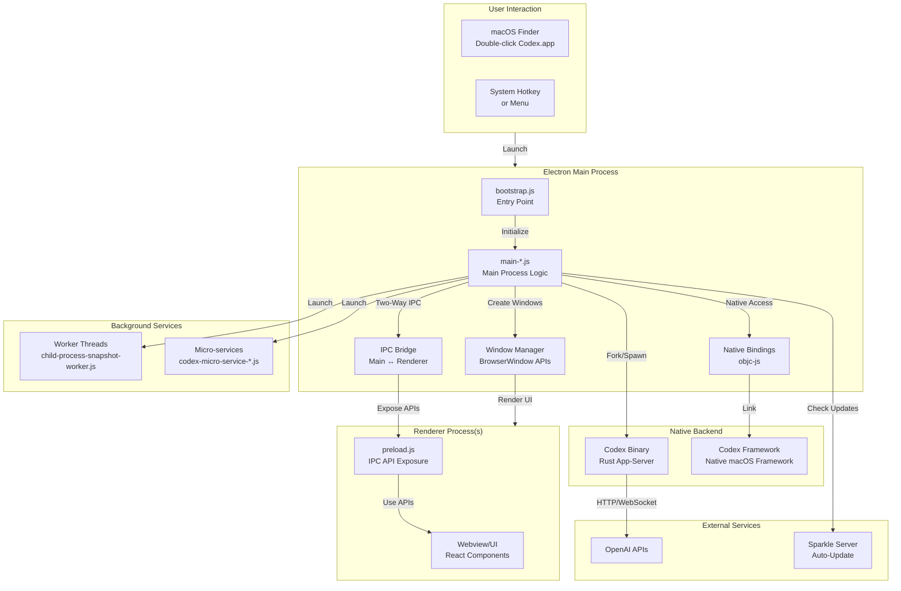
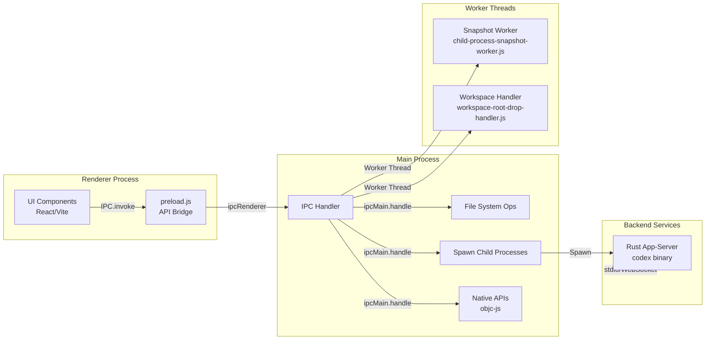
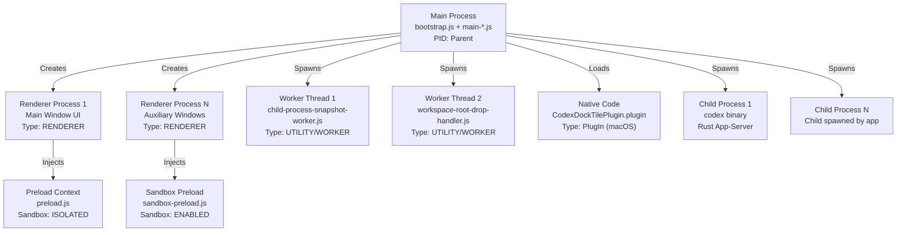
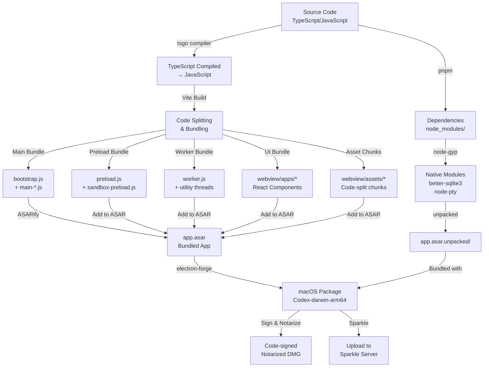
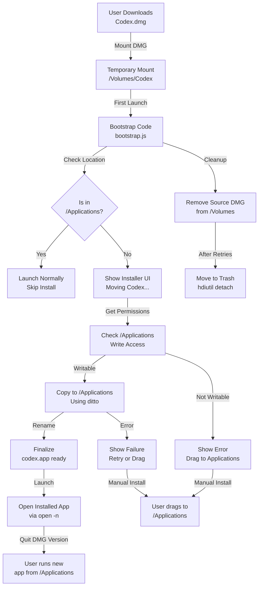
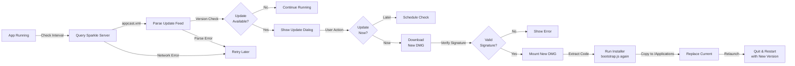
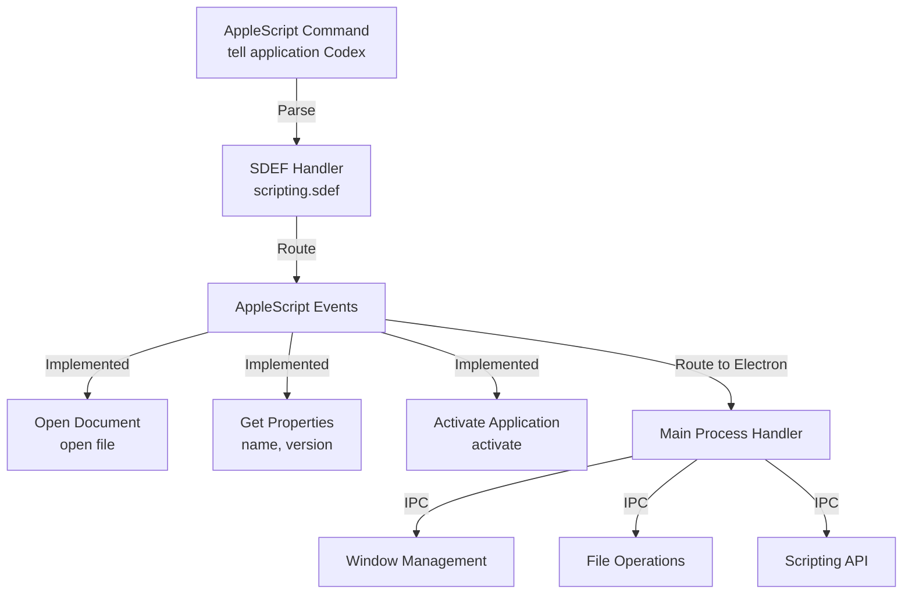
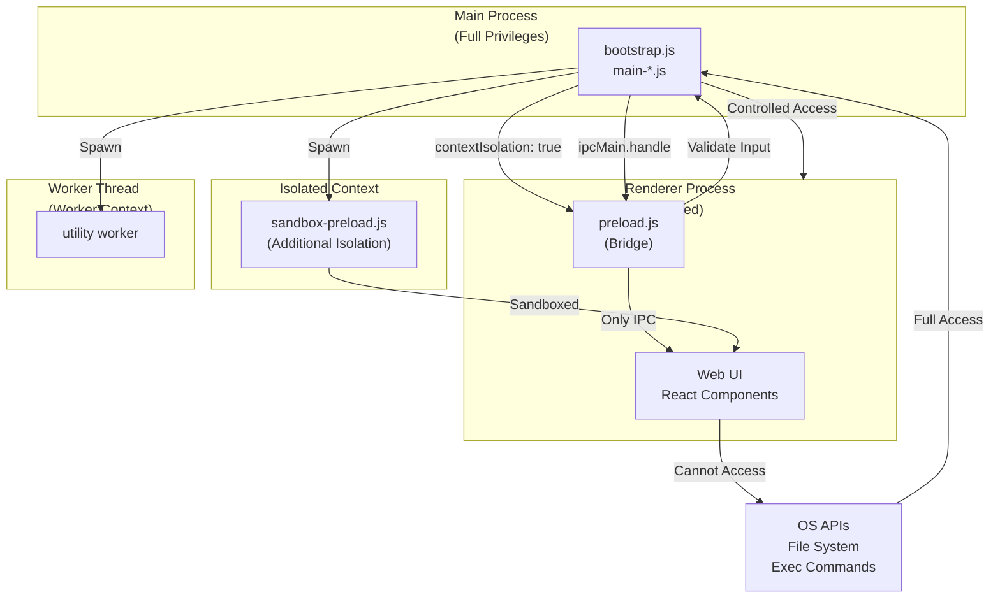

# Codex.app Technical Overview

**Product Name:** Codex  
**Version:** 26.616.81150  
**Platform:** macOS (ARM64 - Apple Silicon native)  
**Runtime:** OpenAI's "Owl" Electron runtime (based on Electron 42.1.0)  
**Author:** OpenAI  
**Language:** TypeScript/JavaScript (Electron app) + Rust (backend services)  

---

## Table of Contents

1. [Executive Summary](#executive-summary)
2. [Architecture Overview](#architecture-overview)
3. [Process Architecture](#process-architecture)
4. [File Structure & Components](#file-structure--components)
5. [Key Technologies & Dependencies](#key-technologies--dependencies)
6. [Build & Runtime System](#build--runtime-system)
7. [Native Components](#native-components)
8. [Installation & Auto-Update System](#installation--auto-update-system)
9. [AppleScript Integration](#applescript-integration)

---

## Executive Summary

Codex is a sophisticated macOS desktop application built on a heavily customized Electron framework. The application serves as a frontend to OpenAI's AI services, with an emphasis on accessibility, native OS integration, and extensibility.

### Key Characteristics:
- **Electron-based** UI framework with custom "Owl" runtime
- **Vite** build system for bundling and code splitting
- **Multi-process architecture** with main process, renderer processes, and worker processes
- **Native binaries** bundled for extended functionality (codex app-server, ripgrep for search)
- **Rust backend** (app-server) for heavy lifting operations
- **Sparkle framework** for sophisticated auto-update mechanism
- **Dock integration plugin** for system tray/dock tile management
- **Comprehensive i18n** support (66+ language packs)

---

## Architecture Overview

### High-Level System Architecture



### Multi-Process Communication Flow



---

## Process Architecture

### Process Hierarchy



### Process Details

| Process | Type | Purpose | Privileges |
|---------|------|---------|-----------|
| **Main** | Electron Main | App lifecycle, window management, IPC routing | Full system access |
| **Renderer** | Chromium Renderer | UI rendering, user interaction | Sandboxed (contextIsolation: true) |
| **Preload** | Node Context | IPC bridge, safe API exposure | Limited by nodeIntegration |
| **Worker 1** | Utility Thread | Child process snapshots, workspace changes | Spawned from main |
| **Worker 2** | Utility Thread | Drag-drop file handling, workspace analysis | Spawned from main |
| **codex** | Native Subprocess | App-server (Rust), request processing, streaming | Full system access |
| **Plugin** | macOS Plugin | Dock tile management, system integration | macOS framework context |

---

## File Structure & Components

### App.asar Bundle Structure

```
Codex.app/Contents/Resources/app.asar
├── package.json
│   ├── "main": ".vite/build/bootstrap.js"
│   ├── "version": "26.616.81150"
│   └── dependencies: (Electron, Vite, Zod, WebSocket, better-sqlite3, etc.)
│
├── .vite/build/ (Compiled/bundled JavaScript)
│   ├── bootstrap.js (13 KB) - Entry point, installer logic, Intel-on-Silicon detection
│   ├── main-dSxbxAhH.js (1.6 MB) - Main process logic
│   ├── preload.js (2.7 KB) - IPC bridge for renderers
│   ├── sandbox-preload.js (1.9 KB) - Sandbox preload context
│   ├── src-BZqs_tzA.js (11 KB) - Core utilities
│   ├── src-DBVh5FZA.js (1.1 MB) - Shared libraries and utilities
│   ├── worker.js (1.4 MB) - Worker thread code
│   ├── child-process-snapshot-worker.js (562 KB) - Child process snapshot handler
│   ├── workspace-root-drop-handler-DYf1cfzL.js (4.1 MB) - Drag-drop workspace handler
│   ├── comment-preload.js (313 KB) - Comment system preload
│   ├── core-CQO5x8Dn.js (53 KB) - Core functionality
│   ├── file-based-logger-DBmu3r68.js (7.1 KB) - Logging system
│   ├── codex-micro-service-DwG_bdlL.js (6.2 KB) - Micro-service spawning
│   ├── avatar-overlay-composition-surface-preload.js (585 B) - Avatar overlay
│   ├── feedback-desktop-log-archive-Bf0lQGXL.js (2.8 KB) - Feedback logging
│   ├── trace-recording-upload-BPRRGHbm.js (1.9 KB) - Trace upload
│   └── [other chunks for code-splitting]
│
├── webview/ (UI components)
│   ├── apps/ (Vite-compiled React apps)
│   │   ├── [main UI bundles with hash naming]
│   │   └── [lazy-loaded page components]
│   ├── assets/ (Compiled JavaScript chunks)
│   │   ├── home-announcements-*.js
│   │   ├── thread-user-message-navigation-rail-*.js
│   │   ├── local-environment-selection-*.js
│   │   ├── command-keybindings-*.js
│   │   └── [100+ code-split asset chunks]
│   └── [compiled HTML entry points]
│
├── skills/ (Custom skills registry)
│   ├── skills/
│   │   ├── .curated/ (Curated skill definitions)
│   │   └── [JSON skill manifests]
│   └── [skill implementations]
│
├── node_modules/ (Production dependencies)
│   ├── better-sqlite3/ - SQLite binding
│   ├── ws/ - WebSocket library
│   ├── objc-js/ - Objective-C bridge
│   ├── node-pty/ - Terminal emulation
│   ├── electron-context-menu/ - Context menus
│   ├── mdast-util-* - Markdown parsing
│   ├── zod/ - Schema validation
│   ├── lodash/ - Utilities
│   ├── ssh-config/ - SSH config parsing
│   └── [50+ other production dependencies]
│
├── native-menu-locales/ (i18n)
│   ├── en.json, ja-JP.json, de-DE.json, ... (66 languages)
│   └── [localized menu strings]
│
└── .vite/ (Build cache)
    └── [Vite build metadata]
```

### Resources Directory

```
Codex.app/Contents/Resources/
├── app.asar (155 MB) - Bundled Electron app
├── app.asar.unpacked/ - Large native modules (unpacked for performance)
│
├── codex (249 MB) - Rust-based app-server binary
│   └── Handles: request processing, streaming, heavy computation
│
├── codex_chronicle (4.5 MB) - Logging/analytics utility
│
├── rg (4.5 MB) - ripgrep binary
│   └── Fast file search functionality
│
├── Codex Framework.framework/ - Custom macOS framework
│   └── Version 149.0.7827.115 (Chromium/Electron framework)
│
├── Assets.car (2.4 MB) - macOS asset catalog
│   └── Icons, images, interface resources
│
├── icon.icns (707 KB) - Application icon
├── icon-codex-dark.png, icon-codex-light.png
├── codexTemplate.png, codexTemplate@2x.png
├── electron.icns
├── app.icns
│
├── codex-notification.wav - Notification sound
│
├── scripting.sdef - AppleScript definition file
│   └── Defines scripting interface for automation
│
├── owl-electron-app.json - Owl runtime metadata
│   └── Contains build package info and runtime hash
│
├── THIRD_PARTY_NOTICES.txt - Open source licenses (2.3 MB)
│
├── *.lproj/ (66 language packs)
│   ├── en.lproj/InfoPlist.strings
│   ├── ja-JP.lproj/InfoPlist.strings
│   ├── de-DE.lproj/InfoPlist.strings
│   └── ... (localized strings for each language)
│
├── com.openai.codex.manifest/ - App manifest/metadata
│
├── cua_node/ - Common User Activities integration (macOS)
│
└── default_app/ - Default app fallback resources
```

### Frameworks & Plugins

```
Codex.app/Contents/Frameworks/
├── Codex Framework.framework/
│   ├── Codex Framework (64-bit shared library)
│   ├── Resources/ (Framework resources)
│   └── _CodeSignature/ (Code signing metadata)
│
└── Sparkle.framework/
    ├── Sparkle (64-bit shared library)
    ├── Autoupdate (utility)
    ├── Resources/
    └── _CodeSignature/

Codex.app/Contents/PlugIns/
└── CodexDockTilePlugin.plugin/
    ├── CodexDockTilePlugin (64-bit executable)
    ├── Info.plist
    ├── Resources/
    └── _CodeSignature/
```

---

## Key Technologies & Dependencies

### Core Framework
- **Electron** 42.1.0 - Cross-platform desktop app framework
- **Vite** 8.0.3 - Next-generation frontend build tool
- **React** (via Ink and Vite) - UI component framework
- **TypeScript** 5.9.3 - Type-safe JavaScript

### IPC & Communication
- **ws** 8.18.3 - WebSocket implementation
- **electron-context-menu** 4.1.1 - Context menu handling
- **node-pty** 1.1.0 - Pseudo-terminal support

### Data & Persistence
- **better-sqlite3** 12.9.0 - Embedded SQL database
- **smol-toml** 1.5.2 - TOML config parsing
- **ssh-config** 5.0.3 - SSH configuration parser
- **zod** 4.1.13 - Runtime schema validation
- **better-sqlite3** - SQLite binding for data storage

### System Integration
- **objc-js** 1.5.0 - Objective-C bridge (native macOS calls)
- **electron-installer-dmg** 5.0.1 - DMG installer creation
- **@electron/notarize** 3.1.1 - Code signing/notarization
- **@electron/fuses** 1.8.0 - Electron hardening

### Error Tracking & Analytics
- **@sentry/electron** 7.5.0 - Error tracking and monitoring
- **@sentry/node** 10.29.0 - Node.js error tracking

### Development & Build
- **electron-forge** 7.11.1 - Electron packaging toolchain
- **@rolldown/plugin-babel** - Babel transpilation
- **cross-env** 7.0.3 - Cross-platform env vars
- **node-gyp** 12.4.0 - Native module building
- **vitest** 4.1.5 - Testing framework

### Utilities
- **lodash** 4.17.21 - JavaScript utilities
- **mime-types** 2.1.35 - MIME type detection
- **shlex** 3.0.0 - Shell lexing
- **which** 4.0.0 - Executable path resolution
- **mdast-util-from-markdown** 2.0.3 - Markdown parsing

---

## Build & Runtime System

### Build Process Flow



### Key Build Scripts

From `package.json`:

```bash
# Development
npm run dev              # Hot-reload development server
npm run owl             # Special development shell with mock keychain
npm run prepare:owl     # Prepare for owl development

# Building
npm run build           # Package for distribution
npm run build:ci        # CI-optimized build
npm run forge:package   # Electron Forge package
npm run forge:make      # Create installers (DMG, ZIP, etc.)

# Compilation
npm run compile         # Compile TypeScript to JavaScript
npm run tsc            # Type check only

# Testing & Linting
npm run test           # Run vitest
npm run lint           # Run oxlint (fast linter)
npm run format         # Check code formatting
```

### Vite Configuration

The app uses **Vite 8.0.3** with the following characteristics:

- **Entry point**: `.vite/build/bootstrap.js`
- **Code splitting**: Aggressive splitting for lazy loading
- **Asset naming**: Content-hash based (e.g., `main-dSxbxAhH.js`)
- **Build targets**: Electron main process + Renderer processes
- **Plugins**: 
  - electron-forge integration
  - @rolldown/plugin-babel for transpilation
  - Custom plugins for resource handling

---

## Native Components

### Compiled Native Binaries

#### 1. **codex** (Rust App-Server)
- **Size**: 249 MB
- **Type**: ARM64 Mach-O 64-bit executable
- **Purpose**: 
  - Request processing and routing
  - Streaming response handling
  - Tokenization and computation
  - Session management
  - State machine for request lifecycle
- **Build**: Rust-based service compiled to native binary
- **Runtime**: Spawned as child process from main Electron process
- **Communication**: 
  - stdin/stdout for direct I/O
  - HTTP server (localhost)
  - WebSocket for streaming
- **Dependencies**: Built with Cargo from Rust source

#### 2. **codex_chronicle** (Logging Utility)
- **Size**: 4.5 MB
- **Type**: ARM64 Mach-O 64-bit executable
- **Purpose**: 
  - Event logging
  - Analytics collection
  - Diagnostic information
  - Session tracking
- **Invoked by**: Main process for telemetry

#### 3. **rg** (ripgrep)
- **Size**: 4.5 MB (typical ripgrep binary)
- **Type**: ARM64 Mach-O 64-bit executable
- **Purpose**: 
  - Fast file searching
  - Regex pattern matching
  - Workspace file discovery
  - Code search capabilities
- **Why bundled**: Faster than native Node.js file operations

### Electron Framework

#### Codex Framework.framework
- **Version**: 149.0.7827.115 (Chromium-based)
- **Type**: macOS dynamic shared library
- **Contains**:
  - V8 JavaScript engine
  - Chromium renderer
  - GPU acceleration
  - Media codecs
  - System APIs
- **Linked by**: Main Electron process

#### Sparkle.framework
- **Purpose**: Sophisticated auto-update system
- **Components**:
  - `Sparkle` - Main framework library
  - `Autoupdate` - Update checking and installation logic
- **Configuration**: 
  - URL: `https://persistent.oaistatic.com/codex-app-prod/appcast.xml`
  - Public key: `mNfr1v9t63BfgDtlw4C8lRvSY6uMggIXABDOCi3tS6k=` (for signature verification)

### macOS Plugin

#### CodexDockTilePlugin.plugin
- **Type**: macOS Bundle Plugin
- **Binary**: 64-bit ARM64 executable
- **Purpose**: 
  - Dock tile customization
  - Badge management
  - Interactive dock menu
  - App indicator status
- **Loaded by**: Electron main process via PlugIns directory

### Native Bindings

#### objc-js (1.5.0)
- **Purpose**: JavaScript ↔ Objective-C bridge
- **Enables**:
  - Native macOS dialogs and file pickers
  - System preferences access
  - Notification system integration
  - Accessibility APIs
  - Menu bar integration
  - AppleScript execution
- **Example usage**: `show macOS file open dialog`, `check system dark mode`

---

## Installation & Auto-Update System

### Installation Flow



### Auto-Update System (Sparkle)



### Key Files for Installation

| File | Size | Purpose |
|------|------|---------|
| `bootstrap.js` | 13 KB | Entry point, installation logic, platform checks |
| `THIRD_PARTY_NOTICES.txt` | 2.3 MB | Open source license attribution |
| `owl-electron-app.json` | ~1 KB | Runtime metadata and verification hash |
| `embedded.provisionprofile` | varies | Code signing certificate chain |

---

## AppleScript Integration

### AppleScript Support

The app provides AppleScript automation capabilities via `scripting.sdef`:



### Supported Document Types

The app registers as capable of opening:

- **Folders** (`public.folder`) - Drag to open workspace
- **CSV Files** (`public.comma-separated-values-text`) - Alternate handler
- **TSV Files** (`public.tab-separated-values-text`) - Alternate handler
- **XLS Files** (`application/vnd.ms-excel`) - Alternate handler
- **XLSM Files** (`application/vnd.ms-excel.sheet.macroEnabled.12`) - Alternate handler

---

## Security Architecture

### Sandboxing & Isolation



### Security Features

1. **Context Isolation**: Renderer process isolated from Node.js context
2. **Sandbox**: Renderers run with sandbox: true
3. **No Node Integration**: nodeIntegration disabled
4. **Preload Bridging**: IPC API carefully exposed through preload
5. **Code Signing**: Notarized and signed by Apple
6. **Sentry Monitoring**: Error tracking and security event logging

---

## Performance Optimizations

### Code Splitting Strategy

The Vite build employs aggressive code splitting:

```
bootstrap.js (13 KB)          - Entry point only
├─ main-*.js (1.6 MB)         - Main process logic
├─ worker.js (1.4 MB)         - Worker threads
├─ src-BZqs_tzA.js (11 KB)    - Utilities
├─ src-DBVh5FZA.js (1.1 MB)   - Shared libraries
├─ preload.js (2.7 KB)        - IPC bridge
├─ workspace-root-drop-handler-*.js (4.1 MB) - Lazy-loaded
├─ child-process-snapshot-worker-*.js (562 KB) - Lazy-loaded
└─ webview/assets/*.js (100+ files)        - UI components (lazy-loaded)
```

**Benefits**:
- **Lazy loading**: UI components loaded on demand
- **Tree-shaking**: Unused code removed during build
- **Caching**: Hash-based names allow aggressive browser caching
- **Parallel loading**: Multiple chunks load simultaneously

### Resource Bundling

- **app.asar.unpacked/**: Native modules excluded from ASAR for faster loading
- **Assets.car**: macOS asset catalog for efficient image/icon storage
- **Native binaries**: Compiled code (codex, ripgrep) faster than interpreted

---

## Runtime Configuration

### Environment Variables

```bash
CODEX_ELECTRON_USER_DATA_PATH    # Override app data directory
CODEX_ELECTRON_AGENT_RUN_ID      # For agent-mode deployments
NODE_ENV                          # development or production
```

### Configuration Files

- **~/.Library/Application Support/Codex/** - User data directory
  - `extensions/` - Browser extension data
  - `Service Worker/` - Service worker cache
  - `Code Cache/` - V8 code cache
  - Application state and preferences

### Build Metadata

From `package.json`:

```json
{
  "codexBuildFlavor": "prod",           // Build flavor (prod/dev/agent)
  "codexBuildNumber": "4306",           // Build sequence number
  "codexAppBrand": "codex",             // Brand identifier
  "codexSparkleFeedUrl": "https://persistent.oaistatic.com/codex-app-prod/appcast.xml",
  "codexSparklePublicKey": "mNfr1v9t63BfgDtlw4C8lRvSY6uMggIXABDOCi3tS6k="
}
```

---

## Multi-Language Support

The app includes localization for **66 languages**:

```
.lproj directories:
af (Afrikaans), am (Amharic), ar (Arabic), bg (Bulgarian), bn (Bengali),
bs (Bosnian), ca (Catalan), cs (Czech), da (Danish), de (German),
el (Greek), en (English), en_GB (British English), es (Spanish),
es_419 (Spanish - Latin America), et (Estonian), fr (French),
fr_CA (French - Canadian), gu (Gujarati), hi (Hindi), hr (Croatian),
hu (Hungarian), hy (Armenian), id (Indonesian), it (Italian),
ja (Japanese), kk (Kazakh), ko (Korean), lt (Lithuanian), lv (Latvian),
ml (Malayalam), mr (Marathi), ms (Malay), my (Myanmar), nb (Norwegian),
pa (Punjabi), pl (Polish), pt (Portuguese), pt_BR (Portuguese - Brazilian),
ro (Romanian), ru (Russian), sk (Slovak), sr (Serbian), sv (Swedish),
sw (Swahili), ta (Tamil), te (Telugu), th (Thai), tl (Tagalog),
tr (Turkish), uk (Ukrainian), ur (Urdu), vi (Vietnamese), zh (Simplified Chinese),
zh_HK (Traditional Chinese - Hong Kong), zh_TW (Traditional Chinese - Taiwan)
```

Each language pack includes localized menu strings and UI text.

---

## Summary

Codex represents a sophisticated, production-grade macOS desktop application that:

1. **Leverages Electron** for cross-platform development while maintaining native macOS integration
2. **Uses a custom "Owl" runtime** - OpenAI's optimized Electron fork
3. **Employs a multi-process architecture** for robustness and security
4. **Bundles native Rust components** (app-server) for performance-critical operations
5. **Integrates deeply with macOS** via frameworks, plugins, and AppleScript
6. **Provides sophisticated auto-update** via Sparkle framework
7. **Emphasizes code security** with sandboxing, code signing, and context isolation
8. **Optimizes performance** through aggressive code-splitting and lazy-loading
9. **Supports global accessibility** with 66 language packs
10. **Monitors reliability** via Sentry error tracking

The architecture balances the flexibility of web technologies (React, Vite, TypeScript) with the performance and native integration of compiled code (Rust services, Objective-C bindings), making it a powerful platform for AI-powered code assistance.

---

## References

- **App Version**: 26.616.81150
- **Build Number**: 4306
- **Runtime**: Owl (OpenAI's Electron fork, Electron 42.1.0)
- **Build System**: Vite 8.0.3 + Electron Forge 7.11.1
- **Source Build Location**: `/Users/runner/work/openai/openai/codex/codex-apps/electron`
- **Runtime SHA**: `508963dcc7a33e930573b2f061faba2e1c6aaf87fee2b93406a6d0bbda668f4b`
