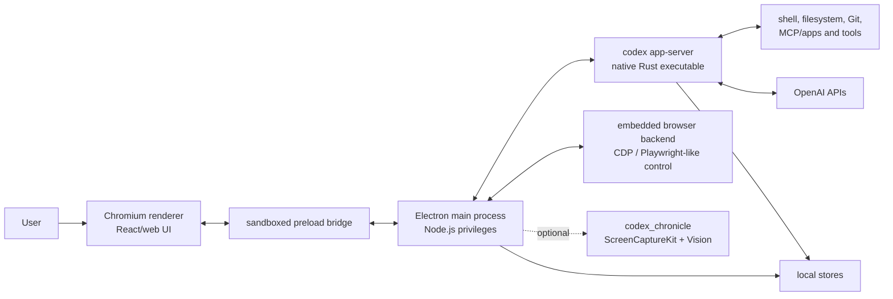
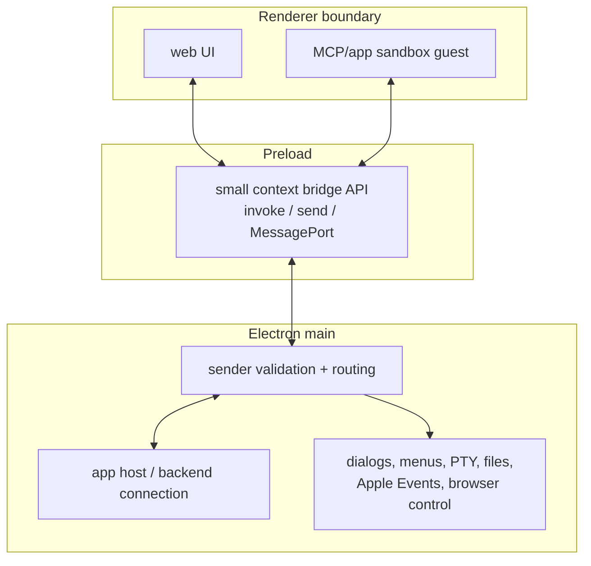
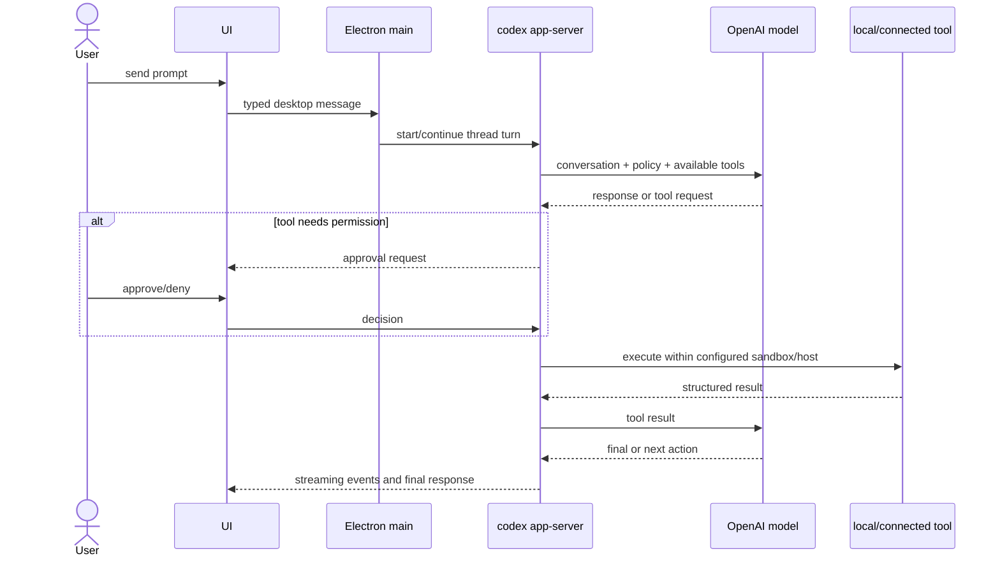
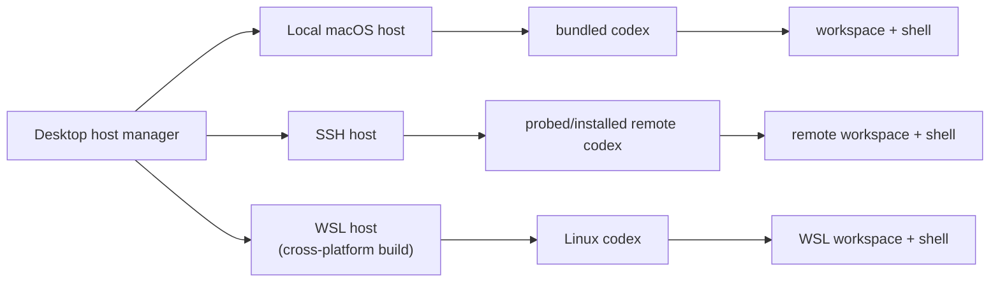
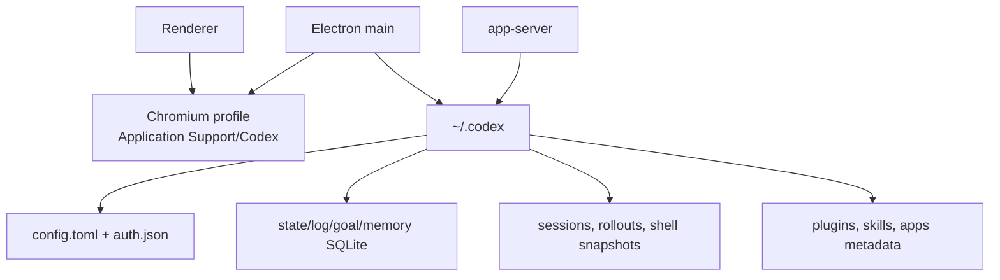

# Codex.app for macOS: a static technical overview

> Research date: 2026-06-24. Target inspected: `/Applications/Codex.app`, version `26.616.81150` (build `4306`), arm64. This is an independent static-analysis report, not official architecture documentation.

## Executive summary

Codex.app is an Electron desktop application that places a web UI around a bundled native Codex CLI/backend. Its principal trust and process boundary is not “website versus native app,” but a chain of components:

1. Chromium renderer processes display the product UI.
2. A narrow preload bridge forwards typed messages into Electron's privileged main process.
3. The main process owns windows, menus, filesystem integration, PTYs, authentication, updates, browser automation, runtime selection, and lifecycle management.
4. A bundled Rust `codex` executable runs an `app-server`, exposing the actual agent/session protocol over stdio, Unix sockets, or WebSockets.
5. The app-server executes tools under Codex's configurable approval and sandbox policy, persists agent state beneath `~/.codex`, and communicates with OpenAI services.

The application also contains an optional native `codex_chronicle` subsystem for privacy-filtered screen capture and memory summarization. It is architecturally separate from ordinary thread execution and requires macOS Screen Recording permission.



## What was inspected

The report uses the shipped bundle itself as primary evidence:

- `Contents/Info.plist`, code signatures, entitlements, Mach-O linkage, and bundle layout.
- The Electron ASAR table and selected extracted/minified production bundles (`bootstrap.js`, main process, preload, and Codex micro-service).
- The bundled binaries' help output and printable symbols/strings.
- Existing application data directory names (not private record contents).

No process injection, debugger attachment, traffic interception, credential access, or modification of the installed app was performed. “Confirmed” below means directly visible in the shipped artifact; “inferred” means the most plausible interpretation of those artifacts.

## Bundle composition

| Layer | Shipped evidence | Role |
|---|---|---|
| App host | Electron `42.1.0`, Chromium `149.0.7827.115`, Vite `8.0.3` | Windows, renderer isolation, IPC, native OS integration |
| Frontend/main JS | `Resources/app.asar`, package `openai-codex-electron` | Product UI and desktop orchestration |
| Agent backend | `Resources/codex`, `codex-cli 0.142.0` | Threads, turns, tools, config, authentication, app-server protocol |
| Screen memory | `Resources/codex_chronicle` | Optional capture, OCR/privacy filtering, recursive summaries |
| Native Node modules | `sparkle.node`, `devicecheck.node`, `sky.node`, `avatar-overlay.node`, input-monitoring and remote-control modules | macOS services that JavaScript cannot directly provide |
| Chromium helpers | renderer, GPU, service and alerts helper apps; Crashpad | Standard multiprocess Chromium runtime |
| Utilities | bundled `rg` | Fast workspace search available to agent workflows |

The production JavaScript is bundled and minified, but not cryptographically hidden. `Info.plist` records a SHA-256 ASAR integrity hash. The application is hardened-runtime signed by team `2DC432GLL2`, has a stapled notarization ticket, and is native arm64.

## Startup and process topology

`package.json` identifies `.vite/build/bootstrap.js` as the Electron entry point. Bootstrap loads the production main bundle. Electron then creates Chromium helper processes as needed and the main process manages the native backend.

```mermaid
sequenceDiagram
    participant macOS
    participant E as Electron main
    participant UI as Renderer + preload
    participant AS as codex app-server
    participant API as OpenAI service

    macOS->>E: launch Codex.app
    E->>E: enforce single instance; load settings and shared state
    E->>AS: start or connect to managed app-server
    Note over E,AS: local control directory and app-server.log<br/>transport can be stdio/Unix socket/WS
    E->>UI: create BrowserWindow and isolated preload
    UI->>E: connect-app-host / MessagePort
    E->>AS: initialize and subscribe to notifications
    AS->>API: authenticate, fetch models, run turns
    AS-->>E: thread/turn/tool events
    E-->>UI: typed event stream
```

The backend explicitly supports `stdio://`, `unix://`, and `ws://IP:PORT`; non-loopback WebSockets support capability-token or signed-bearer authentication. The desktop main bundle references an `app-server-control` directory and log, which strongly indicates a managed daemon/control-socket mode rather than one permanently coupled child per renderer. Exact lifecycle choices can vary by configuration and release.

## Renderer-to-native boundary

The preload does not simply expose unrestricted Node.js. It defines IPC calls including shared-object snapshot retrieval, app-host connection, application/context menus, system-theme updates, sandbox guest/host messaging, build-flavor queries, and message routing between view and worker. Several main-process handlers validate the sender before acting.



This is an important security boundary: a renderer compromise should still need to cross a defined IPC surface to reach Node/macOS capabilities. The mere presence of validation does not prove that every handler is safe; a complete security audit would require source maps or systematic deminification and dynamic fuzzing.

## How a Codex turn works

The native app-server owns the domain protocol. The shipped CLI can generate TypeScript bindings and JSON Schema for that protocol, explaining how the TypeScript desktop shell can consume a Rust backend without hand-maintained ad hoc messages.



The app-server reads `~/.codex/config.toml`; its command-line interface exposes feature overrides, strict config validation, analytics settings, transport selection and authentication. This means permissions and tool behavior live primarily in the backend configuration/policy layer, while the desktop shell renders approval UX and brokers OS facilities.

## Workspaces, terminals, and execution hosts

Confirmed desktop dependencies include `node-pty`, `ssh-config`, `shlex`, `which`, WebSockets and platform-specific runtime code. The main bundle contains local, SSH, WSL, and remote Codex install/probe/kill paths. On macOS the normal case is local execution, but the abstraction is deliberately host-oriented:



The app registers folders as document inputs and opens CSV/TSV/Excel formats as an alternate viewer. A PTY allows terminal-like subprocess interaction. Worktrees, local environments, automations, plugins, skills, apps/connectors, MCP, and browser-use support all appear in the product bundle or linked help routes.

## Embedded browser and computer-use facilities

The app is more than an ordinary Electron renderer. Its dependencies and bundles include `browser-api`, shared browser backends, Playwright, Chrome DevTools Protocol-related tooling, browser sandbox guest/host channels, remote-control device keys, and peer authorization. The likely division is:

- Electron/Chromium supplies browser processes and profiles.
- The main process exposes a controlled browser backend to agent tools.
- An app/MCP sandbox isolates embedded third-party UI from the privileged host.
- Native modules handle device identity/authorization and macOS input-permission checks.

This interpretation is strongly supported by artifact names but some detailed call paths remain inferred because the production bundle is minified.

## Persistence and data locations

Two storage families are used:

| Location | Observed purpose |
|---|---|
| `~/Library/Application Support/Codex` | Chromium profile, cookies/cache/service workers, Crashpad, local browser databases, extension data, feature bootstrap cache, single-instance socket metadata |
| `~/.codex` | Codex configuration/auth, thread/session indexes and rollouts, model cache, logs, goals, memories, plugin state, process-manager records, shell snapshots, and SQLite state |

Observed database names include `state_5.sqlite`, `logs_2.sqlite`, `goals_1.sqlite`, `memories_1.sqlite`, `sqlite/codex-dev.db`, and Chromium-owned stores. The Electron code also references `codex.sqlite`. SQLite is used both through the native backend and the desktop's `better-sqlite3` dependency.



Secrets should be treated as present in these directories, particularly authentication material and browser profile data. The report intentionally did not inspect their contents.

## Network and authentication

Static endpoint strings include `https://chatgpt.com/backend-api`, `https://auth.openai.com`, and `https://api.openai.com/{auth,mfa,profile}`. The `codex://` custom URL scheme and `ASWebAuthenticationSession` support allow browser-based login callbacks into the app. Loopback HTTPS origins are specially recognized, consistent with local development/authorization flows.

The main process can use WebSockets, while the app-server supports local sockets and authenticated WS listeners. Apps/connectors and MCP add further endpoints according to user configuration. Static strings reveal possible routes, not proof that every route is contacted in a normal session.

## Updates, telemetry, and crash handling

Updates use Sparkle through `sparkle.node`. The production feed is `https://persistent.oaistatic.com/codex-app-prod/appcast.xml`, authenticated with the Ed25519 public key embedded in both `Info.plist` and `package.json`. This provides signed update metadata/artifacts in addition to macOS application signing.

The bundle includes Sentry Electron/Node integrations, trace-recording upload code, a file logger, feedback log archiving, and Chromium Crashpad. The backend help states app-server analytics are disabled by default unless first-party startup flags/config change that default; users can still opt out in configuration. Exact events and retention cannot be established from static inspection alone.

## Chronicle: optional screen-derived memory

`codex_chronicle` is a native arm64 program linked against ScreenCaptureKit, Vision, CoreML, Metal, AVFoundation and image frameworks. Its strings expose a concrete pipeline: enumerate displays, capture sparse frames, apply a privacy filter, detect visual-activity evidence, store rolling artifacts, summarize 10-minute windows, recursively roll them into six-hour memories, and write Markdown memories beneath `~/.codex/memories/extensions/chronicle`.

```mermaid
flowchart LR
    SC["ScreenCaptureKit<br/>display frames"] --> PF["privacy filter<br/>window/app observations"]
    PF --> EV["activity/evidence selection"]
    EV --> BUF["temporary rolling recordings<br/>per display"]
    BUF --> S10["10-minute summary agent"]
    S10 --> S6["recursive 6-hour summary"]
    S6 --> MEM["Chronicle Markdown memories"]
    MEM -. optional context .-> TURN["future Codex turns"]
```



The binary pauses on idle, prunes expired recordings, uses a single-instance lock, and can spawn a dedicated screen-capture child. Its embedded summarizer configuration disables ordinary memories, telemetry and unrelated features for the summarization subprocess, then selectively enables configured connectors. Chronicle is permission-gated and optional; its presence in the bundle does not mean it is running or enabled.

## macOS integration and security posture

Confirmed integration points include:

- hardened runtime, notarization, arm64 native execution, and ASAR integrity checking;
- custom `codex://` URL handling and web-auth callback support;
- microphone, camera, audio capture, Desktop folder and Screen Recording-related capabilities;
- Apple Events/AppleScript support for controlling other apps on the user's behalf;
- user-selected read/write files and network-client access;
- Dock tile plugin, notifications, native menus and automatic updates.

The bundled `codex` entitlement dump explicitly says App Sandbox is **false** and permits JIT/unsigned executable memory, Apple Events, camera/audio, user-selected files, and networking. Electron/Chromium commonly requires JIT-related permissions, and an agent developer tool needs subprocess/workspace access, but the consequence is significant: security depends on hardened runtime, code signing, renderer isolation, IPC validation, Codex's own sandbox/approval policy, and user consent—not the macOS App Sandbox alone.

`Info.plist` also sets `NSAllowsArbitraryLoads=true`. That broad ATS exception does not by itself prove insecure traffic; it means the OS-level ATS policy does not enforce HTTPS-only networking for all app requests.

## Confidence and unanswered questions

High confidence:

- Electron-main/preload/renderer architecture;
- bundled native Rust CLI and app-server protocol;
- local persistence families and named databases;
- Sparkle, Sentry/Crashpad, PTY, browser-control and Chronicle components;
- versions, endpoints, entitlements and macOS permission declarations.

Medium confidence:

- managed daemon/control-socket lifecycle in every normal launch;
- precise browser tool isolation model;
- which state entity belongs to which SQLite table;
- when optional connectors participate in Chronicle summaries.

Not established by static analysis:

- live network request bodies, encryption above TLS, or server-side retention;
- whether every IPC handler is resistant to malicious renderer input;
- effective sandbox rules for each tool invocation and approval combination;
- telemetry event schemas actually emitted under the current user configuration;
- runtime feature flags delivered after launch.

A deeper audit would capture a clean launch under a disposable macOS account, record the process tree and open files/sockets, generate the app-server JSON schema, instrument IPC, and compare behavior across approval modes. That should be done in an isolated test profile because it can expose authentication and workspace content.

## Compact mental model

Codex.app is best understood as a **native agent backend plus a privileged Electron orchestration shell and web UI**. The Rust app-server is the durable agent engine; Electron makes it a macOS product by adding windows, authentication, local/remote runtime management, terminals, browser/computer use, updates, notifications, plugins/apps, and optional passive screen memory. Most meaningful security decisions occur at three gates: renderer IPC, app-server tool policy/approvals, and macOS privacy permissions.
