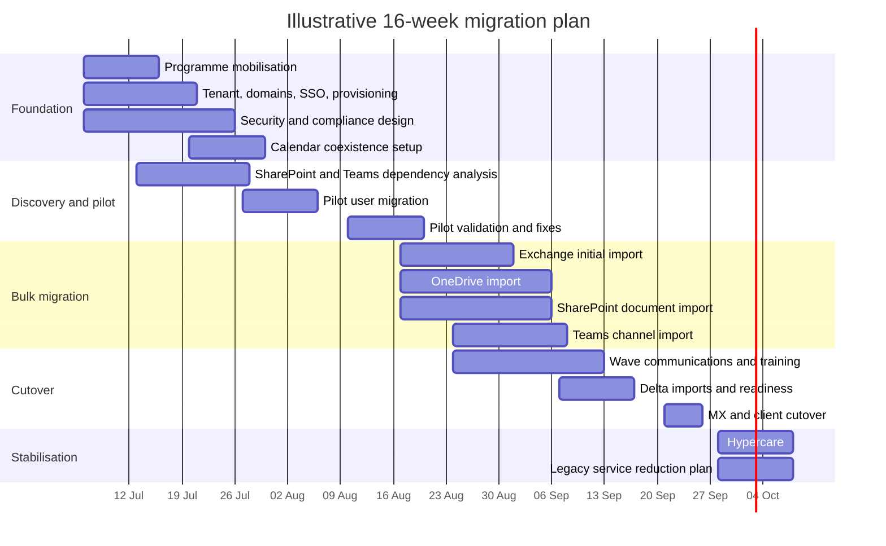

# Migration from Microsoft 365 E5 to Google Workspace Enterprise

## Executive summary

For a 1,200-user organisation, a move from Microsoft 365 E5 to Google Workspace is technically feasible, but it is **not** a like-for-like suite swap. The closest Google target is **Google Workspace Enterprise Plus**, not Enterprise Standard, because Enterprise Plus adds the controls and scale most comparable to an E5 estate: S/MIME for email, client-side encryption, 1,000-participant Meet, enterprise data regions, Context-Aware Access, Cloud Identity Premium, enterprise endpoint management, and Google Vault. Even then, Microsoft 365 E5 remains broader in several areas, especially **defence-in-depth security, identity governance, CASB-style control, Outlook/Exchange richness, SharePoint information architecture, and Teams-native collaboration breadth**. citeturn16view1turn16view2turn16view5turn15view1turn13search0turn15view2turn15view3turn29view4

The strongest case for migration is organisational preference for **browser-first working, simpler end-user collaboration in Docs/Drive/Meet, reduced client dependency, and a more consolidated admin experience**. The weakest case is where the current E5 tenant materially depends on **Purview, Defender, Entra P2, Intune depth, SharePoint lists/pages/metadata, Outlook-heavy workflows, or Teams chat/channel fidelity**. Those dependencies can all be replaced or mitigated, but often only by **process change, selective coexistence, and sometimes third-party security or management tools**, which can erode any licence savings. citeturn38view1turn22view3turn22view4turn22view6turn28view3turn28view4turn31search1turn33view0turn15view3turn15view2

The most defensible recommendation is therefore:

1. **Target Google Workspace Enterprise Plus** as the destination architecture, not a lower Google tier.  
2. **Keep Microsoft Entra ID as the primary identity provider during transition**, federating Google Workspace/Cloud Identity to the existing IdP while provisioning users and groups to Google. Google supports SAML 2.0 SSO with an external IdP and recommends combining SSO with automated user provisioning. citeturn23search0turn23search2turn12search3turn15view1  
3. **Use Google’s advanced, cloud-to-cloud import methods** for Exchange Online, OneDrive, SharePoint Online, and Teams channels wherever possible, with delta imports before cutover. These methods use a dedicated Azure application and avoid most endpoint-side data hauling. citeturn32view4turn31search13turn31search2turn15view5turn31search8turn33view0  
4. **Run a staged migration, not a big bang**, with formal coexistence for calendar free/busy and clearly managed mail routing/MX cutover. Google Calendar Interop supports Exchange and Google free/busy coexistence during transition. citeturn26search2turn26search6turn26search18  
5. **Rebuild compliance policy deliberately before decommissioning E5**. Native migration copies content, but retention, holds, DLP logic, and eDiscovery workflows must be recreated in Google Vault / Google DLP and validated against legal requirements. Google explicitly says its Teams chat import is a productivity feature, not a legal-compliance solution. citeturn30view0turn22view1turn22view2turn22view4turn32view3

In practical terms, the migration should be treated as a **business operating-model change** as much as a technical move. The users most likely to feel pain are executive assistants, legal/compliance staff, records managers, heavy Outlook users, Teams power users, and business units that rely on SharePoint as an intranet, process platform, or metadata-rich document management system rather than just file storage. citeturn38view0turn28view3turn28view4turn34view0turn33view0

## Functional comparison

### Exchange Online and Gmail

Exchange Online in E5 provides **100 GB primary mailboxes** and **auto-expanding archive up to 1.5 TB** for E3/E5-class users, with warning/send/receive thresholds that reflect that 100 GB mailbox size. Google Workspace Enterprise is built around **pooled storage**, and Google’s public Workspace pricing pages state that **Business Plus and Enterprise Plus include 5 TB pooled storage per user**, with Enterprise able to upgrade for more storage. This makes the two models structurally different: Exchange gives a large dedicated mailbox and a very large archive, whereas Google gives shared capacity across Workspace services. For organisations with large legal or project mail histories, Exchange archiving remains materially stronger out of the box. citeturn40view0turn39view1turn37view1turn37view4

Google’s Exchange Online import supports **email, calendar, and contacts**, including **all folders and subfolders** mapped to **Gmail labels**, shared mailboxes imported as regular mailboxes, and read/unread status; the advanced method also supports **Microsoft In-Place Archive** for active users. That is strong functional coverage for migration, but it also exposes a design difference: Gmail does not use folders in the Exchange/Outlook sense, and Google’s own migration guidance emphasises that Outlook folder workflows become labels-and-search workflows in Gmail. citeturn32view0turn25search3turn25search23turn25search7

Gmail is strongest where the organisation values **web-native access, strong search, simplified threading, automatic saving, AI-assisted composition, dynamic email, and lower client dependency**. Google documents Gmail as a web-native application and highlights features such as Smart Compose, nudges, tabbed inbox, and dynamic email. Gmail offline exists, but it is **Chrome-based offline**, not equivalent to Outlook’s full cached Exchange client experience. citeturn38view1turn25search1

Exchange remains stronger in areas many enterprise users take for granted: richer delegate and shared-mailbox behaviours, mature mailbox/archive semantics, Outlook-native workflows, and a broader ecosystem of mail/compliance features. Exchange Online also supports large attachment and message limits up to **150 MB** where configured, with caveats for Outlook on the web and external routing. citeturn40view4turn39view1

A concise comparison is below.

| Area | Microsoft 365 E5 | Google Workspace Enterprise Plus | Assessment | Evidence |
|---|---|---|---|---|
| Primary mailbox | 100 GB user mailbox in E3/E5 class | Pooled storage model across Workspace; Enterprise Plus publicly positioned with 5 TB pooled storage per user | Different model rather than direct parity; Exchange favours email-heavy archival estates | citeturn40view0turn37view1turn37view4 |
| Archive | Auto-expanding archive up to 1.5 TB | Vault is governance/eDiscovery, not a user archive mailbox | Exchange stronger for classic mailbox archiving | citeturn39view1turn30view0 |
| Migration coverage | Native source workload supports mail, calendar, contacts | Google import supports mail, calendar, contacts from Exchange Online | Good migration coverage, but semantics change | citeturn32view0 |
| Folder model | Real folders and subfolders | Folders import as Gmail labels | Change-management issue for Outlook-heavy users | citeturn32view0turn25search3turn25search23 |
| Shared mailboxes | Native Exchange object model | Shared mailboxes import as regular mailboxes; Gmail delegation can be added after import | Functional but not like-for-like | citeturn32view0turn25search2 |
| Offline | Mature desktop cached-mode client model | Gmail offline in Chrome | Google is workable, but thinner for offline-heavy users | citeturn25search1turn38view1 |

### Outlook and Gmail web and client experience

If the organisation standardises on **Gmail web**, the user experience becomes cleaner and more consistent with Google’s intended operating model. Google’s migration guidance is explicit that the switch from Outlook to Gmail is primarily a **desktop app to web app** shift, and that the learning materials are “primarily web only.” citeturn38view2turn38view1

If the organisation wants to **keep Outlook as a transition client**, Google Workspace Sync for Microsoft Outlook can preserve a surprising amount of mail/calendar usability. Google says users can still send and manage mail, work with invitations, use nested folders in Outlook, autocomplete addresses, and delegate the inbox. However, Google also documents important omissions: **no public folders, no shared mailbox folders-as-folders, no S/MIME via GWSMO, no delivery receipts, no Recover Deleted Items, Outlook add-in limitations, and Outlook’s out-of-office behaviour does not work as expected**. Those are not edge cases in many 1,200-user enterprises. citeturn38view0

This leads to a practical conclusion: an organisation can either **embrace Gmail web as the target UX** or accept a prolonged support burden supporting Outlook-on-Google compromises. The latter is viable for a small number of specialist users, but it is not the cleanest strategic end state. citeturn38view0turn38view1

### Exchange calendars and Google Calendar

Calendar functionality is one of the stronger parity areas. Google Calendar supports **resource booking**, **appointment schedules**, **working location**, **focus time**, **time insights**, and can interoperate with Exchange during coexistence through **Calendar Interop** so that users on both platforms can see each other’s availability. citeturn16view2turn26search1turn26search5turn26search3turn26search11turn26search19turn26search2turn26search6

Microsoft/Exchange remains stronger in the classic **delegate calendar** and **room mailbox** model. Microsoft documents delegate permissions at mailbox-folder level and room-mailbox delegation behaviours directly in Exchange. That is familiar and often deeply embedded in executive-assistant processes. Google can support shared calendars and resource booking, but organisations that rely on complex Outlook delegate workflows should expect retraining and process redesign. citeturn26search12turn26search0turn26search8

The migration implication is favourable: calendars can coexist during transition, reducing cutover risk. But the operating-model implication is more subtle: Google Calendar is usually acceptable or better for ordinary users, while executive support workflows often need early pilot testing. citeturn26search2turn26search6turn26search18

### Teams and Google Meet and Chat

The direct Microsoft-to-Google comparison here is **not one product to one product**. Teams combines meetings, telephony, channels, apps, file collaboration, webinars, town halls, and a very deep Microsoft 365 integration surface. Google splits that experience across **Meet** for meetings and **Chat** for messaging/spaces. Microsoft’s Teams service description highlights **webinars, town halls, Teams Rooms, voice/Teams Phone**, and integration with Microsoft 365 groups and Entra-managed identities. Google Enterprise editions give **Meet recordings, transcripts, eCDN, co-hosting, waiting rooms, and, in Enterprise Plus, up to 1,000 participants with in-domain live streaming and client-side encryption for audio/video**. Google Chat supports **spaces, discoverable spaces, external chat controls, and Chat DLP**. citeturn39view2turn16view2turn16view1

For meeting workloads, Google Meet is credible and often simpler. For persistent team collaboration, the biggest issue is not raw meeting quality but **channel-model fidelity**. Google’s native Teams import brings **Teams channels into Google Chat spaces**, maps one owner/manager to a Google space manager, imports common formatting, and maps all channel types to a **restricted space** initially. However, it does **not** import **1:1 chats, group direct messages, file attachments, pasted images/stickers, code snippets, tables, nested lists, many bots/app constructs, or more than 500 replies in long threads**. Google also warns that the import is intended as a productivity feature and is not designed to satisfy legal-compliance requirements. citeturn33view0turn32view3

That is arguably the single largest collaboration gap in the whole migration. If Teams is heavily used as a knowledge base and decision log, a move to Google Chat requires one of three decisions: accept partial history, preserve Teams read-only for a period, or implement an export/archival strategy outside the collaboration platform. citeturn33view0turn32view3

### SharePoint and OneDrive versus Google Drive and Shared Drives

This is the area where migration success depends most on what SharePoint is **actually being used for**. If most SharePoint and OneDrive content is just files and folders with permissions, Google’s native imports are strong. OneDrive import preserves **files, folders, OneNote notebooks as folders, several permission types, and share links**, with clear mappings to Google Drive roles. SharePoint Online import maps **site collections to shared drives**, nested sites to shared drives or folders, libraries to folders, files in place, and several user/group permission levels to Drive permissions. citeturn32view1turn15view5

If SharePoint is being used as a richer content platform, the gaps become material. Google explicitly states that SharePoint import does **not** bring across **SharePoint lists, webpages, site-folder permissions, restricted/blocked-download content, previous versions, Personal Vault files, document expiration dates, or favourites/shortcuts**. OneDrive import likewise excludes **previous versions**, Personal Vault, file expiration dates, and certain restricted or externally owned content. For many intranet or records-management estates, these are not optional extras. citeturn34view0turn34view3

Google Drive does, however, have meaningful enterprise collaboration features in its own right. Google supports **shared drives**, **file labels**, **label-based search**, file activity, file versions, and DLP rules that apply to **My Drive and Shared drives**. On non-Google files, older versions may be deleted after **30 days or 100 newer versions** unless explicitly kept forever. Google Docs supports suggestion mode, and tracked changes from Microsoft Office convert into Google suggestions during import/conversion. citeturn28view0turn28view1turn22view4turn28view2

SharePoint remains stronger for **managed metadata, content types, taxonomy-driven retrieval, and broader information architecture**. Microsoft documents centrally managed metadata and metadata-based content queries in SharePoint document libraries. In other words, Google Drive labels are capable and useful, but they are not the same thing as a well-governed SharePoint information architecture. citeturn28view3turn28view4

### Collaboration, co-authoring, versioning, metadata, and search

Both ecosystems support real-time collaboration, but they do so with different centre of gravity. Google’s model is native collaborative authoring in Docs/Sheets/Slides with **suggestions, comments, and conversion of Office tracked changes into suggestions**. Microsoft’s model is collaboration around Office files in OneDrive/SharePoint, with extra considerations when sensitivity labels and encryption are involved. Microsoft documents that co-authoring for **labelled and encrypted documents** requires a tenant setting plus version compatibility across apps and tooling, and that metadata storage behaviour changes when that setting is enabled. citeturn28view2turn29view1turn29view0

For search and classification, Google offers **Drive labels** and label-based search, while SharePoint offers richer metadata query capability and centrally managed taxonomies. This matters operationally: Google is typically simpler for end users, but SharePoint is stronger for organisations that deliberately engineer information structures rather than relying mainly on search and sharing. citeturn28view0turn28view3turn28view4

## Security, compliance, and identity

### Security and compliance posture

Microsoft 365 E5’s security/compliance stack is broader and more modular. Microsoft positions Defender as a platform protecting **devices, identities, applications, email, and data across Microsoft and non-Microsoft environments**. Purview provides integrated governance, protection, and compliance capabilities, including DLP, retention, eDiscovery, information protection, message encryption, audit retention, and Customer Key. Google Workspace Enterprise provides a strong but narrower built-in model centred on **Vault, DLP, security centre/investigation, advanced phishing and malware protection, Context-Aware Access, and client-side encryption in Enterprise Plus**. citeturn15view3turn29view4turn21search1turn21search2turn21search3turn22view3turn16view1turn16view2

Google Vault is an information governance and eDiscovery tool supporting **Gmail, Drive, Calendar, Chat when history is on, Meet recordings and logs, Groups, Sites, and Gemini app messages**. Vault supports retention, holds, search, export, audit log, and OU-based access control. But Google is clear that Vault **does not retain data until retention rules are configured**, and that Vault is **not a data archive** in the Exchange sense. Microsoft Purview eDiscovery, by contrast, natively spans **Exchange Online, Teams, Microsoft 365 Groups, OneDrive, SharePoint, and Viva Engage**, with premium E5 features for deeper case workflows. citeturn30view0turn22view1turn22view2turn29view3turn21search4

DLP is available in both platforms, but Microsoft’s scope and E5 differentiation are broader. Google DLP applies across Drive/Shared drives, Gmail, and Chat, and Google documents that DLP rules can be tested in audit-only mode and can be combined with Context-Aware Access. Microsoft Purview DLP spans Exchange, SharePoint, OneDrive, Teams files, and—at E5 level—Teams chat and channel messages, with deeper content analysis and broader policy scope. Microsoft also documents retention label conditions in DLP and longer-term audit retention up to 10 years in Purview Audit (Premium). citeturn22view4turn22view5turn29view2turn13search7turn13search3turn21search1

Encryption is also asymmetrical. Google Enterprise Plus adds **S/MIME**, **client-side encryption** for email/Drive/Meet/Calendar fields, and enterprise data regions. Microsoft has **Purview Message Encryption**, **Advanced Message Encryption**, and **Customer Key** for application-level key control at rest. Microsoft’s messaging and labelling stack is generally more mature in policy granularity and IRM-style use cases; Google’s client-side encryption is compelling for organisations that need a simpler “your keys in Google apps” story. citeturn16view2turn16view5turn9search6turn9search14turn21search2turn21search3turn21search15

### Conditional access, identity integration, MFA, and SSO

Microsoft Entra ID P2 remains significantly stronger than Google’s native identity controls where the organisation depends on **identity risk, risk-based policies, privileged identity governance, and just-in-time administration**. Microsoft documents Entra ID Protection as a P2 feature driven by large-scale risk signals and machine learning, integrated with Conditional Access. Microsoft also documents Entra ID Governance and Privileged Identity Management for access packages, reviews, and control over privileged access. citeturn15view2turn13search1turn23search11

Google Cloud Identity Premium and Workspace Enterprise provide a solid identity platform: **2-Step Verification, security keys, password monitoring, SSO both as IdP and as service provider, automated user provisioning, endpoint management, device inventory, and Context-Aware Access**. Google’s architecture guidance explains that Cloud Identity/Workspace supports SAML 2.0 SSO with an external IdP, and that user provisioning can be combined with federation. Google’s editions page shows that Cloud Identity Premium adds **Context-Aware Access, automated user provisioning, Windows device management, advanced mobile management, and broader reports/logs**. citeturn15view1turn23search0turn23search2turn12search1turn12search0

The gap is not that Google lacks MFA/SSO; it is that Google’s native stack does not, in the sources reviewed here, present a first-party equivalent to the full combination of **Entra ID Protection + PIM + Defender for Cloud Apps**. Google offers **multi-party approval for sensitive actions**, strong contextual access policies, and a consolidated security centre, but that is not the same as Microsoft’s richer privileged-role and CASB posture. This is an inference from the official feature sets and should be treated as such, but it is the most important identity/security conclusion in the comparison. citeturn16view1turn22view3turn22view6turn15view3turn15view2

### Advanced E5 features versus Workspace equivalents

The most important E5-to-Google mappings are below.

| E5 capability | Microsoft position | Closest Google equivalent | Practical verdict | Evidence |
|---|---|---|---|---|
| Defender for Office 365 Plan 2 | Safe Links, Safe Attachments, advanced investigation, hunting, simulation, response | Gmail advanced phishing and malware protection, Security Sandbox, investigation tool | Google covers email threat prevention well, but Microsoft is deeper for post-breach operations and simulation | citeturn13search0turn13search16turn16view1turn22view3 |
| Defender for Cloud Apps | CASB, shadow IT discovery, app governance, information protection across SaaS | No direct first-party Workspace feature of the same breadth in the reviewed Google sources; adjacent controls are Security Center, DLP, Context-Aware Access | Likely gap; often requires separate security tooling | citeturn7search6turn15view3turn22view3turn22view4turn22view6 |
| Entra ID Protection | Risk-based identity protection and automated responses | Context-Aware Access plus Cloud Identity Premium security features | Partial equivalence only; Microsoft stronger on identity risk | citeturn15view2turn12search0turn22view6 |
| PIM and identity governance | Just-in-time privilege, access reviews, access packages | Multi-party approval for sensitive actions; standard admin role controls | Material gap for mature privileged-access programmes | citeturn13search1turn15view2turn16view1 |
| Purview eDiscovery Premium | Cross-M365 case workflow with premium review/analysis | Google Vault search, hold, export | Vault is strong but generally narrower and less workflow-rich | citeturn29view3turn30view0 |
| Purview retention and labels | Broad lifecycle and retention label model | Vault retention plus Drive/Gmail labels | Google is workable, but Microsoft is richer for records/lifecycle architecture | citeturn13search7turn13search15turn17search0turn22view1 |
| Intune | Full endpoint and app management | Google enterprise endpoint management / Cloud Identity Premium | Google is credible for Chrome/Android and core endpoint controls, but Intune is broader and usually deeper for Windows/macOS/app policy | citeturn13search2turn15view1turn37view4 |

## Administration, licensing, and operating model

### Administration model

Microsoft 365 E5 environments typically operate across **multiple specialised admin planes**: Microsoft 365 admin centre, Exchange admin, Teams admin, SharePoint admin, Purview, Defender, Entra, and Intune. That gives depth, but also more role fragmentation and operational complexity. Google’s design is more consolidated around the **Google Admin console**, with the **security centre**, **investigation tool**, **Vault**, and some adjacent cloud services. Google’s own architecture guidance also notes that Cloud Identity and Workspace share a common technical platform and administrative tools for users, groups, and authentication. citeturn10search17turn13search2turn29view4turn22view3turn23search2

That difference matters more than it first appears. In Microsoft, deep control often comes from specialised consoles and a deep PowerShell/API culture. In Google, fewer consoles can simplify day-to-day administration, but it also means some advanced enterprise controls simply do not exist in the same way. The administrative trade-off is therefore **simplicity versus granularity**, not simply “easier versus harder.” citeturn22view3turn12search0turn15view2turn29view4

### Licensing and cost considerations

Microsoft publicly lists **Microsoft 365 E5 at $57.00 per user per month, paid yearly**, which equates to **$820,800 per year** for 1,200 users before discounting, taxes, support uplift, add-ons, and telephony. Google’s public UK pricing page does **not** publish a UK list price for Enterprise; it directs buyers to **contact sales** for Enterprise and states that Enterprise plans have no minimum or maximum user cap. Google’s UK pricing page does, however, show **Business Plus at £18.40 per user per month** and states that Enterprise adds features such as **S/MIME, 1,000-participant meetings, DLP, Context-Aware Access, enterprise data regions, Cloud Identity Premium, and enterprise endpoint management**. In other words, the direct Google licence analogue needed to approach E5 is not publicly priced in the UK source set and should be quoted commercially. citeturn36view1turn37view3turn37view5turn37view2turn37view4

That means the cost discussion should be framed around **whole-stack replacement**, not seat price alone. A migration can still save money, but only if the organisation is comfortable giving up or replacing parts of E5 such as advanced identity governance, CASB, endpoint management depth, or Microsoft-native records/compliance architecture. If those functions must be recreated through third-party tools or retained Microsoft services, the “Google is cheaper” thesis becomes much less certain. citeturn15view3turn15view2turn29view4turn22view3

A practical financial framing is below.

| Cost lens | Observation | Why it matters | Evidence |
|---|---|---|---|
| Current list price baseline | Microsoft 365 E5 is $57/user/month annual commitment | 1,200 users = $820,800/year list before discounts | citeturn36view1 |
| Google Enterprise quote | UK public pricing page requires contact sales for Enterprise | Exact comparison needs a commercial Google quote | citeturn37view3turn37view5 |
| Lowest public Google benchmark with eDiscovery | Business Plus is £18.40/user/month and includes eDiscovery, 500-participant Meet, advanced endpoint management | Useful floor/reference point, but not comparable to E5 parity | citeturn37view2turn37view3 |
| Near-parity Google tier | Enterprise adds DLP, Context-Aware Access, Cloud Identity Premium, enterprise endpoint management, S/MIME, enterprise data regions | Enterprise Plus is the realistic comparison tier for E5 migration planning | citeturn37view4turn16view1turn16view2turn16view5 |
| Hidden cost drivers | Training, coexistence, retained Microsoft subscriptions, security replacements, specialist migration tooling, archive/backup strategy | These can outweigh licence deltas | citeturn32view3turn34view0turn38view0turn15view3 |

### Functionality users are likely to miss

The highest-probability user-impact areas are clear from the source material.

| User-impact area | Likely pain point | Mitigation |
|---|---|---|
| Outlook-dependent users | Labels instead of folders, weaker Outlook-on-Google parity, no public folders, different out-of-office behaviour, add-in limitations | Standardise on Gmail web for most users; keep Outlook only for exception roles during transition; targeted training and champion network |
| Executive assistants | Delegate model differences in calendar/inbox workflows | Early pilot with assistants and executives; redesign delegate processes before broad rollout |
| Teams-heavy teams | Native channel import excludes 1:1 chats, group DMs, file attachments, images/stickers, some formatting and long-thread depth | Preserve Teams read-only for a period; export/compliance archive separately; reset expectations clearly |
| SharePoint power users | Lists, pages, site structure semantics, metadata-heavy libraries, previous versions not imported | Rationalise what must stay in Microsoft or be rebuilt elsewhere; treat intranet/process sites as separate projects |
| Compliance/legal | Retention, holds, eDiscovery workflows must be recreated and validated | Parallel compliance design workstream before cutover; do not decommission E5 governance estate prematurely |

These are not hypothetical concerns; they are visible directly in Google’s GWSMO limitations, Teams import exclusions, and SharePoint/OneDrive import limitations. citeturn38view0turn33view0turn34view0turn34view3

## Migration strategy, mapping, effort, and timeline

### Recommended migration approach

For this organisation size, the best-fit first-party approach is:

- **Identity first**: create Google Workspace / Cloud Identity tenant, configure SAML SSO to the existing external IdP, and provision users/groups. Google requires the user accounts to exist in Workspace/Cloud Identity even when authentication is federated. citeturn23search0turn23search2turn15view1  
- **Use Google’s advanced Exchange Online import**, because it uses a dedicated Azure application, supports batches of **up to 5,000 users**, up to **10 batches concurrently**, and supports scanning/reporting plus delta imports. For 1,200 users, that comfortably fits one production batch or a few staged waves. citeturn32view4turn31search13  
- **Use Google’s native imports for OneDrive, SharePoint Online, and Teams channels** where the target is file preservation rather than fidelity of SharePoint solution constructs. SharePoint import supports up to **1,000 sites at a time**. Teams import supports up to **1,000 teams at one time** with the default method, or advanced Azure-app based batch imports. citeturn31search2turn31search8turn33view0  
- **Use Calendar Interop during coexistence** so Exchange and Google users can see each other’s availability while waves are migrated. citeturn26search2turn26search6  
- **Run delta imports before cutover** for mail and chat so cutover windows are about final synchronisation, client profile changes, and mail routing rather than bulk copy. citeturn31search13turn32view4

The mail coexistence pattern should usually be: keep Exchange Online authoritative during migration, sync/provision users to Google, run initial imports, validate, run delta imports, switch mail routing/MX, then move clients and support teams into hypercare. The free/busy coexistence piece is well supported by Calendar Interop. The exact mail-routing design must be finalised in detailed design, but the important point is that the Google migration tooling supports **copy-first, delta-later**, which is the right foundation for a controlled cutover. citeturn32view0turn31search13turn26search2

### Data mapping by workload

| Source workload | Google target | Native coverage | Key caveats |
|---|---|---|---|
| Exchange Online mail | Gmail | Strong | Folders become labels; shared mailboxes become regular mailboxes; In-Place Archive requires advanced method |
| Exchange calendars | Google Calendar | Strong | Test exec delegate/resource behaviours early |
| Exchange contacts | Google Contacts | Strong | Workflow change more than data loss risk |
| OneDrive | My Drive | Strong for files/folders/permissions | Previous versions do not import; not imported to shared drives; restricted/external-owned content caveats |
| SharePoint Online document libraries/sites | Shared drives / folders | Moderate to strong for file estates | Lists, pages, prior versions, some permission constructs do not import |
| Teams channels | Google Chat spaces | Partial | No 1:1 chats, no group DMs, no file attachments, many message artefacts lost |
| Teams files | Separate OneDrive/SharePoint imports | Indirect | Need workload coordination to avoid user confusion |
| Compliance policies | Vault / DLP / retention recreation | Manual redesign | Legal/compliance validation required before E5 retirement |

The key message is that **mail and basic files are straightforward; collaboration history and information architecture are not**. citeturn32view0turn32view1turn15view5turn33view0turn30view0turn22view4

### Estimated effort

This is a planning estimate rather than a vendor quotation, but for 1,200 users with the scope requested, a realistic programme is typically **12 to 20 weeks**, depending mainly on how much SharePoint complexity, Teams dependence, and compliance redesign exist. The timeline below assumes no major line-of-business platform rebuilds and that the organisation accepts Google-native working practices rather than trying to preserve every Microsoft behaviour. This estimate is grounded in the workload scope and Google’s batch/concurrency capabilities for Exchange, Teams, and SharePoint. citeturn32view4turn31search2turn33view0

A sensible staffing baseline would usually include a programme lead, a Google Workspace architect, messaging/files migration leads, an identity/security lead, an adoption/change lead, and dedicated service-desk hypercare capacity. The more the organisation relies on SharePoint as an application platform rather than a file platform, the more this grows into a broader transformation programme. This staffing estimate is an inference based on the validated technical scope above. citeturn34view0turn33view0turn28view4

### Migration task overview

| Task | Native tool or method | Estimated complexity | Notes |
|---|---|---|---|
| Tenant, domains, SSO, provisioning | Google Workspace + Cloud Identity + external IdP federation | Medium | Foundational; should be completed before pilot |
| Exchange mail/calendar/contacts import | Advanced Exchange Online import | Medium | Best first-party path for 1,200 users |
| Delta mail sync | Exchange Online delta import | Low to medium | Critical cutover-control mechanism |
| OneDrive migration | OneDrive native import | Medium | Good for user files; previous versions lost |
| SharePoint document migration | SharePoint Online native import | High | Separate document libraries from intranet/process use cases |
| Teams channel history migration | Teams native import | High | Partial fidelity only |
| Calendar coexistence | Calendar Interop | Medium | Valuable for staged migration |
| Client migration | Gmail web standardisation, optional limited GWSMO use | Medium | Change management more important than tooling |
| Compliance rebuild | Vault, retention, DLP, investigations | High | Must run as a formal workstream |
| Adoption and training | Role-based enablement | High | Largest determinant of user satisfaction |

### Illustrative migration timeline

## Risks, gaps, and recommended mitigations

The single biggest strategic risk is assuming that Google Workspace Enterprise is a direct replacement for Microsoft 365 E5. It is not. The difference is not just branding; it is architectural. E5 is a broader security/compliance and endpoint stack, while Workspace Enterprise is a strong collaboration suite with enterprise controls layered in. The risk materialises when organisations discover too late that they were really paying for **Purview, Defender, Entra P2, Intune, or SharePoint solution depth**, not merely email and storage. citeturn15view3turn15view2turn13search2turn29view4turn22view3

The next major risk is **collaboration-history loss**. Google’s Teams import exclusions are substantial enough that some business groups will perceive that “their Teams history did not come across,” even if channel messages technically imported. File attachments, 1:1 conversations, group direct messages, and several rich message artefacts are outside native coverage. The mitigation is not technical perfection; it is honest scope-setting, targeted preservation of Teams access for a defined period, and explicit legal archiving decisions. citeturn33view0turn32view3

A third major risk sits in **SharePoint oversimplification**. If the organisation treats a complex SharePoint estate as “just files,” migration will succeed mechanically but fail functionally because lists, pages, versions, and metadata-led retrieval patterns disappear. The mitigation is a site-by-site triage: classify each SharePoint site as **document library**, **intranet/publishing**, **process/app**, or **records/knowledge**; then migrate only the first category directly to shared drives unless a deliberate redesign is agreed. citeturn34view0turn28view3turn28view4

The final critical risk is **compliance drift at cutover**. Google Vault, DLP, and retention are capable, but they do not automatically inherit Microsoft Purview policy semantics, and Google explicitly notes that Vault does not retain data until rules are configured. The mitigation is to run compliance as an equal workstream with signed-off target-state designs, test matters/holds/exports before cutover, recreate DLP conditions deliberately, and keep the Microsoft source estate intact until legal and compliance teams approve the new controls. citeturn30view0turn22view1turn22view2turn22view4turn32view3

Overall, the recommended mitigations are straightforward:

| Gap or risk | Recommended mitigation | Why it works |
|---|---|---|
| E5-security breadth not matched natively | Adopt Enterprise Plus, retain external IdP, and assess need for complementary security tooling before retirement of E5 controls | Prevents hidden security regressions |
| Outlook-heavy user resistance | Default to Gmail web as target, with limited temporary Outlook/GWSMO exceptions | Reduces long-term support complexity |
| Teams history gaps | Preserve Teams read-only during transition; define archival/export approach | Avoids “missing history” shock |
| SharePoint functional loss | Triage sites by purpose before migration | Stops publishing/process platforms being flattened into files |
| Compliance mismatch | Rebuild and test Vault/DLP/retention in parallel | Avoids cutover with unverified legal controls |
| Migration overruns | Use advanced imports, staged waves, and delta syncs | Reduces cutover pressure and keeps workloads controllable |

## Open questions and limitations

This report is intentionally anchored in **official Microsoft and Google documentation**, which makes the core conclusions high confidence. The main limitations are that **third-party migration products were not independently benchmarked in this source set**, so this report does not rank external migration vendors product by product, and the **public UK Google Enterprise price is not published on the pricing page reviewed**, so a commercial quote is needed for a true financial comparison. citeturn37view3turn37view5

There are also a few decision points that require internal discovery rather than public research: how much the organisation uses **SharePoint lists/pages/workflows**, which E5 controls are actually enabled today, whether Teams 1:1 chat history is business-critical, whether Outlook must remain a supported desktop standard, and whether any legal hold or records obligations depend on current Microsoft semantics. Those answers will determine whether this is a relatively clean collaboration-suite migration or a much broader platform transformation. citeturn34view0turn33view0turn38view0turn29view3