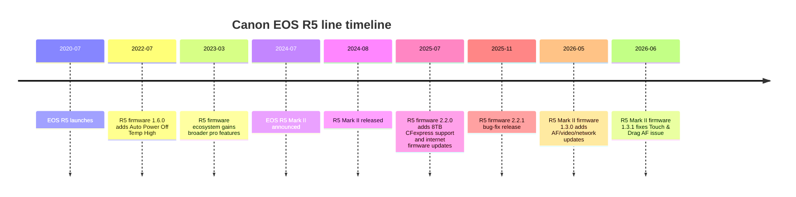

# Canon EOS R5 versus Canon EOS R5 Mark II

## Executive summary

The **Canon EOS R5 Mark II** is the more capable camera overall. It meaningfully improves on the original **EOS R5** in the areas that matter most for fast-moving work and serious hybrid shooting: autofocus intelligence, electronic-shutter readout speed, rolling-shutter control, blackout-free shooting, burst depth, video tools, and thermal management. The biggest practical gains are for **wildlife, sports, action, and hybrid photo/video** users. citeturn12view0turn14view0turn9view4turn29search0turn30view3

The original **EOS R5** remains a very strong camera in 2026. It still delivers excellent 45MP stills, very strong autofocus, 8K/30p RAW and 4K/120p video, robust stabilisation, and a more attractive price. For photographers who shoot mostly **landscape, studio, portraits, weddings, travel, or general professional stills**, the R5 can still be the stronger value proposition, especially because its low-ISO dynamic range appears to be **slightly better** than the R5 Mark II’s in several independent comparisons. citeturn33search0turn33search4turn34search8turn26search6turn38search1

If you are **buying new with no stated budget ceiling**, my overall recommendation is the **EOS R5 Mark II**. If you already own an **EOS R5**, the upgrade case is strongest only if you specifically need **better action AF, cleaner electronic shutter behaviour, deeper buffers, stronger video ergonomics, or improved heat handling**. Otherwise, the original R5 is still good enough that many owners can justify keeping it. citeturn12view0turn14view0turn9view4turn31view0turn40search18

## What changed from the R5 to the R5 Mark II

Canon kept the core concept the same: both are weather-sealed, 45MP, full-frame RF-mount hybrid flagships with one **CFexpress Type B** slot and one **UHS-II SD** slot, IBIS, a 5.76M-dot EVF, and strong still/video capabilities. The Mark II, however, replaces the original sensor with a **45MP back-illuminated stacked** full-frame CMOS design, adds a **DIGIC Accelerator** alongside DIGIC X, introduces **Eye Control AF**, improves subject-recognition and sports-specific AF, raises electronic burst speed to **30 fps**, and expands video to **8K/60p RAW**, more advanced codecs, Canon Log 2, a full-size HDMI port, four-channel audio, and simultaneous still/video capture. citeturn20view0turn18view0turn12view0turn14view0turn29search17

The original R5 uses a conventional 45MP CMOS sensor and remains highly capable, but its electronic shutter is slower and its video feature set is less cinema-oriented. Canon’s own comparison article and The-Digital-Picture both portray the Mark II as the “next-level hybrid” body, while also making clear that both cameras are still fundamentally high-end professional tools. citeturn12view0turn14view0turn9view4turn33search3

One important reconciliation point: some early review copy and comparison snippets give slightly different autofocus low-light figures than Canon’s current manuals. For the purpose of this report, I prioritise the **current Canon manuals** where discrepancies exist. For example, Canon’s current R5 Mark II manual lists still-photo AF sensitivity as **EV –6.5 to 21** with an f/1.2 lens, whereas some review summaries mention lower values under other framing or marketing conditions. citeturn35view4turn9view4

## Technical specification comparison

| Category | Canon EOS R5 | Canon EOS R5 Mark II | Analytical note | Key sources |
|---|---|---|---|---|
| Sensor | 45MP full-frame CMOS; Dual Pixel CMOS AF. citeturn18view0 | 45MP full-frame **back-illuminated stacked** CMOS; ~50.3MP total pixels; Dual Pixel CMOS AF. citeturn20view0 | The Mark II’s stacked BSI sensor is the main hardware reason for its speed gains. | citeturn18view0turn20view0 |
| Processor | DIGIC X. citeturn35view2 | DIGIC X + DIGIC Accelerator. citeturn9view4turn12view0 | Mark II has more headroom for AF/AE, Action Priority and some in-camera AI features. | citeturn9view4turn12view0 |
| RF mount and adapted lenses | RF mount; EF/EF-S via EF-EOS R adapter; RF-S/EF-S apply ~1.6x crop. citeturn18view0 | Same; no EF-M support. RF-S/EF-S also crop ~1.6x. citeturn17search7turn17search8 | Lens ecosystem continuity is excellent between generations. | citeturn18view0turn17search7turn17search8 |
| Burst rates | Up to **12 fps mechanical**, **20 fps electronic**. citeturn35view2 | Up to **12 fps mechanical**, **30 fps electronic**. citeturn9view4turn29search17 | Mark II is materially better for peak-action sequences. | citeturn35view2turn9view4turn29search17 |
| Buffer depth | Canon manual: up to **180 RAW** at 12 fps with CFexpress; **87 RAW** with high-speed SD; JPEG bursts up to 350. citeturn18view0 | Canon manual: up to **230 RAW** at 12 fps mechanical/EFCS with CFexpress; **93 RAW** electronic; **760 JPEG** mechanical/EFCS. citeturn20view0 | The Mark II buffers deeper in the most useful high-speed still modes. | citeturn18view0turn20view0 |
| Shutter limits | Mechanical/EFCS to 1/8000 sec; electronic to 1/8000 sec. citeturn31view0 | Electronic up to **1/32000 sec**. citeturn9view4turn14view0 | Mark II offers more headroom for bright-light and action work in e-shutter. | citeturn9view4turn14view0turn31view0 |
| Autofocus system | Dual Pixel CMOS AF II; strong people/animal tracking; AF sensitivity to **–6 EV** on Canon UK product page. citeturn35view2turn33search0 | Dual Pixel Intelligent AF; Register People Priority; Eye Control AF; Action Priority AF; AF sensitivity to **–6.5 EV** in current manual. citeturn12view0turn14view0turn35view4 | Mark II’s AF improvements are practical rather than cosmetic, especially for sport and events. | citeturn12view0turn14view0turn35view2turn35view4 |
| IBIS claim | Up to **8 stops** with compatible lenses. citeturn35view2turn12view0 | Up to **8.5 stops** with compatible lenses. citeturn10search6turn12view0 | On paper the gain is modest; in practice the bigger change is the Mark II’s video-toolset around stabilised shooting. | citeturn10search6turn12view0turn31view0 |
| Viewfinder | 0.5-inch OLED EVF, 5.76M dots. citeturn19view4 | 0.5-inch OLED EVF, 5.76M dots; brighter, HDR-capable, blackout-free in electronic burst use according to reviews. citeturn21view3turn37search11 | Similar headline spec; better real-world action viewing on Mark II. | citeturn19view4turn21view3turn37search11 |
| Rear display | Vari-angle touch LCD; 2.1M-dot class. citeturn31view0 | Vari-angle touch LCD; ~2.1M dots. citeturn37search11 | Little change here. | citeturn31view0turn37search11 |
| Card slots | 1× CFexpress Type B + 1× UHS-II SD. citeturn19view4turn36view0 | 1× CFexpress Type B + 1× UHS-II SD; CFexpress 2.0 and VPG400 support. citeturn20view0turn36view2 | Good migration news: same slot format. Bad news: top codecs increasingly demand very fast CFexpress cards. | citeturn19view4turn20view0turn36view2 |
| Video headline modes | 8K RAW up to **30p**; 4K up to **120p**; strong oversampled 4K HQ modes. citeturn31view0turn18view0 | 8K RAW up to **60p**; 4K up to **120p**; oversampled 8K-derived 4K/60; Full HD 240p; Canon Log 2 and 3; simultaneous still/video capture in some modes. citeturn14view0turn20view0 | Mark II is the much more serious video body. | citeturn14view0turn20view0 |
| Video interfaces/tools | HDMI **micro** Type D; mic/headphone; less cinema-oriented UI. citeturn19view2 | HDMI **full-size Type A**; waveform, tally lamp, four-channel audio, Cinema EOS-style formats/settings. citeturn21view4turn14view0turn25view1 | This is one of the clearest upgrade wins for hybrid shooters. | citeturn19view2turn21view4turn14view0turn25view1 |
| Wireless | Wi‑Fi 5 era implementation plus Bluetooth 5.0. citeturn19view3turn19view1 | Wi‑Fi 6E / 802.11ax in some regions, 2×2 MIMO, Bluetooth 5.3, more advanced FTP options. citeturn14view0turn20view0 | Mark II is notably better for newsroom and event workflows. | citeturn14view0turn20view0 |
| Battery compatibility | LP-E6, LP-E6N, LP-E6NH, LP-E6P compatible. citeturn19view2 | LP-E6P native; LP-E6NH/LP-E6N usable with limited functionality; LP-E6 not usable. citeturn21view1turn17search5 | Existing R5 owners can reuse newer batteries, but full Mark II performance expects LP-E6P. | citeturn19view2turn21view1turn17search5 |
| CIPA battery life | Approx. **320** shots EVF / **490** LCD with LP-E6NH. citeturn19view2 | Approx. **340** shots EVF / **630** LCD with LP-E6P. citeturn21view1 | Mark II improves LCD-based stamina on paper. | citeturn19view2turn21view1 |
| Dimensions and weight | 138.5 × 97.5 × 88.0 mm; 738 g with battery/card. citeturn19view1 | 138.5 × 101.2 × 93.5 mm; 746 g with battery/CFexpress card. citeturn21view2 | Mark II is slightly taller, deeper and heavier, but not by much. | citeturn19view1turn21view2 |

### Specification reconciliation notes

The specifications above prioritise **Canon’s current manuals and official product pages** when they conflict with review-page summaries. For example, The-Digital-Picture highlights the R5 Mark II’s “AF at incredibly dark EV -7.5” in a feature summary, but Canon’s current manual specifies **EV –6.5 to 21** for still-photo AF with an f/1.2 lens. Likewise, review shorthand sometimes collapses multiple electronic-shutter and video-readout behaviours into a single number; I treat Canon’s manuals as authoritative for baseline spec and reviewers as authoritative for **measured behaviour**. citeturn9view4turn35view4turn18view0turn20view0

## Measured performance and real-world behaviour

| Metric | Canon EOS R5 | Canon EOS R5 Mark II | What it means in practice | Key sources |
|---|---|---|---|---|
| Stills sensor readout speed | **16.3 ms** electronic shutter readout in The-Digital-Picture’s testing. citeturn29search2 | **6.3 ms** electronic shutter readout in The-Digital-Picture’s testing. citeturn9view4 | This is the single most important action upgrade: the Mark II is far less vulnerable to warped subjects and wobble in e-shutter. | citeturn29search2turn9view4 |
| Video rolling shutter | DPReview measured **15.4 ms** in 8K/30p and oversampled 4K, **9.7 ms** in sub-sampled 4K/30 and 4K/60p, **8.7 ms** in 1080/60p. CineD measured **15.5 ms**. citeturn37search2turn39search3 | DPReview measured **12.6 ms** in DCI 8K. CineD measured **17.3 ms** in 8K DCI / 4K Fine, **9.7 ms** in 4K normal and 4K/60, **7.1 ms** in 4K/120. citeturn29search0turn39search1 | Different labs and modes produce different numbers, but the broad pattern is clear: the Mark II is better for fast pans and fast subjects, especially in stills and some video modes. | citeturn37search2turn29search0turn39search1turn39search3 |
| Low-ISO dynamic range | Photons to Photos figures cited by PetaPixel put peak PDR at about **11.85**. citeturn26search6 | The same PetaPixel summary puts peak PDR at about **11.45**. citeturn26search6 | The original R5 appears to retain a modest low-ISO DR edge, which matters most for landscape and deep-shadow recovery. | citeturn26search6turn38search1 |
| High-ISO / noise character | The-Digital-Picture: very low noise through ISO 800; still very good at ISO 1600–3200; ISO 6400 shows clear impact; ISO 12800 is strong noise territory. DPReview also found strong high-ISO Raw performance for the class. citeturn34search1turn34search6 | The-Digital-Picture: very low noise through ISO 800; high quality remains at ISO 1600–3200. DPReview and other tests suggest a slight speed/DR/high-ISO trade-off versus the original R5. citeturn34search0turn38search7turn34search10 | In practical output, differences are not huge, but pixel-level peeping tends to favour the original R5 slightly at some settings. | citeturn34search0turn34search1turn38search7turn34search10 |
| Action autofocus | DPReview: “among the best we’ve seen” for the R5, with excellent human and animal recognition. citeturn33search0 | DPReview: very fast autofocus with very effective subject tracking; dedicated sports-oriented Action Priority AF and Eye Control boost subject acquisition speed. citeturn33search5turn40search18 | The R5 is already excellent; the Mark II is more decisive in crowded frames, occlusions and team sports. | citeturn33search0turn33search5turn40search18 |
| Thermal endurance | At launch-era behaviour, TDP reports approx. **20 min** of 8K and **25 min** of 4K/60p before thermal shutdown at room temperature; with firmware 1.6.0 and Auto Power Off Temp High, TDP reports up to **45 min** 8K/30p and **60 min or more** 4K/60p at 23°C. citeturn31view0turn24search1 | TDP reports at 23°C: without fan, approx. **26–37 min** for 8K/30p depending on temp setting, **18–21 min** for 8K/60p RAW, and **45–120+ min / unlimited** for 4K/60p depending on settings and fan use. With cooling grip, 8K/30p rises to **106–120 min** and 4K/60p to **unlimited**. Canon also says the optional cooling grip can let you shoot 8K/30p for up to **four times longer**. citeturn30view3turn30view0 | The Mark II is the much safer choice for regular professional video recording. | citeturn31view0turn24search1turn30view3turn30view0 |
| Buffer depth in practice | Canon’s own test figures reach **180 RAW** with CFexpress in 12 fps mechanical/EFCS mode. citeturn18view0 | Canon’s own test figures reach **230 RAW** with CFexpress in mechanical/EFCS mode and **93 RAW** electronically. citeturn20view0 | The Mark II’s advantage matters for birds in flight, motorsport, and long action bursts. | citeturn18view0turn20view0 |
| Video dynamic range and latitude | CineD found the EOS R5’s H.265 C-Log dynamic range on the lower side for full-frame, but said **8K RAW** improved results and characterised rolling shutter as superb. citeturn39search3 | CineD found the R5 Mark II to deliver about **12 stops above the noise floor** in 8K internal CRAW, with a visible 13th/14th stop in the noise floor, and broadly solid exposure latitude to about **8 stops**, though with purple shadows and horizontal striping when pushed very hard. citeturn39search1 | For serious grading, the Mark II’s video pipeline is more mature, but neither body fully escapes hybrid-camera compromises. | citeturn39search1turn39search3 |

### What the numbers actually mean

For **autofocus**, the original R5 still holds up impressively. It remains one of Canon’s strongest stills AF bodies for people, animals and general event work. But the R5 Mark II adds a more advanced recognition stack, better persistence through occlusions, **Register People Priority**, **Eye Control AF**, and **Action Priority AF** for sports such as football, basketball and volleyball, with American football added by firmware. Those are not brochure features; they directly improve keeper rate when the scene is chaotic. citeturn12view0turn14view0turn25view1turn33search0turn33search5

For **stills image quality**, both cameras are excellent. Resolution is effectively the same, colour and detail are strong on both, and either body is fully professional for editorial, commercial, wedding and portrait work. The nuance is that the original R5 appears to retain a **small advantage in base-ISO dynamic range** and, depending on workflow and viewing basis, can look a little cleaner in some high-ISO comparisons. The Mark II’s advantage is not absolute image quality so much as **how quickly and reliably it can deliver it** under pressure. citeturn33search3turn34search3turn26search6turn38search1turn38search7

For **video**, the R5 Mark II is a larger step forward than many stills-only photographers may expect. It adds **8K/60p RAW**, more robust codec choices, Canon Log 2, waveform support, full-size HDMI, four-channel audio, optional active cooling, simultaneous still/video capture in some modes, and stronger thermal behaviour. The original R5 can still make gorgeous video, especially in 4K HQ and 8K/30p RAW, but it is easier to run into thermal and ergonomic limits in intensive production use. citeturn14view0turn21view4turn30view3turn31view0turn39search1

For **IBIS**, Canon’s official claims are **8 stops** for the R5 and **8.5 stops** for the R5 Mark II with compatible lenses. Reviewers broadly describe both bodies as effective handheld tools; The-Digital-Picture specifically calls the R5’s IBIS “substantial” but notes it can look slightly twitchy if your hands are already shaking. In other words: both are good, but the Mark II’s broader video system improvements probably matter more than the extra half-stop on the spec sheet. citeturn35view2turn12view0turn10search6turn31view0

## Use-case recommendations and upgrade logic

### Wildlife and birds

The **R5 Mark II** is the better wildlife body if you shoot birds in flight or unpredictable action. The faster 30 fps electronic burst, much faster 6.3 ms stills readout, deeper buffer, better subject tracking, improved small-subject detection, blackout-free EVF behaviour and pre-continuous shooting give it a clear edge. The original R5 is still very good for wildlife, but the Mark II is the one that better converts fleeting moments into keepers. citeturn9view4turn14view0turn20view0turn33search5

### Sports

The **R5 Mark II** is the obvious choice. This is the user group for whom Canon’s upgrade makes the most sense: Action Priority AF, Eye Control AF, faster electronic shutter, reduced rolling shutter, improved metering, flash support with electronic shutter, and more resilient tracking all point in the same direction. The original R5 can shoot sports well, but the Mark II is much more purpose-built. citeturn12view0turn14view0turn9view4

### Studio, landscape and product

The **R5** remains highly compelling. You do not gain extra stills resolution with the Mark II, and the original camera’s slight low-ISO DR advantage can matter more for controlled-light or shadow-recovery-heavy workflows. If your work is tripod-based, flash-based or pace-controlled, the Mark II’s speed advantages may not justify the price premium. The R5’s later firmware also added **IBIS High Resolution** mode for approximately **400MP** composite files, which some studio/product users may value. citeturn26search6turn14view0turn22search4turn24search1

### Wedding and events

This is the most nuanced case. If you mainly shoot stills, the **R5** remains excellent: strong AF, good ergonomics, silent shooting, very good image quality, and lower cost. If you increasingly deliver **hybrid coverage** or want the best subject-selection tools for crowded scenes, the **R5 Mark II** becomes more attractive thanks to Register People Priority, improved occlusion handling, better video workflow, and stronger thermals. citeturn33search0turn12view0turn14view0turn40search2

### Hybrid photo and video

The **R5 Mark II** wins clearly. The jump is not just frame rates; it is the combination of better codecs, better ports, better tools, better heat tolerance, stronger AF during video, Canon Log 2, optional active cooling, and generally more production-friendly behaviour. If hybrid work is central to your income, the upgrade is easy to defend. citeturn14view0turn21view4turn30view0turn30view3turn39search1

### Travel

The answer depends on budget and how much action/video matters. The **R5** is smaller, lighter and much cheaper in current market pricing, while still producing excellent files. The **R5 Mark II** is only marginally heavier, but its cost and appetite for fast media make it a less obvious travel choice unless you specifically want its action or hybrid strengths. citeturn19view1turn21view2turn45search3turn35view2

## Pricing, migration considerations and recommendation

### Launch and current pricing

| Camera | Launch price | Current street / store price seen in retrieved sources | Pricing takeaway | Key sources |
|---|---|---|---|---|
| Canon EOS R5 | At launch, reviewers cited **£4,199.99 UK** and **$3,899.99 US** body-only. citeturn44search2 | Canon UK Store currently lists **£2,849.99** body-only; Canon USA currently lists **$2,599** special price, regular price $3,299. citeturn35view2turn45search3 | In 2026 the R5 is a much stronger value buy than it was at launch. | citeturn44search2turn35view2turn45search3 |
| Canon EOS R5 Mark II | DPReview gives launch / recommended price as **$4,299**; UK reviews widely quoted **£4,499** body-only. citeturn44search1turn44search10turn44search14 | Canon USA currently lists **$3,899** special price, regular price $4,399; UK market tracking showed about **£3,895** on 20 June 2026. citeturn45search2turn45search7 | The Mark II has already softened meaningfully from launch, but still carries a clear premium over the original R5. | citeturn45search2turn45search7turn44search1turn44search14 |

Street prices move quickly. The figures above should be treated as **snapshot pricing around 24 June 2026**, not permanent list prices. citeturn35view2turn45search2turn45search7

### Migration considerations

If you are moving from an **R5 to an R5 Mark II**, the good news is that your **lenses, adapters, card-slot workflow, and general EOS R operating logic** all transfer cleanly. Both bodies use the RF mount, both adapt EF/EF-S lenses through the same adapter family, and both pair one CFexpress Type B slot with one UHS-II SD slot. citeturn18view0turn17search8turn36view0turn36view2

The less-good news is that the R5 Mark II is stricter about **power and accessories**. It is designed around the **LP-E6P** battery; older **LP-E6NH/LP-E6N** packs can be used, but Canon warns that functionality is limited, and the old **LP-E6** cannot be used at all. Canon also steers users toward the new **BG-R20/BG-R20EP** grips for optimal performance. So, although the system is not a clean-sheet reset, it is also not a perfect drop-in continuation of all R5-era batteries and grips. citeturn21view1turn17search5

Media is similar on paper but more demanding in practice. The original R5 already benefited from fast CFexpress for 8K and top-quality video. The Mark II pushes this further: some of its best modes require **CFexpress 2.0 Type B cards capable of 200–400 MB/s sustained write**, and Canon explicitly notes **VPG400** support. So while you can often reuse your card type, you may not want to keep using your oldest or slowest cards if you intend to exploit the Mark II’s full video spec. citeturn36view0turn36view1turn36view2

### Pros and cons

The **EOS R5**’s main strengths are value, excellent 45MP stills, mature handling, very strong autofocus, slight low-ISO dynamic-range advantage, and a now much lower entry price. Its limitations versus the Mark II are slower electronic readout, shallower top-end performance for action, less advanced AF intelligence, less robust thermal behaviour for demanding video, and a less production-friendly video interface. citeturn40search0turn40search2turn26search6turn31view0

The **EOS R5 Mark II**’s main strengths are speed, AF sophistication, reduced rolling shutter, deeper buffers, much stronger hybrid-video credentials, better thermal options, and improved connectivity. Its drawbacks are a higher price, a small but real low-ISO DR trade-off relative to the R5, more dependence on newer batteries and faster media, and ergonomics that some reviewers still find compact for heavy-lens use. citeturn9view4turn14view0turn39search1turn21view1turn40news35

### Overall recommendation

If you are choosing between the two **today**, the **Canon EOS R5 Mark II** is the better camera; the **Canon EOS R5** is the better bargain. That may sound obvious, but it is the central conclusion the evidence supports. citeturn9view4turn12view0turn14view0turn35view2turn45search2

Choose the **EOS R5 Mark II** if your work regularly includes **wildlife, sports, fast action, mixed still/video assignments, newsroom/event turnaround, or sustained high-end video**. Choose the **EOS R5** if your priority is **maximum value, mostly stills-based work, landscapes, studio, product, portraiture, weddings with modest video demands, or travel**. Existing R5 owners should upgrade only if the Mark II’s **speed-and-hybrid package** solves a real business problem for them; otherwise, the older body still holds up remarkably well. citeturn26search6turn33search0turn33search5turn31view0turn40search18

## Primary sources used

The two **The-Digital-Picture** review pages requested for the spec extraction and comparison were the **Canon EOS R5 Review** and **Canon EOS R5 Mark II Review**. citeturn8view3turn8view4

The main **Canon official sources** used for cross-checking were the **Canon EOS R5 manual**, **Canon EOS R5 Mark II manual**, the **Canon UK R5 Mark II product/comparison material**, and Canon’s official firmware/support pages. citeturn18view0turn20view0turn12view0turn14view0turn24search1turn25view1

For independent performance checks, the report used **DPReview**, **CineD**, **Imaging Resource**, **Photography Blog** and **Photons to Photos data as summarised by PetaPixel** where appropriate. citeturn33search0turn33search5turn29search0turn37search2turn39search1turn39search3turn40search2turn44search2turn26search6

## Open questions and limitations

A few data points are not perfectly apples-to-apples across sources. In particular, **rolling-shutter figures vary by lab and video mode**, and **dynamic-range numbers** differ depending on whether you are discussing stills RAW, compressed video, or internal RAW video. I have therefore treated those figures as indicators of direction and magnitude rather than as universal absolutes. citeturn29search0turn37search2turn39search1turn39search3

Current UK street pricing for the **R5 Mark II** was less cleanly surfaced in an official Canon UK store snippet than for the original R5, so the UK “current” figure for the Mark II should be read as a **market street-price snapshot**, not a Canon list-price claim. citeturn45search7turn45search2