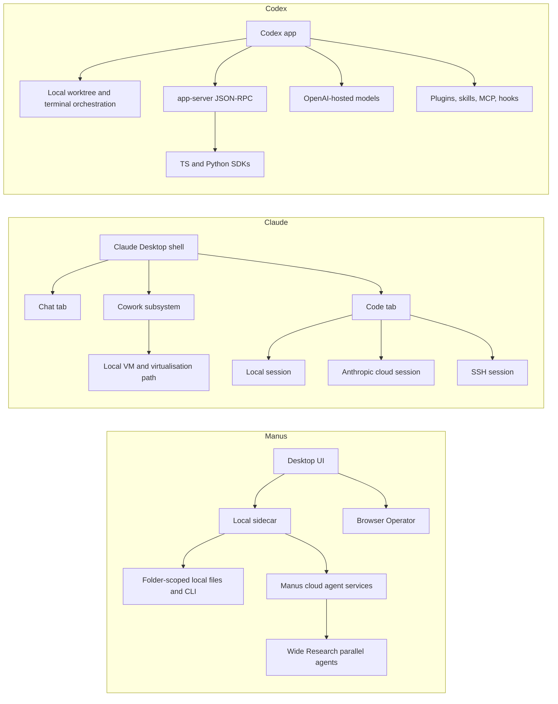

# macOS Desktop Agentic Tools Compared

## Executive summary

Among the three products, **Claude Desktop** is presently the most complete **macOS-native “AI workbench”** for mixed chat, long-running agent work, and code-centric workflows. Its current desktop stack is unusually broad: the app exposes **Chat, Cowork, and Code tabs**; the Code surface supports **local, cloud, and SSH execution**; Remote Control keeps local sessions running on the user’s machine while a phone or browser acts as a remote window; and Anthropic now documents **enterprise PKG deployment**, **Intel/Apple Silicon universal binaries**, shared config files, local scheduled tasks, and a beta sandboxing model rooted in **macOS seatbelt** for command isolation. The supplied static analyses strengthen that picture by showing a split macOS architecture with an Electron shell plus a more specialised Cowork subsystem using macOS virtualisation primitives. For developers and enterprises that need the broadest combination of local code access, visual diff/review, multi-session management, and admin control, Claude currently looks the most operationally mature on macOS.

**Codex** is the strongest option when the requirement is a **programmable local coding agent** with a serious automation surface. OpenAI’s current documentation shows a desktop app with **separate Intel and Apple Silicon downloads**, fine-grained **permission profiles**, **local environments**, **project/worktree automations**, **app-server JSON-RPC transports**, **TypeScript and Python SDKs**, **AGENTS.md instructions**, **skills**, **subagents**, **plugin packaging**, and **managed macOS MDM configuration** via the `com.openai.codex` preference domain. Its docs also make the local/cloud boundary explicit: the app works on your machine, while model execution and many agent features remain OpenAI-hosted unless you are using local shell/tooling against your own project. The supplied reverse-engineering reports add important platform detail not yet fully surfaced in the public docs, including **Sparkle-based updating**, local memory components such as **Chronicle**, and an AppleScript bridge in the inspected build. For software engineering teams that want a codified, scriptable agent platform with strong policy controls, Codex is the most “developer platform first” of the three.

**Manus Desktop** is the most ambitious in terms of **high-level task delegation** and cross-application orchestration, but it is also the least transparent of the three on macOS-specific implementation details. Official Manus docs clearly describe an autonomous agent with its own **sandboxed virtual computer**, **persistent file system**, **internet access**, **parallel “Wide Research” multi-agent execution**, **local-browser operation**, **folder-scoped desktop access**, **MCP connectors**, **custom MCP servers**, **Zapier**, **Slack**, and a **REST API** with tasks, projects, files, skills, agents, and webhooks. Its security pages advertise **SOC 2 Type I/II**, **ISO 27001**, and **ISO 27701**. However, public Manus docs currently say much less than Anthropic or OpenAI about macOS packaging details such as notarisation status, Intel support, sandbox entitlements, or admin deployment tooling. The supplied static analyses therefore matter more for Manus than for the other two products; they indicate an Electron-style desktop shell with a local sidecar and updater, and they suggest that the inspected macOS build was more opaque and less enterprise-instrumented than Claude or Codex. Manus is the most attractive choice when the primary goal is “delegate an end-to-end task”, not “build a controlled local agent platform”.

The biggest strategic distinction is this: **Manus optimises for delegated outcomes**, **Claude optimises for supervised collaborative agency**, and **Codex optimises for programmable engineering agency**. That difference shows up repeatedly in architecture, permissioning, observability, deployment controls, and the maturity of APIs/SDKs.

## Scope, methodology, and assumptions

This report synthesises two evidence classes. First, it uses the user-supplied static analyses as **base knowledge** for binary structure, macOS packaging, reverse-engineered components, and implementation clues that are often absent from vendor marketing or surface docs. Second, it augments that base with current **official documentation, release notes, pricing pages, API docs, security docs, and enterprise admin docs** from Anthropic, OpenAI, Manus, and Apple. Where official documentation and static analysis differ in level of detail, I treat official docs as authoritative for documented features and policy, while using the static analyses to illuminate implementation details that vendors do not publicly spell out.

A key limitation is that **macOS notarisation, entitlements, helper-process sandboxing, exact updater channels, and Electron/runtime dependency versions can change release-to-release**, while vendors rarely expose these details on public product pages. For that reason, this report distinguishes between what is **officially documented** and what was **observed in the inspected builds** contained in the supplied analyses. Where the public docs do not specify a property such as notarisation, I say so explicitly and provide reproducible verification commands later in the report rather than pretending the property is stable.

The comparison below uses the most concrete currently documented release markers available. For Claude, current docs reference **Claude Desktop v1.2581.0 or later** for pane layout/terminal/file features, **Claude Code v2.1.51+** for Remote Control, **v2.1.79+** for Remote Control from VS Code, and **v2.1.176** for some title/localisation behaviour. For Codex, current docs describe a permission-profile transition where **Codex 0.138.0 or later** matters for enterprise rollout compatibility; the current model lineup also includes **gpt-5.5**, **gpt-5.4**, **gpt-5.4-mini**, and **gpt-5.3-codex-spark**. For Manus, the public docs are feature-oriented rather than version-oriented, so the most precise release-grounding comes from the supplied static analyses of inspected macOS builds.

## Architecture and runtime design

The products differ most at the level of **where the agent loop runs**, **how local tools are exposed**, and **how strongly the local runtime is isolated**. The simplified model below captures the current centre of gravity.



Manus describes itself as an **autonomous general AI agent** that, unlike a conventional chatbot, operates inside a **complete sandbox environment** with **internet access**, a **persistent file system**, and the ability to **install software and create custom tools**. Its “Wide Research” feature formalises that notion by decomposing a task and launching **hundreds of independent agents in parallel**, later synthesising the results. The desktop extension of that model is **My Computer**, which moves Manus from a cloud-only virtual worker to a hybrid local/cloud operator with folder-scoped access and command-line execution on the user’s machine. The supplied reverse-engineering notes fit this positioning: they describe a desktop shell with a local sidecar and message-passing architecture rather than an offline local-model stack.

Claude’s architecture is more explicitly **multi-surface**. Anthropic’s desktop docs state that the desktop app has **three tabs: Chat, Cowork, and Code**. The Code tab can **run on your machine, in the cloud, or over SSH**; Remote Control lets a local Claude Code process continue running on the user’s machine while web/mobile surfaces merely proxy the session; cloud execution uses **isolated Anthropic-managed VMs** with network controls, credential proxying, branch restrictions, audit logging, and automatic cleanup. The supplied analyses add an important macOS-specific layer: the current desktop macOS build appears to be split between an Electron-based shell and a more specialised Cowork subsystem that uses **macOS Virtualization.framework** and related local services. Put plainly, Claude is not one runtime but several coordinated runtimes under a single desktop shell.

Codex is now the cleanest example of a **local control plane over remote intelligence**. The app is a desktop surface for local tasks, but the public docs make clear that it sits alongside the **CLI**, **IDE extension**, **web**, **SDK**, and **app-server**. The app-server exposes Codex via **JSON-RPC** over **stdio**, **Unix sockets**, or an experimental **WebSocket** transport; the Python SDK controls the local app-server over JSON-RPC and ships with a pinned Codex runtime; the TypeScript SDK offers a higher-level server-side interface. At the app level, Codex is heavily built around **worktrees**, **local environments**, **permissions**, **plugins**, **skills**, **hooks**, **AGENTS.md**, **subagents**, and **remote connections** back into a connected host. The supplied static analyses are directionally consistent with that official picture, describing a desktop shell that talks to a local app-server and integrates additional memory and browser-control subsystems.

A practical consequence of these architectures is that **none of the three is a genuinely offline local-first LLM desktop agent in the traditional sense**. All three can operate deeply on the local machine, but the reasoning models and most high-value agent intelligence remain fundamentally cloud-backed. Manus is the most cloud-agent-centred, Claude is the most explicitly hybrid, and Codex is the most locally programmable while still relying on OpenAI-hosted models.

## macOS packaging, installation, updates, and platform integration

### Comparison matrix

| Product | Current macOS distribution picture | Apple Silicon vs Intel | Update mechanism | Sandboxing and isolation on macOS | Notarisation visibility |
|---|---|---|---|---|---|
| **Claude Desktop** | Official desktop download; enterprise **PKG** support for managed rollout. | **Universal build** for Intel and Apple Silicon. | Public docs mention manual **Check for Updates** and also say the app **auto-updates on launch**. | Claude Code sandboxing on macOS is built on **seatbelt**; cloud sessions run in Anthropic VMs; supplied analyses indicate Cowork uses macOS virtualisation. | Public docs reviewed do **not** prominently document notarisation; verify locally. |
| **Codex** | Official desktop download for macOS and Windows. | Separate **Apple Silicon** and **Intel** downloads. | Public docs focus on settings and deployment; supplied analyses report **Sparkle** in the inspected build. | Fine-grained permission profiles on macOS; computer use requires **Screen Recording** and **Accessibility**; supplied analyses describe a local app sandbox plus helper components. | Public docs reviewed do **not** foreground notarisation; verify locally. |
| **Manus Desktop** | Official macOS desktop download exists, but platform-packaging detail is sparse. | Official docs reviewed do **not** say; supplied analyses suggest the inspected build was **arm64-oriented / Apple Silicon first**. | Public docs reviewed do not document the updater; supplied analyses indicate a desktop updater path. | Folder-scoped access, explicit command approvals, browser/session approvals; no public equivalent of Codex permission profiles or Claude seatbelt docs. | Public docs reviewed do **not** specify notarisation; verify locally. |

Claude is the best documented of the three for **macOS deployment mechanics**. Anthropic now explicitly documents **PKG installers for Mac** for enterprise deployment, version control of updates, automatic SSO for managed devices, and pre-approval of desktop extensions. The Code tab docs also state that the macOS build is **universal for Intel and Apple Silicon**, and the desktop docs expose a conventional “Check for Updates” flow. That combination makes Claude the easiest of the three to slot into a standard macOS fleet-management playbook.

Codex is nearly as strong, but in a more engineering-led way. OpenAI documents **separate Apple Silicon and Intel downloads**, and its managed-configuration docs go further than Claude’s public docs in spelling out **macOS MDM keys**, specifically the `com.openai.codex` preference domain with `config_toml_base64` and `requirements_toml_base64` payloads. That is unusually concrete and gives enterprise Mac admins a real configuration surface rather than just a packaging story. However, Codex’s public docs are less explicit than Anthropic’s about app-level auto-update semantics; the supplied static analysis fills that gap for the inspected build by identifying **Sparkle**.

Manus is operationally the least transparent on macOS. The official site confirms a macOS desktop app and documents “My Computer” folder authorisation, but the public docs reviewed here do not provide a comparable statement about **Intel vs Apple Silicon**, **PKG/MDM deployment**, **notarisation**, or **update channels**. The supplied analyses become correspondingly more important: they indicate that the inspected build used a desktop-shell-plus-sidecar architecture and are the best source here for package-level detail. In other words, Manus can be deployed on macOS, but it is the least enterprise-legible of the three today.

On **platform integration**, the differences are similarly sharp. Claude documents integration with the **integrated terminal**, **embedded preview/browser**, **Finder**, **keyboard shortcuts**, shared `~/.claude.json` / `.mcp.json` / `claude_desktop_config.json`, macOS **Accessibility** and **Screen Recording** for computer use, and macOS logging through **Console.app**. Codex documents **notifications**, a settings-driven keyboard-shortcut system, **Screen Recording** and **Accessibility** for computer use and Appshots, a local `.codex` project folder, app-server/SDK control, and—via the supplied analyses—an observed **AppleScript bridge** in the inspected build. Manus officially documents browser and folder access, local CLI execution, and browser extension control, but I did not find equivalent official AppleScript, Shortcuts, Spotlight, or structured macOS automation APIs in the reviewed Manus docs.

## Agent features, automation, extensibility, and developer surfaces

Claude’s strongest current differentiator is the breadth of its **agent-work modalities**. The desktop app consolidates conversational chat, “Cowork” for longer-running agentic work, and the “Code” environment for software development in one shell. The Code tab supports **parallel sessions**, **side chats**, **visual diff review**, **integrated terminal**, **file editor**, **app preview**, **computer use**, and execution **on your machine, in the cloud, or over SSH**. Remote Control then bridges those local sessions to the browser and mobile app without moving the runtime itself into the cloud. Anthropic’s Agent SDK extends the same agent loop into Python and TypeScript libraries with built-in tool execution, MCP connectivity, hooks, checkpointing, OpenTelemetry, and support for plugins and skills.

Claude also has the clearest documented **multi-surface memory/configuration story** among the three. Desktop and CLI explicitly share `CLAUDE.md`, `CLAUDE.local.md`, `~/.claude.json`, `.mcp.json`, and permission/settings files; Desktop can also import MCP servers from the desktop chat app config into Code sessions. Scheduled tasks can run **locally** on the user’s Mac while the app is open and the machine awake, or analogous “remote routines” can run in the cloud. This is a more coherent “single product, multiple execution loci” model than Manus currently exposes, and a less explicitly programmable but more integrated model than Codex.

Codex is stronger where **programmability** and **distribution of custom agent behaviour** matter. Official docs now cover **skills**, **plugins**, **hooks**, **AGENTS.md**, **subagents**, **local environments**, **project actions**, **remote connections**, **the app-server**, **the SDK**, and non-interactive/scriptable flows. Skills live in repo-, user-, admin-, or system-level locations; plugins package **skills, apps, MCP servers, and lifecycle hooks**; the app-server exposes a concrete transport layer for external control; AGENTS.md provides layered project instructions; and subagents allow explicit parallel specialist agents under one orchestrator. This is the richest extension surface of the three products if the goal is to make the agent itself into a programmable substrate.

Codex’s automation model is also more operationally explicit than Claude’s. Local **automations** run only when the machine is powered on, Codex is running, and the project still exists on disk; they can run in the local project or a new **worktree** in the background. Local environments store shared setup and action definitions in the project’s `.codex` folder, which can be checked into Git. This is exactly the sort of “codified local agent behaviour under source control” that software teams often want.

Manus’s agent features are the most overtly **outcome-first**. “Wide Research” uses a task-decomposition and parallel-agent architecture; Browser Operator can use either the user’s **local browser session** or an **isolated cloud browser**; My Computer gives Manus local file/application/CLI authority under folder-scoped permissions; and the integrations story covers **MCP connectors**, **custom MCP servers**, **Zapier**, **Slack**, premium data sources, and a REST API with **tasks, projects, files, webhooks, skills, and agents**. That is a serious orchestration surface, but it is operationally less inspectable than Codex’s SDK/app-server/hook stack and less clearly unified with a local developer workflow than Claude Code.

### Feature-by-feature strengths and weaknesses

| Product | Principal strengths | Principal weaknesses |
|---|---|---|
| **Claude Desktop** | Best integrated **desktop workbench**; strong local/cloud/SSH flexibility; documented enterprise PKG rollout; shared config across surfaces; good human-in-the-loop UX; remote control without moving local runtime; mature security docs. | Extension/deployment model is less programmatic than Codex’s app-server/SDK/plugin stack; some of the most interesting isolation details live in blog posts and reverse engineering rather than top-level product docs; full computer use is unavailable on Team/Enterprise according to current docs. |
| **Codex** | Best for **programmable engineering agency**; strongest local automation/control surfaces; first-class SDK/app-server; strong policy model; AGENTS.md, hooks, skills, plugins, subagents, MDM, governance, and auditability. | Broader “general desktop cowork” story is weaker than Claude’s; public docs are excellent for engineering surfaces but less expressive for consumer-style collaboration; some local-desktop implementation details still require static analysis to understand fully. |
| **Manus** | Best at **delegation-first** workflows; strongest official claim to broad autonomous execution and large-scale parallel research; easy-to-understand connectors and browser models; very good high-level product ambition. | Least transparent macOS platform engineering; weaker public detail on packaging, deployment, admin policy, and debugging; less obviously suited to strict enterprise Mac governance than Claude or Codex. |

## Security, privacy, reliability, observability, and performance

All three systems are fundamentally **permissioned agent runtimes**, so their real security posture depends less on “the model” and more on **sandbox boundaries, network controls, update-chain trust, connector/plugin trust, and the clarity of approval UX**. Claude documents this most directly. Claude Code is **read-only by default**, asks for approval for edits and most commands, has a **sandboxed bash tool** for filesystem and network isolation, stores credentials in the **macOS Keychain when available**, warns about MCP trust, and distinguishes between local sessions, Remote Control sessions, and cloud-executed sessions in Anthropic-managed VMs with audit logging and cleanup. Anthropic also explicitly states that Team plan content is **not used for model training by default**, and the Enterprise plan adds audit logs, a compliance API, custom retention controls, network-level access control, IP allowlisting, and a HIPAA-ready offering.

Codex’s security model is more policy-engineered. Permission profiles on macOS can define **least-privilege filesystem and network rules**, with built-in `:read-only`, `:workspace`, and `:danger-full-access` profiles; automatic approval review can route eligible permission requests to a reviewer agent; managed configuration can constrain allowed approval/sandbox policies; and governance exports expose **Compliance API audit records** for ChatGPT-authenticated Codex activity with up to **30 days** of retention. On the data side, OpenAI’s platform docs state that **API data is not used to train models unless the customer explicitly opts in**, and the data-controls docs spell out retention, Zero Data Retention boundaries, ephemeral hosted-container state, and Enterprise Key Management. This is the most fully articulated policy stack among the three.

The supplied Codex static analyses add nuance that official docs do not yet fully foreground: the inspected build reportedly included **local telemetry/instrumentation components**, a **Sparkle updater**, and memory-related local storage. Those observations do not negate the policy docs, but they matter for enterprise review because they imply that Codex should be threat-modelled not just as a networked LLM client but as a multi-component local desktop platform with background services and telemetry paths.

Manus’s public security posture is clearer on compliance badges than on runtime specifics. Manus publicly advertises **SOC 2 Type I**, **SOC 2 Type II**, **ISO 27001:2022**, and **ISO 27701:2019**, along with encryption, penetration testing, restricted key access, and customer-data deletion on leaving. At the feature level, Manus documents **folder-scoped access**, **per-command approval**, **Browser Operator session approval**, action logging, and a statement that it does **not store your passwords**. However, I found much less detail than with Anthropic or OpenAI on enterprise-grade agent governance such as configurable local network policy, structured audit export, or macOS-specific policy payloads.

On **reliability and state**, Claude and Codex again lead. Claude documents session persistence, multiple concurrent sessions, worktree isolation, and remote reconnection after sleep/network interruption in Remote Control. Codex documents worktrees, background automations, local environment setup, AGENTS.md layering, thread continuation, appshots stored locally in session files, and explicit remote-host reuse of the host’s projects, files, plugins, and policies. Manus clearly supports persistent long tasks and scheduled work, but its official docs expose less about crash recovery semantics, log export, or replay/debugging.

On **observability and debugging**, Codex has the deepest formal instrumentation surface, because it exposes **app-server transports**, SDKs, hooks, managed config, and policy/export surfaces. Claude also has a meaningful observability story through **verbose transcript view**, **Console.app** logs on macOS, issue reporting, structured settings, and OpenTelemetry in the Agent SDK. Manus, by contrast, surfaces transparency to end users mainly through **Browser Operator action logs** and workflow-level outputs rather than a rich admin/developer telemetry fabric in the public docs.

On **performance and resource usage**, none of the vendors currently publishes a rigorous, directly comparable set of macOS desktop **CPU/GPU/RAM/latency benchmarks** for the full desktop products. What can be said with confidence is structural. Manus, Claude, and Codex all rely primarily on **remote model execution**, so local CPU and memory overhead on macOS mostly arise from the desktop shell, local sidecars/helpers, browsers/previews, worktree/setup scripts, screen capture/OCR, and any commands, dev servers, or tools the agent launches. Claude’s Cowork/virtualisation path and Codex’s appshots/computer-use/local-environment features can increase local overhead relative to a pure chat client; Manus’s “use your local GPU” pathway means performance can depend heavily on which local workloads you allow it to run. Because vendor-published app-level benchmarks are sparse, the most defensible course is to benchmark the actual installed builds locally; a reproducible harness is included below.

I did **not** locate a strong, vendor-maintained public list of product-specific macOS **CVEs** for Manus Desktop, Claude Desktop/Code, or the Codex app during this research. The more relevant issue pattern today is not classic memory-unsafety CVEs exposed by the vendors, but operational weaknesses around **approval fatigue**, **prompt injection**, **MCP/plugin trust**, **browser/control surfaces**, and **update-chain hygiene**. Anthropic explicitly frames approval fatigue as a design problem that the new sandbox runtime tries to solve, and both Anthropic and OpenAI warn that MCP servers/plugins are not automatically trustworthy.

## Commercial, compliance, and deployment guidance

Commercially, Claude is the most straightforward all-in-one purchase if the buyer wants a bundled desktop/chat/code product. Anthropic’s pricing page states that **Pro includes Claude Code and Claude Cowork**, while Team and Enterprise include Claude Code/Cowork plus enterprise capabilities such as SSO, admin controls for connectors, desktop deployment, audit logs, and compliance controls. That makes Claude attractive for organisations that want a single vendor motion spanning knowledge work, chat, and code assistance.

Codex’s pricing model is more segmented by surface and identity type. OpenAI’s pricing docs distinguish **ChatGPT Plus, ChatGPT Pro, ChatGPT Business, Enterprise/Education, and API-key** access, and explicitly map which Codex surfaces and features are available on which plans. That is powerful but can be commercially and operationally more complex than Claude. On the other hand, it aligns well with engineering organisations that want to mix **interactive app use**, **CLI/IDE use**, and **trusted automation via tokens/SDKs** under one platform.

Manus’s pricing is presently less publicly legible at a detailed enterprise-control level than either Claude’s or Codex’s. The official docs describe a **credit-based** Free / Pro / Team structure, and the public site advertises SSO and API access, but I found much less current public detail on seat-level policy controls, admin observability, and contract/deployment mechanics. Manus may still be commercially compelling for high-output delegation workflows, but it demands more due diligence from enterprise buyers.

For **individual users**, the recommendation is simple. Choose **Manus** if the goal is “give one prompt, get a finished artefact or delegated workflow”. Choose **Claude Desktop** if the goal is to move fluidly between chat, research/cowork, and code inside one polished desktop environment. Choose **Codex** if the goal is to automate, script, and govern coding work locally on macOS with the deepest extension surface.

For **developer teams**, the best fit is usually **Codex or Claude**, depending on whether human supervision or automation depth is more important. Pick **Claude** if you want an easier on-ramp, strong visual review, integrated preview, local/cloud/SSH flexibility, and a more collaborative “assistant alongside me” interaction model. Pick **Codex** if you want AGENTS.md, hooks, app-server, policy files, skills/plugins, MDM, and strongly source-controlled automation. Manus is credible for research-heavy or cross-tool operations, but its relative lack of public Mac governance detail makes it a harder default for serious source-code environments.

For **enterprise deployment**, my recommendation is more opinionated. If regulated or security-sensitive Mac fleets are central, **Claude Desktop** currently offers the best balance of feature breadth, human-supervised agency, explicit security language, and public deployment clarity. **Codex** is the better choice when the enterprise is prepared to treat the agent as a policy-managed developer platform and can exploit MDM, managed TOML payloads, permission profiles, audit exports, and SDK/app-server control. **Manus** should be treated as a high-potential but higher-diligence platform: strong on product vision, weaker on public operational transparency.

## Reproducible macOS verification tests and open questions

The most reliable way to evaluate these tools on **Intel and Apple Silicon Macs** is to verify current binaries directly rather than relying only on vendor pages. The following commands are safe, reproducible, and useful for procurement, security review, and performance benchmarking.

### Packaging, code signing, notarisation, and architecture

```bash
APP="/Applications/Claude.app"   # or Manus.app / Codex.app

echo "== Gatekeeper assessment =="
spctl -a -vv "$APP"

echo "== Code signature =="
codesign -dv --verbose=4 "$APP" 2>&1 | sed -n '1,40p'

echo "== Stapled notarisation ticket =="
xcrun stapler validate "$APP"

echo "== Architectures =="
lipo -archs "$APP/Contents/MacOS/"* 2>/dev/null || file "$APP/Contents/MacOS/"*
```

These commands establish what the vendor sites often omit publicly: whether the current build passes Gatekeeper, whether a notarisation ticket is present, which Team Identifier signed it, and whether the executable is **universal**, **arm64-only**, or **x86_64-only**. Use the same script for each product before fleet rollout. Apple’s code-signing and notarisation tooling is the correct source of truth for the installed binary, not the marketing site.

### Process model, helper processes, sockets, and local listeners

```bash
APP_NAME="Codex"   # or Claude / Manus

echo "== Running processes =="
pgrep -alf "$APP_NAME|codex|claude|manus"

echo "== Open files and sockets =="
lsof -nP -c "$APP_NAME" | sed -n '1,120p'

echo "== Listening TCP/Unix sockets =="
lsof -nP -iTCP -sTCP:LISTEN | egrep "Claude|Codex|Manus|codex|claude|manus" || true
lsof -U | egrep "Claude|Codex|Manus|codex|claude|manus" || true
```

Use this to confirm whether the app exposes **local TCP listeners**, **Unix sockets**, or helper processes. This is particularly useful for validating Codex app-server usage, Manus sidecar behaviour, and Claude multi-process behaviour against the supplied analyses.

### Filesystem access and permission scope

```bash
sudo fs_usage -w -f filesystem "Claude"    # repeat with Codex / Manus
# In another terminal, trigger a local task that reads/writes files.
# Stop with Ctrl-C after ~30 seconds.
```

For a lighter-weight view of opened paths:

```bash
sudo opensnoop -n Claude
sudo opensnoop -n Codex
sudo opensnoop -n Manus
```

This is the fastest way to test claims about **folder-scoped access**, `.codex` / `.claude` project-state writes, preview temp files, appshot storage, and whether the product respects the workspace roots you expect.

### Network egress and telemetry review

```bash
sudo tcpdump -i any -n host api.openai.com or host api.anthropic.com
# Run a small prompt; inspect only destination/IP metadata unless you have approval for deeper capture.
```

For endpoint discovery without packet capture:

```bash
lsof -nP -i -c Claude
lsof -nP -i -c Codex
lsof -nP -i -c Manus
```

This is useful for confirming whether a “local” workflow still calls vendor APIs, whether any plugin/MCP traffic is leaving the machine, and whether additional telemetry endpoints appear in practice. It is especially relevant to the Codex and Claude policy stories, and to reviewing the telemetry observations in the supplied Codex analysis.

### Idle and active resource usage benchmark

```bash
#!/usr/bin/env bash
set -euo pipefail

PROC_REGEX="${1:-Claude|Codex|Manus}"
SAMPLES="${2:-30}"

echo "timestamp,pid,pcpu,pmem,rss_mb,command"
for i in $(seq 1 "$SAMPLES"); do
  ps -Ao pid,pcpu,pmem,rss,command \
    | egrep "$PROC_REGEX" \
    | egrep -v "egrep|bash" \
    | awk -v ts="$(date +%s)" '{rss_mb=$4/1024; printf "%s,%s,%s,%s,%.1f,%s\n", ts,$1,$2,$3,rss_mb,substr($0,index($0,$5))}'
  sleep 2
done
```

Run the script once with the app idle and once during a standardised scenario, such as: open a repo, ask for a code explanation, run one test command, open preview/browser, and complete one automation. This will not benchmark model inference latency directly, because inference is remote, but it will benchmark local CPU/RAM overhead, helper-process fan-out, and preview/browser/computer-use side effects.

### Common scenario latency benchmark

Use the same task on all three products on both Intel and Apple Silicon:

```text
Task: "Open the same local Git repository; describe the architecture; run the repo's test command; fix one trivial lint issue; produce a diff summary."
```

Record:

- time to first UI-ready state after launch;
- time to first response token;
- time to first proposed plan;
- time to first filesystem change;
- time to completed diff;
- number of approval prompts;
- peak RSS;
- number of spawned helper processes.

This benchmark is more decision-useful than a synthetic token-latency chart because it captures the true cost of **agent orchestration + local tool execution + approval UX** on macOS.

### Open questions and limitations

Several questions remain genuinely open because the public documentation is incomplete and the relevant properties can change per build. I did not find a consistently documented public statement from the vendors on **notarisation status**, **entitlement sets**, or **helper-process sandboxing** for every current macOS release; those must be verified on the installed build. Manus in particular remains under-documented on enterprise Mac deployment compared with Claude and Codex. Codex and Claude are much stronger on policy and deployment docs, but their reverse-engineered local components still deserve direct validation in high-trust environments.

If I had to make one recommendation per buyer type today, it would be this: **individual delegation → Manus; interactive professional/developer workstation → Claude Desktop; programmable engineering platform and enterprise-controlled local agent automation → Codex**. The strongest all-rounder for Mac fleets is Claude; the strongest technical substrate for serious agent engineering is Codex; the strongest “let the agent go do the work” experience is Manus.