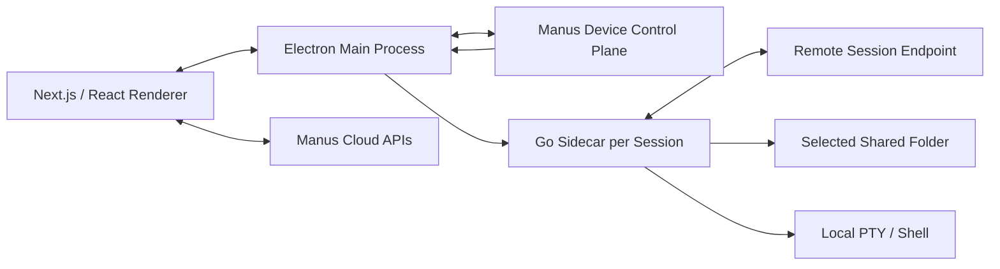
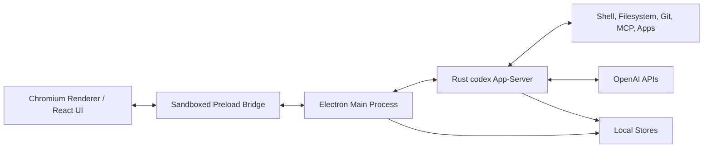
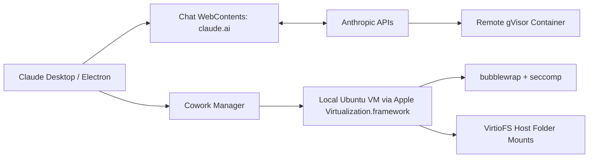

# Comparison of Manus, Codex, and Claude Desktop macOS Applications

**Scope:** macOS desktop applications and their architecture, local execution model, sandboxing/isolation, cloud dependency, and security posture.

**Primary sources:** uploaded reverse-engineering and research notes for Manus, Codex, Claude Desktop, and Claude Code sandboxing.

---

## Executive Summary

Although Manus, Codex, and Claude Desktop all present as AI desktop applications on macOS, they have materially different architectures.

**Manus** is best understood as a cloud-first web client wrapped in Electron, with a local Go sidecar that enables the “My Computer” capability. The Manus cloud control plane tells the desktop app which local folder or session to activate, and Electron starts a sidecar process that exposes scoped filesystem and terminal capabilities over signed WebSocket connections.

**Codex** is closer to a local agent shell. Electron provides the desktop UI and native integration, while a bundled Rust `codex` app-server owns the agent/session protocol, tools, approvals, local state, and communication with OpenAI services.

**Claude Desktop** has two distinct execution models. Normal Chat is essentially Claude’s web app loaded inside an Electron WebContents, with tool/code execution happening remotely in Anthropic infrastructure. The Cowork feature is different: it runs a full local Ubuntu VM using Apple Virtualization.framework.

---

## One-Line Comparison

| App | Architectural Model |
|---|---|
| **Manus** | Cloud agent controlling a local sidecar for selected folders and terminal access |
| **Codex** | Local Rust agent backend wrapped by Electron and connected to OpenAI services |
| **Claude Desktop** | Claude web app plus separate local VM execution environment for Cowork |

---

## High-Level Architecture

| Dimension | Manus | Codex | Claude Desktop |
|---|---|---|---|
| **Desktop framework** | Electron | OpenAI “Owl” Electron runtime / Electron-based | Electron |
| **Primary UI** | Static Next.js / React app | React / web UI bundled in app | Claude web UI loaded from `claude.ai` |
| **Main local backend** | Go sidecar | Rust `codex` app-server | Cowork: local Linux VM; Chat: no local backend execution |
| **Main cloud backend** | Manus cloud services at `api.manus.im` | OpenAI services | Anthropic services |
| **Local execution role** | Sidecar provides scoped filesystem and PTY access | App-server orchestrates tools, shell, filesystem, Git, MCP/apps | Cowork executes in local VM; Chat executes remotely |
| **Inference location** | Appears cloud-based | OpenAI cloud models; local backend handles orchestration | Anthropic cloud models |
| **Best mental model** | Cloud-controlled local bridge | Local agent runtime with cloud model calls | Web app plus optional local VM |

---

## Process Architecture

### Manus

Manus is a three-part desktop client:

1. **Electron main process**  
   Handles application lifecycle, windows, login/deep-link handling, updates, local storage, OS dialogs, permissions, and process management.

2. **Next.js / React renderer**  
   Provides the user-facing interface and talks directly to Manus cloud APIs.

3. **Go sidecar**  
   Powers “My Computer.” Electron starts one sidecar process per active session/folder. The sidecar connects outward to a signed WebSocket URL and exposes filesystem and PTY/terminal operations rooted at the selected shared folder.

### Codex

Codex uses Electron as the desktop shell, but the local Rust backend is central to the product.

1. **Electron main process**  
   Owns windows, menus, native integration, authentication, browser automation, runtime selection, and lifecycle management.

2. **Renderer and preload bridge**  
   Displays the UI and communicates with the privileged main process through a narrow IPC surface.

3. **Rust `codex` app-server**  
   Owns threads, turns, tools, configuration, authentication, local state, approval/sandbox policy, and communication with OpenAI APIs.

### Claude Desktop

Claude Desktop has two separate execution paths.

1. **Chat path**  
   The desktop app loads `https://claude.ai` in an Electron WebContents. Chat tool execution happens remotely in Anthropic infrastructure, typically inside server-side gVisor containers.

2. **Cowork path**  
   The Cowork feature runs a local Ubuntu VM using Apple Virtualization.framework. It uses virtio devices, NVMe-backed disk images, VirtioFS/FUSE host folder sharing, vsock RPC, and a controlled network stack.

---

## Local Execution Model

| Area | Manus | Codex | Claude Desktop |
|---|---|---|---|
| **Runs user commands locally?** | Yes, through sidecar PTY for selected sessions/folders | Yes, through Codex app-server/tool execution | Cowork: yes inside VM; Chat: no, remote |
| **Local filesystem access** | Scoped to selected shared folders for sidecar file operations; PTY may have broader real shell implications depending on command context | Workspace/filesystem access governed by Codex configuration, approvals, and sandbox policy | Cowork: VM filesystem plus explicit host folder mounts; Chat: no direct host filesystem |
| **Terminal model** | Real local shell/PTY exposed through sidecar | Tool/shell execution mediated by app-server | Cowork shell inside local Linux VM; Chat shell remote |
| **Persistence** | Local app state plus sidecar/session state | Local Codex state under user configuration/data directories | Cowork VM/session disks; Chat remote session storage |

---

## Sandboxing and Isolation

| Isolation Layer | Manus | Codex | Claude Desktop |
|---|---|---|---|
| **Renderer isolation** | Electron sandbox, context isolation, Node integration disabled | Sandboxed renderer/preload boundary with typed IPC | Electron WebContents with native bridge paths |
| **Backend isolation** | Sidecar is a local process, not a full VM/container boundary | App-server and tools run under Codex approval/sandbox policy; local process has significant privileges | Cowork uses full VM isolation; Chat uses remote gVisor containers |
| **Filesystem boundary** | Selected shared folder is the core intended boundary | Configurable workspace/tool boundaries and approvals | VM disk + VirtioFS mounts for Cowork; no host access for Chat |
| **Network boundary** | Cloud-controlled signed WebSocket sessions | App-server communicates with OpenAI and local tools as configured | Cowork uses vmnet/gVisor-style network controls; Chat remote policy |
| **Strongest isolation mode** | Scoped sidecar, but not a hard OS sandbox | Policy/approval sandboxing, not necessarily full OS isolation | Cowork full local VM; Chat remote container |

---

## Security Posture

### Manus

**Strengths**

- Renderer uses safer Electron defaults such as context isolation and disabled Node integration.
- Local file operations are designed around selected shared folders.
- Sidecar sessions use signed WebSocket URLs.
- Cloud/device configuration is explicit and session-based.

**Risks / concerns**

- The sidecar exposes real local terminal capabilities, which can be more powerful than scoped file APIs.
- The architecture depends heavily on cloud-issued device/session configuration.
- Broad desktop bridge and IPC surfaces require careful validation.
- The sidecar is a privileged local bridge rather than a full VM or OS-level sandbox.

### Codex

**Strengths**

- Clear separation between renderer, preload bridge, main process, and Rust app-server.
- App-server owns the agent protocol and can centralize approvals, policy, and sandbox behavior.
- Local backend architecture gives more control over tool orchestration and state management.
- Stronger local-agent model than a simple web wrapper.

**Risks / concerns**

- The app-server is powerful and locally privileged.
- Safety depends heavily on approval flows, sandbox configuration, and IPC correctness.
- The local backend can interact with files, shells, Git, browser automation, and MCP/apps.
- A complete audit would require deeper validation of all IPC handlers and backend policy enforcement.

### Claude Desktop

**Strengths**

- Chat execution is remote and does not directly expose the user’s Mac filesystem.
- Cowork uses a full local VM, which is a strong isolation boundary.
- Cowork combines VM isolation with guest-level process isolation and controlled networking.
- Host folder access is explicit through VM sharing mechanisms.

**Risks / concerns**

- The product has two very different execution paths, which can be confusing.
- Native bridges between `claude.ai` and the desktop app require careful trust boundaries.
- Cowork’s host folder sharing must be treated as a sensitive permission boundary.
- VM lifecycle, downloads, and update integrity are important to the trust model.

---

## Developer Experience Implications

| Use Case | Best Fit | Why |
|---|---|---|
| **Cloud agent working with a selected local folder** | Manus | Designed around cloud-orchestrated sidecar sessions and shared folders |
| **Deep local coding agent with persistent local state** | Codex | Bundled Rust app-server owns local agent/session/tool orchestration |
| **Strongly isolated local execution** | Claude Desktop Cowork | Full local Ubuntu VM provides the clearest hard boundary |
| **Minimal local exposure for chat/code execution** | Claude Chat | Execution happens remotely, not on the user’s Mac |
| **Precise control over local workspace and approvals** | Codex | Local backend can enforce agent/tool policy centrally |

---

## Trust Boundary Summary

### Manus

The main trust boundary is between:

- Manus cloud control plane;
- Electron main process;
- Go sidecar;
- selected local folders and PTY shell.

The most important question is: **what can the sidecar do within and beyond the selected shared folder, especially through terminal execution?**

### Codex

The main trust boundary is between:

- renderer UI;
- preload/IPC bridge;
- Electron main process;
- Rust app-server;
- local tools/filesystem;
- OpenAI services.

The most important question is: **how reliably do approvals, sandbox policy, and IPC validation constrain the powerful local app-server?**

### Claude Desktop

The main trust boundary depends on feature:

- **Chat:** user ↔ Claude web app ↔ Anthropic remote container.
- **Cowork:** user ↔ Electron app ↔ local VM ↔ shared host folders.

The most important question is: **which mode is being used, and whether host folders are shared into the Cowork VM.**

---

## Bottom Line

**Manus** is the most cloud-orchestrated of the three. It is a desktop bridge that lets the Manus cloud interact with a selected local environment through a sidecar.

**Codex** is the most local-agent-oriented. Its Rust app-server is a substantial local backend responsible for agent sessions, tools, state, and policy.

**Claude Desktop** has the strongest hard-isolation story when using Cowork because execution happens inside a full local VM. In regular Chat, execution is remote rather than local.

In short:

> **Manus = cloud agent + local sidecar**  
> **Codex = local agent backend + cloud model calls**  
> **Claude Desktop = web Claude + optional local VM**

---

## Source Notes

This comparison is based on the uploaded research files:

- `manus-research.md`
- `manus-research-by-codex.md`
- `manus-research-by-manus.md`
- `manus-research-by-claude.md`
- `codex-research-by-claude.md`
- `codex-research-by-codex.md`
- `research-claude-desktop-architecture.md`
- `research-claude-desktop-virtualization.md`
- `claude-code-sandbox.md`

