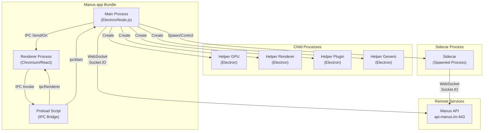
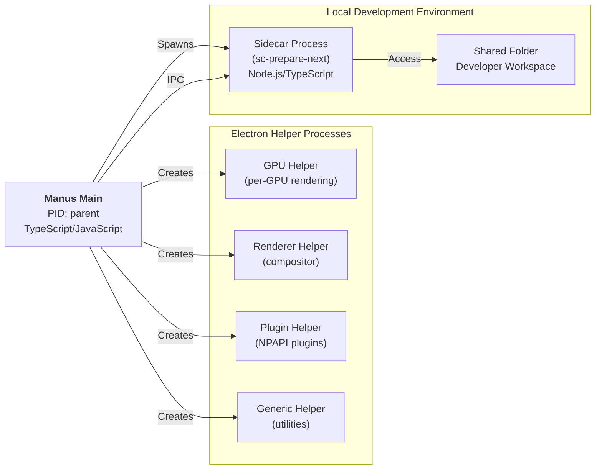
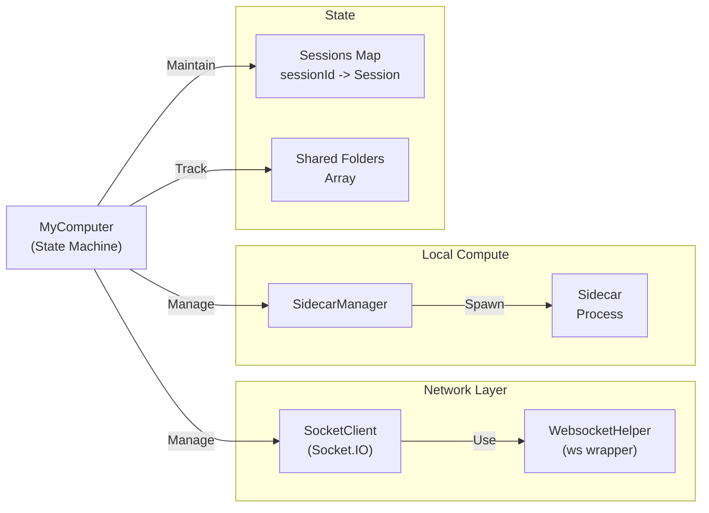
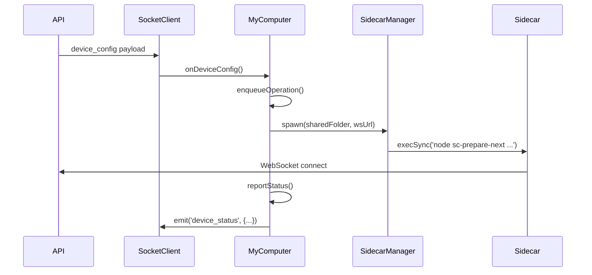
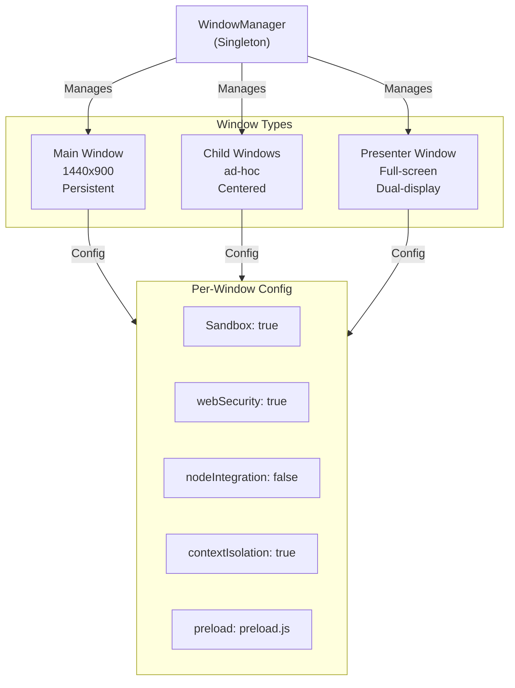
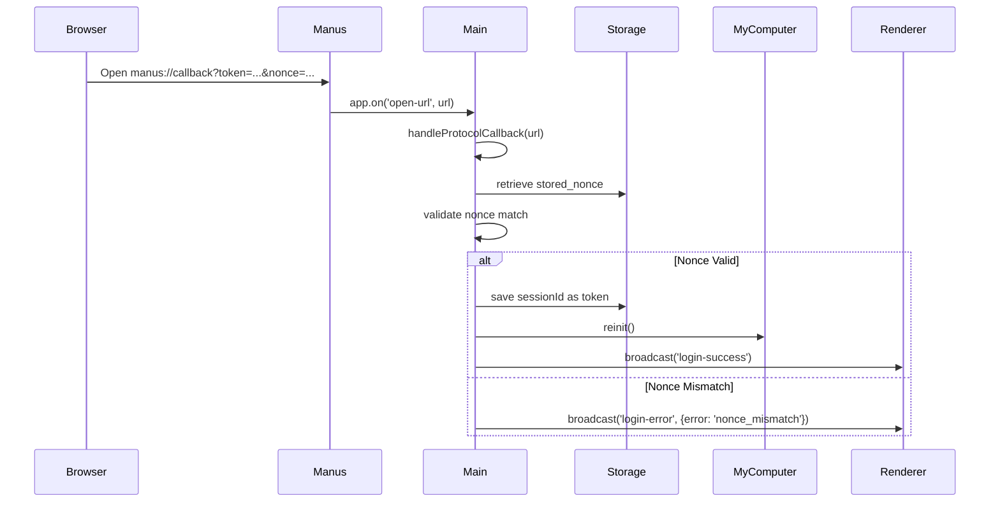
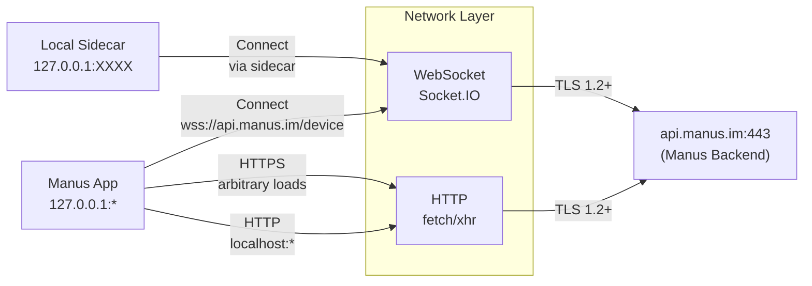
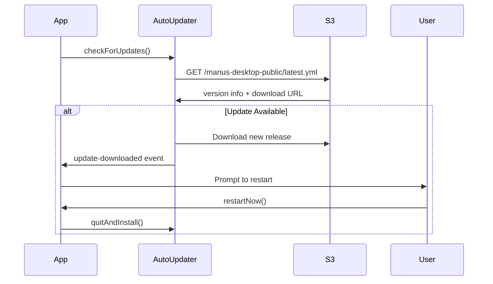
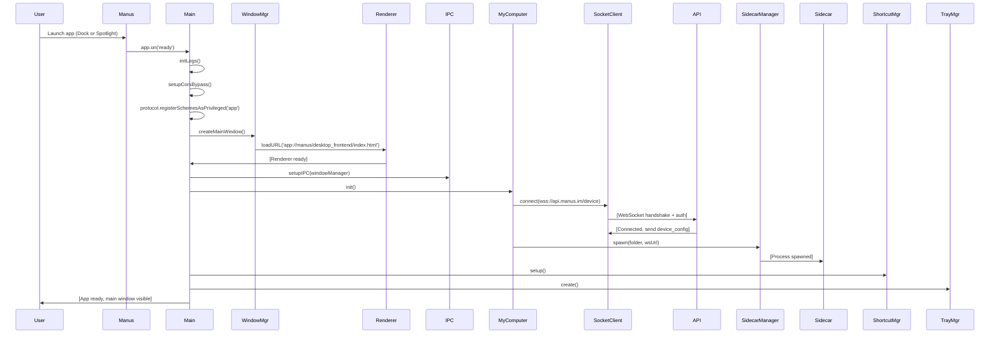
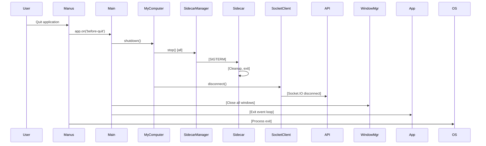

# Manus Desktop Application - Technical Overview

**Version:** 1.6.2  
**Bundle ID:** `im.manus.desktop`  
**Platform:** macOS 11.0+ (optimized for 14.5+)  
**Architecture:** arm64 (Apple Silicon native)  
**Base Framework:** Electron 31.x  
**Updated:** June 18, 2026  

---

## Executive Summary

Manus is a professional desktop application built with Electron that bridges local development environments with cloud-based services. The app enables developers to run code on local machines via a sidecar process while maintaining real-time synchronization with the Manus cloud platform (`api.manus.im`). The architecture emphasizes process isolation, secure IPC communication, and multi-window management.

---

## High-Level Architecture



---

## Process Hierarchy



---

## Core Modules & Responsibilities

### 1. **Main Process (`dist/index.js`)**

**Purpose:** Application lifecycle, window management, protocol handling, IPC coordination

**Key Responsibilities:**
- Electron app initialization and event loop
- Window creation and management (main, child, presenter windows)
- Protocol handler for deep links (`manus://...`)
- IPC setup and message routing
- Storage/localStorage management
- Auto-updater coordination (Squirrel + S3)
- System tray integration
- Keyboard shortcut management
- Navigation monitoring and history

**Dependencies:**
```
electron, electron-log, electron-updater, electron-window-state,
sc-prepare-next, socket.io, socket.io-client, ws, lodash-es
```

**Entry Point Flow:**
```
app.whenReady()
  ├─ initLogs()
  ├─ setupCorsBypass()
  ├─ protocol.handle('app://') - frontend asset loading
  ├─ windowManager.createMainWindow()
  ├─ setupIPC(windowManager)
  ├─ myComputer.init() - connect to api.manus.im
  └─ shortcutManager.setup()
```

---

### 2. **MyComputer Module (`dist/myComputer/myComputer.js`)**

**Purpose:** Device connection state machine, sidecar orchestration, session management

**Core Classes:**
- `MyComputer` - Main orchestrator (singleton)
- `SocketClient` - WebSocket handler (Socket.IO)
- `SidecarManager` - Sidecar process spawning/lifecycle

**Architecture:**


**Session Lifecycle:**
1. Connect to `wss://api.manus.im/device` with auth token + deviceId + deviceName
2. Listen for `device_config` messages (session config)
3. For each session: spawn sidecar → establish local connection
4. Maintain reconnect logic (max 20 attempts, 3s-30s backoff)
5. Forward device status → API (debounced, 3s window)

**Data Flow:**


**Configuration Application:**
- Debounced `applySessionConfig()` (200ms window)
- Session configuration includes folder mappings, permissions, settings
- Tracks `appliedConfigVersion` to prevent duplicate application

---

### 3. **SocketClient (`dist/myComputer/socketClient.js`)**

**Purpose:** Reliable WebSocket client abstraction over Socket.IO

**Features:**
- Auto-reconnection with exponential backoff
- Event listener queuing (pending listeners before connection ready)
- Device identification: `deviceId` (UUID generated on first run), `deviceName`
- Auth via token (session ID from OAuth/login flow)

**Event Handlers:**
```javascript
'device_config'   → device configuration from server
'connect'         → socket.io connected (tracks connectCount)
'disconnect'      → socket.io disconnected (reason logged)
'connect_error'   → connection error (status updated)
'error'           → socket.io error event
```

**Status Object:**
```typescript
{
  connected: boolean,
  lastError: string | null
}
```

---

### 4. **SidecarManager (`dist/myComputer/sidecarManager.js`)**

**Purpose:** Spawn and manage local sidecar processes for each shared folder

**Key Responsibilities:**
- Spawn child process running `sc-prepare-next` (prepare Next.js environment)
- Monitor process exit/error
- Graceful shutdown with SIGTERM → SIGKILL escalation
- Platform-specific cleanup (Windows vs Unix-like)

**Spawn Parameters:**
```bash
# Pattern:
node [sidecar-binary] [sharedFolder] [wsUrl]

# Example:
/usr/bin/node /app/node_modules/.bin/sc-prepare-next \
  /Users/user/projects/myapp \
  wss://api.manus.im/device
```

**Process Management:**
- Monitor for crashes → report to MyComputer
- Increment reconnect counter + schedule retry
- Max 20 reconnect attempts, exponential backoff (3s → 30s)
- Parent: Manus main process (PID tracking)

---

### 5. **WindowManager (`dist/windowManager/WindowManager.js`)**

**Purpose:** Lifecycle management for all BrowserWindow instances

**Window Types:**



**Key Methods:**
- `createMainWindow()` - app window with restored state
- `broadcast()` - send to all renderers
- `preWarmQuickAsk()` - pre-load Quick Ask window for UX
- `mainWindow.sendToRenderer()` - IPC send

**IPC Channels Handled:**
```javascript
'open-external'        → shell.openExternal(url)
'desktop-log'          → electron-log
'open-child-window'    → new BrowserWindow(1440x900)
'open-presenter-window'→ presenter mode (full-screen dual-display)
'get-presenter-data'   → retrieve data passed to presenter
'get-system-locale'    → i18n locale detection
'get-device-id'        → UUID (sync)
'read-file-as-array-buffer' → file system access
'show-folder-dialog'   → native folder picker
```

---

### 6. **Frontend (`frontend/out/`)**

**Technology Stack:** Next.js (static export)

**Page Structure:**
- `index.html` - main app shell
- `login.html` - OAuth/login screen
- `app.html` - primary UI (after auth)
- `quick-ask.html` - floating Ask window
- `presenter.html` - presentation mode
- `404.html` - not found fallback

**Asset Serving:**
- Protocol handler: `app://` scheme
- Custom handler in main process routes to `frontend/out/[path]`
- CORS bypass enabled (configured in `corsHelper.js`)
- CSP headers injected (configured in `cspHelper.js`)

**IPC API Exposed via Preload:**
```typescript
api = {
  on/off/send/sendSync/invoke(),           // generic IPC
  openExternal(url),                       // launch URL
  openChildWindow(url),                    // new window
  openPresenterWindow(url, data),          // presenter mode
  getPresenterData(),                      // retrieve presenter state
  getSystemLocale(),                       // i18n
  getDeviceId(),                           // hardware ID
  readFileAsArrayBuffer(path),             // file I/O
  showFolderDialog(),                      // native picker
  myComputer.reinit(),                     // reconnect device
  update.{getVersion, getStatus, checkForUpdates, restartNow}, // updater
  shortcut.{getConfig, update},            // keyboard shortcuts
  navigation.{getUrl, backToApp, onUrlChanged} // deep-link handling
}
```

---

## IPC Communication Architecture

```mermaid
graph TB
    Renderer["Renderer Process<br/>(React App)"]
    Preload["Preload Script<br/>(Bridge)"]
    Main["Main Process<br/>(Node.js)"]
    
    subgraph IPC_Types["IPC Methods"]
        Send["ipcRenderer.send()"]
        SendSync["ipcRenderer.sendSync()"]
        Invoke["ipcRenderer.invoke()"]
        On["ipcRenderer.on()"]
    end
    
    Renderer -->|synchronous| SendSync
    Renderer -->|async request| Invoke
    Renderer -->|fire & forget| Send
    Renderer -->|listen| On
    
    SendSync -->|→| Preload
    Invoke -->|→| Preload
    Send -->|→| Preload
    On -->|←| Preload
    
    Preload -->|ipcMain.on()| Main
    Preload -->|ipcMain.handle()| Main
    Preload -->|ipcMain.send()| Main
    
    Main -->|emit via BrowserWindow| Preload
    Preload -->|← listener| Renderer
```

**Security Model:**
- `contextIsolation: true` - Renderer cannot access Node APIs
- `nodeIntegration: false` - No require() in renderer
- Preload script runs in isolated context with controlled exports
- All IPC channels explicitly whitelisted in preload
- `webSecurity: true` - same-origin policy enforced

---

## Deep-Link Protocol Handler

**URL Scheme:** `manus://`

**Usage Pattern:**
```
manus://callback?token=<session_id>&nonce=<nonce>
```

**Flow:**


**Security:**
- Nonce validation prevents CSRF
- Session storage is OS keychain-backed (via `storageHelper`)
- One-time nonce consumption (removed after use)

---

## Networking Architecture



**Network Security Settings (Info.plist):**
```xml
NSAppTransportSecurity:
  NSAllowsArbitraryLoads: true         ← HTTPS arbitrary URLs
  NSAllowsLocalNetworking: true        ← localhost exceptions
  
  NSExceptionDomains:
    localhost:
      NSTemporaryExceptionAllowsInsecureHTTPLoads: true  ← dev only
      NSTemporaryExceptionMinimumTLSVersion: 1.0
    127.0.0.1:
      NSTemporaryExceptionAllowsInsecureHTTPLoads: true  ← dev only
```

**Device Identification:**
- `deviceId` - UUID (generated once, stored in localStorage)
- `deviceName` - hostname (retrieved via `os.hostname()`)
- Auth token - session ID from login flow

---

## Update System (Squirrel Framework)

**Technology:** Electron-updater + Squirrel.framework + S3 backend

**Configuration (`app-update.yml`):**
```yaml
provider: s3
bucket: manus-desktop-public
region: us-east-1
updaterCacheDirName: manus-updater
```

**Update Flow:**


**Version String:** `1.6.2` (CFBundleShortVersionString)

---

## System Integrations

### Tray Manager (`dist/trayManager/TrayManager.js`)
- System tray icon (IconManus.icns)
- Quick access menu
- Show/hide main window
- Quit action

### Shortcut Manager (`dist/shortcutManager/`)
- Register global keyboard shortcuts
- Provide shortcut config UI
- Allow user customization

### Storage Helper (`dist/utils/storageHelper.js`)
- localStorage wrapper (session tokens)
- macOS Keychain integration (sensitive data)
- Device ID persistence (first-run generation)

### Logger Integration (`electron-log`)
- File: `~/Library/Logs/manus/app.log` (macOS)
- Log levels: info, warn, error
- Structured logging from IPC channels
- Remote log aggregation (via `desktop-log` IPC)

---

## Permission Model

**macOS Entitlements Required:**
```
NSCameraUsageDescription       "Manus needs access to the camera"
NSMicrophoneUsageDescription   "Manus needs access to your microphone for voice input in Quick Ask"
NSBluetoothAlwaysUsageDescription       "This app needs access to Bluetooth"
NSBluetoothPeripheralUsageDescription   "This app needs access to Bluetooth"
```

**Requested at Runtime:**
- Camera access - when opening video/screen capture features
- Microphone access - when using voice input in Quick Ask
- Bluetooth - for peripheral device integration

---

## Code Structure Summary

```
app.asar/
├── dist/                              # Compiled main process code
│   ├── index.js                       # Entry point, app lifecycle
│   ├── preload.js                     # IPC bridge to renderer
│   ├── setupIPC.js                    # IPC event handlers (~400 lines)
│   ├── setupMenu.js                   # Menu bar configuration
│   ├── setupNavigationHandlers.js     # Deep-link handling
│   ├── setupNavigationMonitoring.js   # Navigation history tracking
│   ├── autoUpdaterManager.js          # Squirrel/electron-updater integration
│   ├── desktopShortcutLinkManager.js  # Desktop shortcut creation
│   ├── myComputer/                    # Device connection orchestration
│   │   ├── myComputer.js              # Main state machine (~600 lines)
│   │   ├── socketClient.js            # Socket.IO wrapper (~200 lines)
│   │   └── sidecarManager.js          # Process spawning (~300 lines)
│   ├── windowManager/                 # Window lifecycle
│   │   ├── WindowManager.js           # Main window orchestrator
│   │   ├── windows/                   # Window type implementations
│   │   └── windowConfig.js            # Presets for each window
│   ├── trayManager/                   # System tray integration
│   │   └── TrayManager.js
│   ├── shortcutManager/               # Keyboard shortcut management
│   │   └── shortcutManager.js
│   ├── utils/                         # Utilities
│   │   ├── corsHelper.js              # CORS bypass setup
│   │   ├── cspHelper.js               # CSP header injection
│   │   ├── storageHelper.js           # localStorage + keychain
│   │   ├── loggerHelper.js            # electron-log wrapper
│   │   ├── commonUtils.js             # Shared utilities
│   │   ├── WebsocketHelper.js         # socket.io wrapper
│   │   └── ...
│   └── constants/                     # App constants
│
├── frontend/                          # Next.js frontend (static export)
│   └── out/
│       ├── index.html                 # Main app shell
│       ├── login.html                 # Auth flow
│       ├── app.html                   # Primary UI
│       ├── quick-ask.html             # Floating panel
│       ├── presenter.html             # Presentation mode
│       ├── _next/                     # Next.js bundle
│       └── ...
│
├── node_modules/                      # Dependencies (limited set)
│   ├── electron-log
│   ├── electron-updater
│   ├── electron-window-state
│   ├── socket.io-client
│   ├── ws
│   ├── lodash-es
│   └── ...
│
├── msix/                              # Windows MSIX packaging
│
├── package.json                       # npm metadata
└── env.js                             # Environment config

# Localization
├── af.lproj/                          # Afrikaans
├── de.lproj/                          # German
├── en.lproj/                          # English
├── fr.lproj/                          # French
├── ja.lproj/                          # Japanese
├── zh_CN.lproj/                       # Simplified Chinese
└── ... (40+ total locales)
```

---

## Startup Sequence



---

## Shutdown Sequence



---

## Key Design Patterns

### 1. **Singleton Services**
```typescript
// MyComputer, WindowManager, SidecarManager - one instance per app lifetime
export const myComputer = new MyComputer();
export const windowManager = new WindowManager();
```

### 2. **Debounced Operations**
```typescript
debouncedReportStatus = debounce(() => this.reportStatus(), 3000);
debouncedApplyDeviceConfig = debounce(() => {...}, 200);
// Prevents excessive API calls
```

### 3. **Operation Queuing**
```typescript
pendingOperation: Promise = Promise.resolve();
operationEpoch = 0;

enqueueOperation(fn) {
  this.pendingOperation = this.pendingOperation.then(fn);
}
// Serializes async operations
```

### 4. **Event Emitter Pattern**
```typescript
// Used by SocketClient, SidecarManager, MyComputer
class MyClass extends EventEmitter {
  on(event, handler) { /* ... */ }
  emit(event, data) { /* ... */ }
}
```

### 5. **Preload Bridge Pattern**
```typescript
// Secure IPC boundary
// preload.js exports controlled API
// Renderer uses only what's exposed
// No eval() or dynamic imports
```

---

## Performance Characteristics

| Aspect | Value | Notes |
|--------|-------|-------|
| **App Bundle Size** | 101 MB | Includes Electron + V8 + resources |
| **Memory (Idle)** | ~150-200 MB | Main + Renderer processes |
| **Startup Time** | ~2-3s | Electron initialization + WebSocket connect |
| **IPC Latency** | <1ms | Same-machine communication |
| **WebSocket Reconnect** | 3s-30s | Exponential backoff, max 20 attempts |
| **Sidecar Spawn Time** | ~500ms | Node.js process startup |
| **Config Apply Debounce** | 200ms | Batches device config updates |
| **Status Report Debounce** | 3000ms | Prevents API spam |

---

## Security Considerations

### Strengths
✅ Context isolation enabled (renderer cannot access Node APIs)  
✅ Sandbox enabled for child windows  
✅ Web security enabled (same-origin policy)  
✅ Nonce validation for OAuth deep-links  
✅ CORS bypass configured (not disabled globally)  
✅ CSP headers injected (content security policy)  
✅ Session tokens in localStorage (+ Keychain on macOS)  
✅ TLS 1.2+ for all remote communication  
✅ Process isolation via Electron helper processes  

### Considerations
⚠️ `NSAllowsArbitraryLoads: true` - allows HTTPS from any domain  
⚠️ `NSAllowsLocalNetworking: true` - localhost exceptions for development  
⚠️ HTTP allowed on localhost/127.0.0.1 - development-only feature  
⚠️ Sidecar process runs with user privileges (no privilege separation)  
⚠️ No code signing verification for sidecar binary at runtime  
⚠️ WebSocket tokens passed in `auth` object (ensure HTTPS enforced)  

---

## Integrations & APIs

### External APIs
- **Manus Backend** (`api.manus.im:443`)
  - WebSocket endpoint: `/device`
  - Protocol: Socket.IO over TLS
  - Auth: Session token + Device ID
  - Messages: `device_config`, `device_status`

- **S3 Backend** (app updates)
  - Bucket: `manus-desktop-public`
  - Region: `us-east-1`
  - Objects: `latest.yml`, release binaries

### Local APIs
- **Sidecar Process** (stdio/inherit)
  - Parent: Manus main process
  - Stdio: inherited from parent
  - Exit events monitored for reconnect logic

- **System Services**
  - Keychain (session token storage)
  - macOS System Preferences (microphone settings link)
  - File system (workspace folder access)
  - Desktop (shortcut creation)

---

## Deployment & Distribution

**Packaging:**
- `.app` bundle (code-signed)
- ASAR archive (`app.asar`, 101 MB)
- Native Mach-O binary (arm64)
- Electron Framework (embedded)
- Multiple helper processes (GPU, Renderer, Plugin, Generic)

**Update Mechanism:**
- Squirrel.framework (installer on Windows/macOS)
- S3-hosted release artifacts
- Electron-updater client library
- User-initiated or auto-check (configurable)

**Localization:**
- 40+ language packs in `.lproj` bundles
- System locale detection via IPC
- Frontend language selection in React app

---

## Debugging & Logging

**Log Locations:**
- **macOS**: `~/Library/Logs/manus/app.log`
- **Windows**: `%APPDATA%\manus\app.log`
- **Linux**: `~/.config/manus/app.log`

**Log Sources:**
1. **Main Process**: `electron-log` (file + console)
2. **Renderer Process**: IPC `desktop-log` channel
3. **Sidecar**: Inherited stdio (logged indirectly)

**Debug Features:**
- `MallocNanoZone=0` environment variable (malloc debugging)
- Detailed operation logging in MyComputer
- Socket.IO connection state tracking
- Sidecar process exit codes and signals

---

## Future Extensibility

**Plugin Points:**
1. **Custom Sidecar Implementations** - Replace `sc-prepare-next` with domain-specific sidecars
2. **Window Type Extensions** - Add new BrowserWindow types (inspector, settings, etc.)
3. **IPC Channel Expansion** - Preload script easily extended with new channels
4. **Storage Backend** - Replace localStorage with database (IndexedDB, SQLite)
5. **Telemetry** - Add analytics via new IPC channel to analytics service

**Known Limitations:**
- Single WebSocket connection to backend (could be load-balanced)
- Sidecar binary hardcoded to `sc-prepare-next` (could be configurable)
- No offline mode (requires constant backend connection)
- No plugin system for third-party extensions

---

## Comparison with Similar Architectures

| Feature | Manus | VS Code | Discord |
|---------|-------|---------|---------|
| **Base** | Electron | Electron | Electron |
| **Local Compute** | Sidecar process | Built-in terminal | None |
| **IPC Model** | Socket.IO to API | LSP over stdio | OAuth + gRPC |
| **Multi-window** | Yes (child, presenter) | Limited | No (single) |
| **Code Signing** | macOS + Notarization | Yes | Yes |
| **Auto-update** | Squirrel + S3 | Server-hosted | Server-hosted |
| **Offline Support** | No | Yes | No |

---

## Conclusion

Manus is a professionally-architected Electron desktop application with clear separation of concerns: the main process handles system integration and IPC, the renderer provides the UI, the sidecar enables local development, and Socket.IO bridges to the cloud backend. Its security model leverages Electron's sandbox and context isolation, while its process isolation follows Chromium's multi-process architecture. The codebase emphasizes operational clarity with singleton services, debounced updates, and explicit event emitters.

**Key Strengths:**
- Modular architecture with clear responsibilities
- Robust error handling and reconnection logic
- Secure IPC with context isolation
- Rich system integration (tray, shortcuts, deep-links)
- Multi-window UI flexibility

**Architecture Score: 8.5/10** - Production-quality with room for offline support and pluggability.

