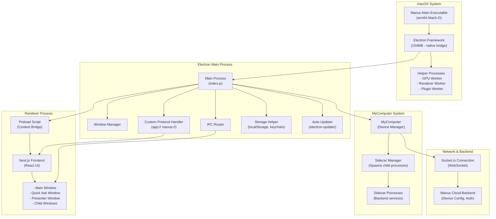
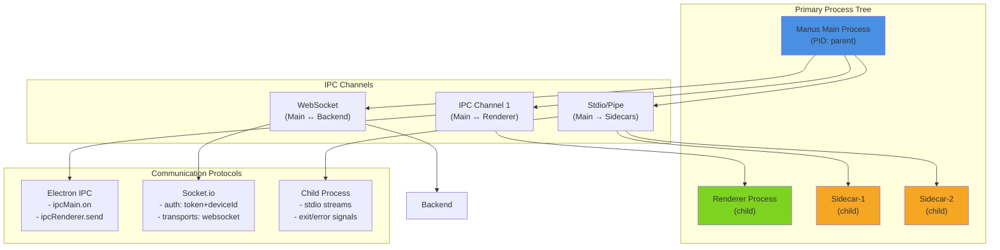
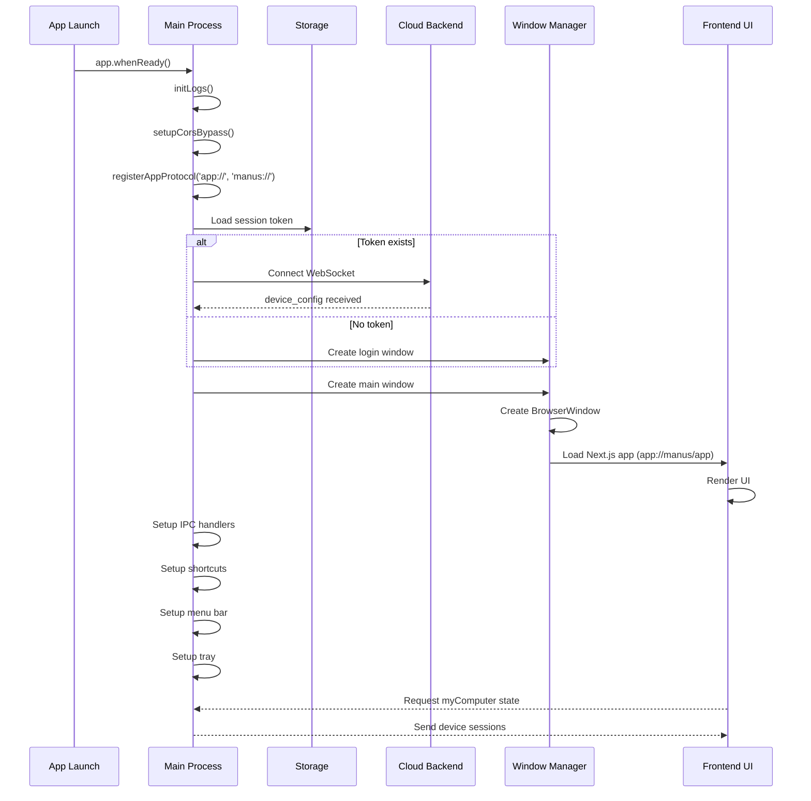
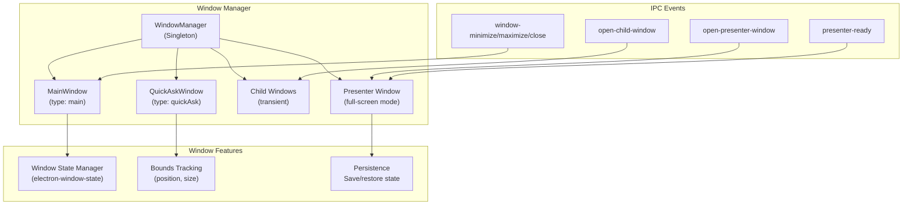
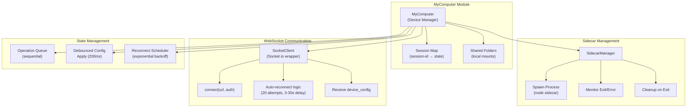
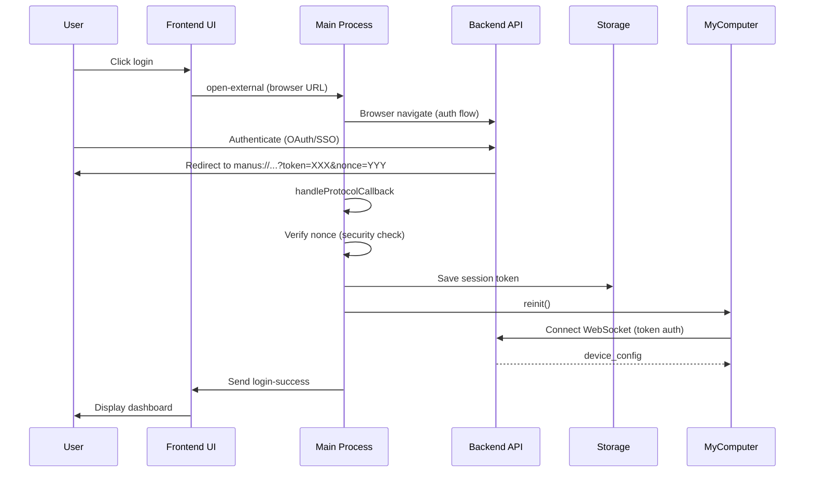
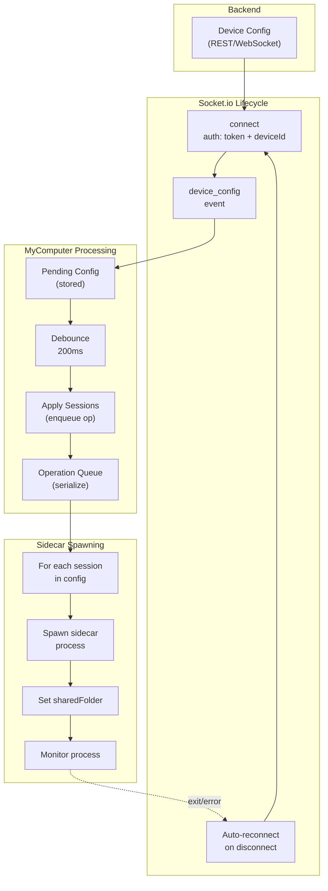
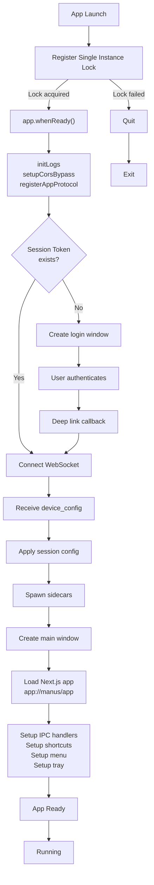
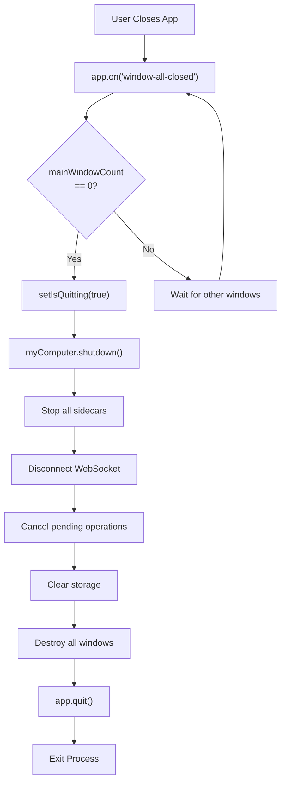

# Manus Desktop App - Technical Architecture Overview

**Version:** 1.6.2  
**Platform:** macOS (arm64, Apple Silicon optimized)  
**Bundle ID:** `im.manus.desktop`  
**Build System:** Electron + Node.js + TypeScript  
**Minimum macOS Version:** 11.0  
**Frontend:** Next.js + React  

---

## Executive Summary

Manus is a cross-platform desktop application built with Electron that provides a task management and productivity interface. The app follows a modern multi-process Electron architecture with:
- **Main Process**: Handles system lifecycle, IPC, and file I/O
- **Renderer Process**: Next.js frontend with React UI
- **Sidecar Process**: Backend service orchestration via WebSocket
- **Helper Processes**: GPU, Renderer, and Plugin delegated processes

The app communicates with a cloud backend via WebSocket (Socket.io) using device and session authentication. It manages local development environments ("MyComputer") through spawned sidecar processes.

---

## Architecture Overview



---

## Process Model & Communication



---

## Main Process Lifecycle



---

## Module Architecture

### 1. Window Management System



### 2. MyComputer - Device Management



### 3. IPC Interface (Preload Context Bridge)

```mermaid
graph TB
    subgraph "Exposed APIs (via Context Bridge)"
        API["api object<br/>(core IPC)"]
        WINDOW["windowControls<br/>(window management)"]
        STORAGE["localStorage<br/>(custom impl)"]
        AUTH["desktopAuthStorage<br/>(token management)"]
        MC_API["api.myComputer<br/>(device ops)"]
        UPDATE["api.update<br/>(auto-updater)"]
        NAV["api.navigation<br/>(URL tracking)"]
        SHORTCUT["api.shortcut<br/>(keyboard shortcuts)"]
    end
    
    subgraph "Core API Methods"
        CORE1["on/off (event listeners)"]
        CORE2["send (async messages)"]
        CORE3["invoke (RPC calls)"]
        CORE4["openExternal (safe URLs)"]
        CORE5["openChildWindow"]
        CORE6["openPresenterWindow"]
    end
    
    subgraph "Storage Ops"
        STOR1["getItem/setItem"]
        STOR2["removeItem/clear"]
        STOR3["IPC sync via sendSync"]
    end
    
    subgraph "Auth Ops"
        AUTH1["getToken()"]
        AUTH2["setToken(token)"]
        AUTH3["removeToken()"]
    end
    
    API --> CORE1
    API --> CORE2
    API --> CORE3
    API --> CORE4
    API --> CORE5
    API --> CORE6
    
    STORAGE --> STOR1
    STORAGE --> STOR2
    STORAGE --> STOR3
    
    AUTH --> AUTH1
    AUTH --> AUTH2
    AUTH --> AUTH3
    
    WINDOW --> CORE1
    WINDOW --> CORE3
    MC_API --> CORE3
    UPDATE --> CORE3
    NAV --> CORE1
    SHORTCUT --> CORE3
```



---

## Data Flow Diagrams

### Login & Authentication Flow



### Device Configuration Flow



---

## Key Components Deep Dive

### Window Manager (windowManager.js)

**Purpose:** Manages lifecycle of all windows (main, quick-ask, child, presenter)

**Key Responsibilities:**
- Create/destroy window instances
- Track window state (singleton vs. multi-instance)
- Emit window lifecycle events
- Send messages to renderer process
- Handle window-closed event cascade

**API:**
```typescript
createWindow(type: 'main' | 'quickAsk', overrides?: object): Window
openNewMainWindow(overrides?: object): MainWindow
openQuickAsk(): QuickAskWindow
mainWindow: MainWindow | null
quickAskWindow: QuickAskWindow | null
broadcast(event: string, data: object): void
```

### MyComputer (myComputer/myComputer.js)

**Purpose:** Manages device sessions, sidecar processes, and WebSocket connection to backend

**Key Responsibilities:**
- Connect to WebSocket backend with auth
- Receive and apply device configurations
- Spawn/manage sidecar child processes
- Track session state (ready, error, connecting)
- Handle reconnection with exponential backoff
- Queue operations for serial execution

**State:**
```typescript
sessions: Map<sessionId, SessionState>
sharedFolders: string[]
isSocketReady: boolean
terminalAvailable: boolean
appliedConfigVersion: number
reconnectStates: Map<sessionId, ReconnectState>
```

**Reconnection Logic:**
- Max 20 reconnect attempts per session
- Initial delay: 3000ms
- Max delay: 30000ms
- Exponential backoff between retries

### Sidecar Manager (myComputer/sidecarManager.js)

**Purpose:** Spawns and manages backend service processes

**Child Process Management:**
- Spawns `sidecar` executable for each shared folder
- Passes WebSocket URL as CLI argument
- Monitors stdin/stdout for errors
- Terminates on exit (SIGTERM, SIGKILL if needed)
- Platform-specific cleanup (PowerShell on Windows, ps on Unix)

**Lifecycle:**
```
spawn() → verify running → return child process
monitor exit → report status → trigger reconnect if unexpected
stop() → SIGTERM → wait 200ms → SIGKILL if needed
```

### IPC Setup (setupIPC.js)

**Main Handlers:**
- `open-external` — safe URL opening (http/https/apple.systempreferences)
- `open-child-window` — spawn new BrowserWindow
- `open-presenter-window` — multi-display presenter mode
- `show-folder-dialog` — native file picker
- `storage-*` — localStorage impl via sendSync
- `token-*` — secure session token storage
- `shortcut-*` — keyboard shortcut management
- `update-*` — electron-updater integration
- `my-computer-reinit` — restart device connection

**Security Features:**
- Context isolation enabled (nodeIntegration: false)
- Sandbox enabled for child windows
- Web security enabled
- Safe URL validation (HTTPS only except localhost)
- Nonce verification on deep links

### Socket Client (myComputer/socketClient.js)

**Socket.io Configuration:**
```typescript
auth: {
    token: sessionId,      // Bearer token
    deviceId: UUID,         // Unique device identifier
    deviceName: string      // macOS computer name
}
transports: ['websocket']
reconnection: true
```

**Key Events:**
- `device_config` — receive device session configuration
- `connect` / `disconnect` — connection lifecycle
- `connect_error` — authentication/network errors
- `error` — socket.io errors

**Connection State:**
```typescript
status: {
    connected: boolean,
    lastError: string | null
}
connectCount: number  // tracks reconnections
```

---

## Frontend Architecture

### Next.js Application Structure

**Entry Points:**
- `/app` — Main dashboard UI
- `/login` — Authentication page
- `/presenter` — Presenter mode UI
- `/quick-ask` — Quick ask dialog
- `404` — Error page

**Build Output:**
- Compiled to `/frontend/out` (static HTML)
- Served via custom Electron protocol handler (`app://manus/...`)
- Next.js export format (static + prerendered)

**Frontend Capabilities (via preload API):**
```typescript
// Window control
windowControls.minimize()
windowControls.maximize()
windowControls.toggleFullscreen()

// Device management
api.myComputer.reinit()

// File system
api.readFileAsArrayBuffer(filePath)
api.showFolderDialog()

// External links
api.openExternal(url)
api.openChildWindow(url)
api.openPresenterWindow(url, data)

// Keyboard shortcuts
api.shortcut.getConfig()
api.shortcut.update(action, accelerator)

// Authentication
desktopAuthStorage.getToken()
desktopAuthStorage.setToken(token)
desktopAuthStorage.removeToken()

// Events
api.on('channel', callback)
api.send('channel', data)
api.invoke('channel', data)
```

---

## Electron Helper Processes

Manus includes 4 helper processes (Frameworks directory):

1. **Manus Helper (GPU).app** — GPU rendering acceleration
2. **Manus Helper (Renderer).app** — Web content rendering delegation
3. **Manus Helper (Plugin).app** — Plugin/extension host
4. **Manus Helper.app** — General-purpose utility process

These follow Electron's multi-process architecture to:
- Isolate crashes (GPU process crash doesn't kill main app)
- Improve performance (offload rendering to dedicated process)
- Sandbox security (each process has limited privileges)

---

## Frameworks & Dependencies

### Core Frameworks
- **Electron Framework** (154MB) — Native Electron runtime
- **ReactiveObjC** — Reactive extensions library
- **Squirrel** — Windows auto-updater backend
- **Mantle** — Model framework (likely not used on macOS)

### Runtime Dependencies
```json
{
  "app-root-path": "^3.1.0",        // CWD resolution
  "electron-log": "^5.4.0",          // Logging
  "electron-updater": "^6.3.9",      // Auto-update
  "electron-window-state": "^5.0.3", // Window persistence
  "lodash-es": "^4.17.21",           // Utility functions
  "sc-prepare-next": "^1.0.3",       // Next.js integration
  "socket.io": "^4.8.1",             // WebSocket server (unused in main)
  "socket.io-client": "^4.8.1",      // WebSocket client
  "ws": "^8.18.0"                    // WebSocket fallback
}
```

---

## Security Architecture

### Context Isolation
```typescript
webPreferences: {
    sandbox: true,
    webSecurity: true,
    nodeIntegration: false,
    contextIsolation: true,
    preload: path.join(__dirname, 'preload.js')
}
```

### Preload Context Bridge
- Exposes minimal API surface to renderer
- All IPC calls go through main process
- No direct Node.js access from renderer

### Protocol Handler Security
```typescript
registerSchemesAsPrivileged([
    {
        scheme: 'app',
        privileges: {
            secure: true,
            standard: true,
            supportFetchAPI: true,
            corsEnabled: true,
            allowServiceWorkers: true,
            stream: true,
            codeCache: true,
        },
    },
]);
```

### URL Validation
```typescript
const SAFE_URLS = [
    /^https?:\/\//,  // HTTP/HTTPS only
    'x-apple.systempreferences:com.apple.preference.security?Privacy_Microphone'
]
```

### Authentication
- Nonce verification on deep-link authentication
- Token stored in keychain (macOS)
- Device ID generated once and persisted
- Socket.io auth with token + deviceId

### CORS Bypass
- Custom CORS header handling (`setupCorsBypass()`)
- Allows frontend to communicate with backend
- Careful about allowing cross-origin requests

---

## Build & Packaging

### Compilation
- **Language:** TypeScript strict mode
- **Compiler:** LLVM Clang (Xcode 15)
- **Target:** macOS 14.5 SDK (Sonoma)
- **Architecture:** arm64 (Apple Silicon) + x86_64 cross-compilation possible

### Signing
- Code signing with `_CodeSignature` directory
- Likely notarized for Gatekeeper
- Asset catalog (Assets.car) for icon resources

### Update Mechanism
- `electron-updater` for delta updates
- `app-update.yml` configuration
- GitHub releases or custom update server
- Auto-check on startup

### Localization
- 40+ language packs (lproj directories)
- Electron native localization support
- Automatic locale detection from system

---

## File Structure

```
Manus.app/
├── Contents/
│   ├── Info.plist                 # App metadata
│   ├── PkgInfo                    # Package type identifier
│   ├── MacOS/
│   │   └── Manus                  # Main executable (arm64)
│   ├── Resources/
│   │   ├── app.asar               # Bundled app (Next.js + dist)
│   │   ├── icon.icns              # App icon
│   │   ├── Assets.car             # Compiled assets
│   │   ├── app-update.yml         # Update configuration
│   │   ├── {lang}.lproj/          # Localization (40+ languages)
│   │   └── bin/                   # Binary resources
│   ├── Frameworks/
│   │   ├── Electron Framework.framework/
│   │   ├── Manus Helper*.app/     # 4 helper processes
│   │   ├── ReactiveObjC.framework/
│   │   ├── Squirrel.framework/
│   │   └── Mantle.framework/
│   └── _CodeSignature/            # Code signing metadata
```

---

## Startup Sequence



---

## Shutdown Sequence



---

## Key Environment Variables

```typescript
// From dist/env.js and generated-env.js
envHelper.chatWebsocketUrl  // Backend WebSocket URL
                            // Format: ws://backend/device
                            // Auth via socket.io options

process.platform             // 'darwin' (macOS)
process.pid                  // Parent process ID

// Socket.io query params:
// - token: session ID
// - locale: system locale
// - tz: timezone
// - clientType: 'desktop'
// - clientOS: 'darwin'
// - clientVersion: app version
```

---

## Logging Architecture

### electron-log Integration
- File destination: `~/Library/Application Support/Manus/app.log`
- Console output in development
- Rotation and cleanup handled by electron-log
- Log levels: info, warning, error

### Desktop Logging
```typescript
// From ipcMain handler
ipcMain.on('desktop-log', (_, logs) => {
    electron_log_1.default.info(logs);
});
```

### Sidecar Process Logging
- Logged with session context: `session=<sessionId>`
- Status reporting every 3 seconds (debounced)
- Error conditions logged before reconnect attempts

---

## Error Handling & Recovery

### Socket.io Connection Failures
```
Initial connect → Connection timeout/error
→ Exponential backoff (3s → 30s)
→ Retry up to 20 times
→ Mark session as 'error'
→ Trigger reconnection scheduler
→ User sees "offline" state in UI
```

### Sidecar Process Crashes
```
Process exits unexpectedly
→ reportStatus()
→ Set session status = 'error'
→ scheduleSidecarReconnect()
→ Recreate sidecar after delay
→ Re-apply configuration
```

### Authentication Failures
```
Nonce mismatch on deep-link
→ Send login-error to renderer
→ Clear stored token
→ Prompt user to re-authenticate
```

---

## Performance Optimizations

1. **Debounced Operations** (200ms)
   - Device config application debounced to prevent flapping

2. **Operation Queueing**
   - Operations queued for serial execution
   - Prevents race conditions in device config

3. **Status Reporting** (3s debounce)
   - Aggregates status changes
   - Reduces network traffic

4. **Pre-warming Quick Ask**
   - Frontend hints renderer to pre-render quick-ask window
   - Faster open time when user triggers shortcut

5. **Lazy Loading**
   - Frameworks loaded on-demand (OpenTelemetry, gRPC)
   - Electron protocol handler for static assets

6. **Shared Libraries**
   - lodash-es for tree-shaking
   - Electron framework shared across processes

---

## Comparison with Claude Desktop

| Aspect | Manus | Claude Desktop |
|--------|-------|----------------|
| **Purpose** | Task/project management | AI assistant interface |
| **Backend** | Custom Manus backend | Anthropic API |
| **Device Model** | Sessions with sidecars | Isolated sandboxes |
| **Auth** | Token + device ID | API key + session |
| **Network** | Socket.io WebSocket | HTTP streaming |
| **Frontend** | Next.js (static export) | React + custom UI |
| **Helper Processes** | GPU, Renderer, Plugin | N/A |

---

## Future Architecture Considerations

1. **Plugin System** — Manus Helper (Plugin).app suggests extensibility
2. **Device Management** — Sidecar architecture scales to multiple devices
3. **Offline Mode** — WebSocket reconnection logic supports offline-first patterns
4. **Containerization** — Sidecars could run in containers (Docker/Podman)
5. **Cross-Platform** — Windows and Linux support via Electron platform abstractions

---

## Conclusion

Manus is a sophisticated Electron application that manages a complex system of:
- **UI Layer**: Next.js frontend in isolated renderer process
- **System Integration**: Tight integration with macOS via native frameworks
- **Backend Coordination**: WebSocket-based device management
- **Process Orchestration**: Dynamic spawning and monitoring of sidecar processes
- **State Persistence**: Robust reconnection and error recovery mechanisms

The architecture prioritizes **security** (context isolation, sandbox), **reliability** (operation queueing, exponential backoff), and **performance** (debouncing, lazy loading, multi-process rendering).

---

*Research conducted via static analysis of Manus.app v1.6.2 (June 2024) from extracted app.asar archive. This document reflects the architecture as compiled; source code and design rationale are not available.*
