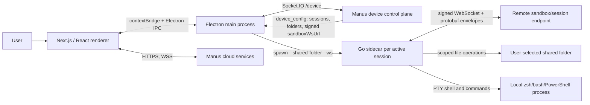
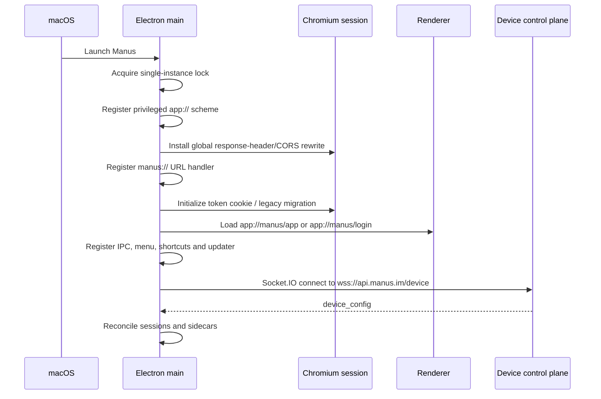
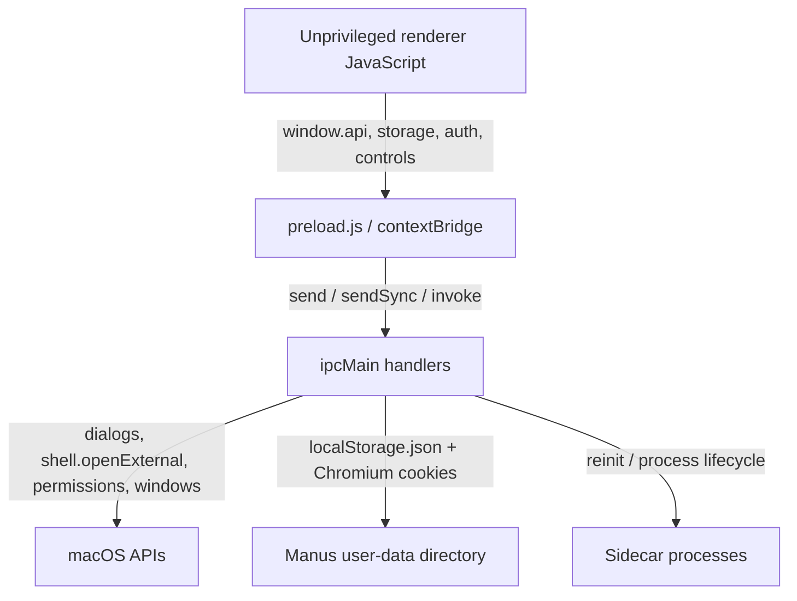
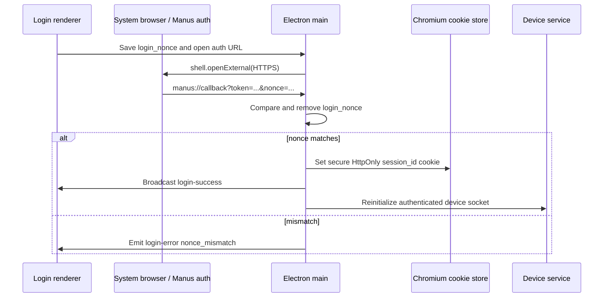
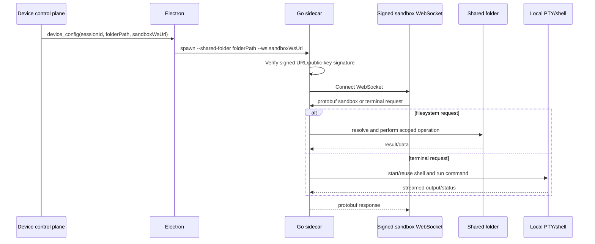
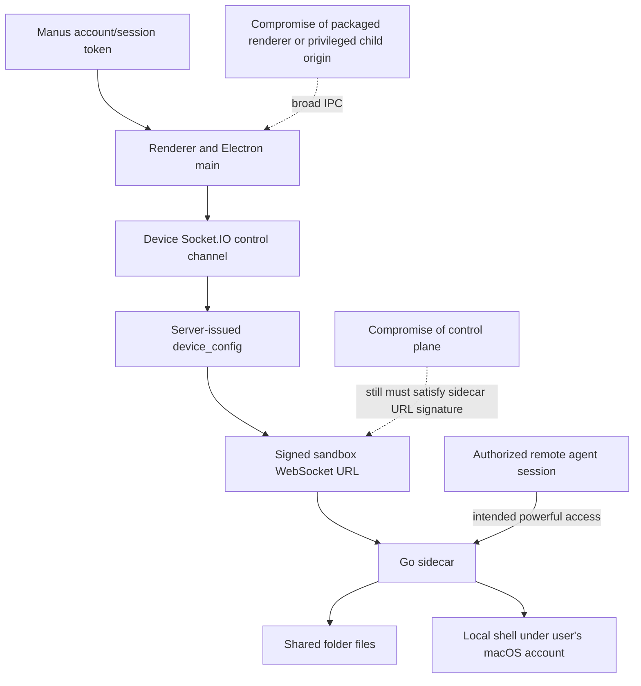

# Manus for macOS — technical architecture and reverse-engineering notes

**Artifact examined:** `~/Applications/Manus.app`  
**Observed application version:** 1.6.2  
**Research date:** 2026-06-24  
**Method:** static, read-only inspection of the macOS bundle, extracted Electron ASAR, JavaScript, Mach-O metadata, Go build metadata, symbols/strings, and existing on-disk application-data structure. The app and sidecar were not launched or instrumented.

## Executive summary

Manus for macOS is not a fully native implementation of the Manus agent. It is a three-part desktop client:

1. An **Electron 34.5.7 main process** provides lifecycle, windows, login/deep-link handling, updates, local storage, OS dialogs, permissions, and process management.
2. A large **statically exported Next.js/React web application** provides almost all user-facing functionality and talks directly to Manus cloud APIs.
3. A **15 MB Go sidecar** provides the “My Computer” capability. The cloud control plane tells Electron which local folder/session to activate; Electron then starts one sidecar process per session. Each sidecar connects outward to a signed WebSocket URL and exposes filesystem and PTY/terminal operations rooted at the selected shared folder.

The desktop app is therefore mainly a privileged bridge between a cloud-oriented web client, macOS, and a remotely orchestrated local execution helper. The AI inference and agent planning do not appear to run locally in this bundle.



## Bundle composition

| Component | Finding |
|---|---|
| Bundle identifier | `im.manus.desktop` |
| Version | `1.6.2` (`CFBundleShortVersionString` and `CFBundleVersion`) |
| Architecture | arm64 only; minimum macOS 11.0 |
| Bundle size | approximately 350 MB |
| Runtime | Electron Framework 34.5.7 |
| UI package | `Contents/Resources/app.asar`, about 101 MB |
| Native helper | `Contents/Resources/bin/sidecar`, arm64 Mach-O, about 15 MB |
| Updates | `electron-updater` with Squirrel framework; S3 metadata and `https://download.manus.im/` feed |
| URL scheme | `manus://` |
| Declared privacy capabilities | microphone, camera, Bluetooth |
| ATS policy | arbitrary loads and local networking allowed; HTTP exceptions for localhost/127.0.0.1 |

The ASAR contains 3,046 files after extraction and expands to about 108 MB. Its first-party Electron code is readable compiled JavaScript under `dist/`; the renderer is a production-minified Next.js export under `frontend/out/`, with pages for `/`, `/login`, `/app`, `/presenter`, and `/quick-ask`.

The package description says “The official Manus from Meta Windows app,” which is inconsistent with the macOS artifact and likely stale packaging metadata. The executable and bundle identity are Manus, not a Meta application.

### Integrity observation

The installed bundle did **not** pass strict code-signature verification at research time: `codesign --verify --deep --strict` reported that code or signature had been modified. Its Team Identifier is `5V8XDGQQB6`, and hardened-runtime metadata is present, but signer authority could not be resolved by the local inspection.

There is also a concrete ASAR mismatch: `Info.plist` records SHA-256 `fa976b...0810`, while the installed `app.asar` hashes to `5238a1...524c`. The sidecar hashes to `0ce559...68c9`. This means the findings describe the exact installed files, but the bundle should not be treated as a verified pristine vendor release. The analysis itself did not modify the app bundle.

## Startup and application lifecycle

The Electron entry point is `app.asar/dist/index.js`.



Important lifecycle behavior:

- Only one instance is allowed. A second launch focuses the existing main window and forwards any `manus://` URL.
- On macOS, closing the main window hides it instead of quitting. The process remains available until explicit quit.
- Renderer crashes trigger a reload after one second.
- Main-window position and size are persisted by `electron-window-state`.
- The main window loads `app://manus/app` when a token exists, otherwise `app://manus/login`.
- A Quick Ask window exists in code, but version 1.6.2 effectively disables it: prewarming immediately returns, its default shortcut is disabled, and the shortcut action also immediately returns. The microphone permission and window implementation remain present.
- Tray code exists, but no call to `trayManager.setup()` was found in the startup path, so the tray appears dormant in this build.

## Renderer and custom `app://` origin

The renderer is a static Next.js application, build ID `ajizrRq_pP1bfUmKs1d3S`, mounted under `/desktop_frontend`. Electron registers `app` as a secure, standard, fetch-capable, CORS-enabled scheme with service-worker and code-cache support.

For an `app://manus/...` request, Electron maps the route to a corresponding HTML file in `frontend/out`; `/app/*` always resolves to `app.html`. Asset URLs are rewritten into the exported `_next` directory. HTML is read into memory, assigned a fresh nonce, and returned with a generated Content Security Policy.

The CSP is narrowly focused on scripts:

```text
script-src 'self' 'nonce-<random>' 'strict-dynamic' 'wasm-unsafe-eval';
```

The nonce is injected into scripts and relevant preload links. This is useful script-injection hardening, but there is no `default-src`, `connect-src`, `frame-src`, or equivalent broader policy in the generated header.

The renderer contains essentially the same large Manus web client used by the online product. Embedded production configuration includes:

- API/RPC and chat/STT WebSockets at `api.manus.im`;
- `manus.space`, `manus-preview.space`, `manus.computer`, and `pages.manus.im` product domains;
- metrics at `metrics.manus.im`;
- Sentry, Amplitude, Intercom, FingerprintJS-style telemetry, Google Drive/Maps, PDF worker, and CreativeEditor SDK configuration;
- components for authentication, localization, file/folder upload, agent sessions, presentations, analytics, and network-state handling.

The presence of public client IDs, site keys, and browser-side analytics keys is normal for a web bundle; they are identifiers, not necessarily secrets.

## Electron process model and IPC

Every managed BrowserWindow is created with the safer Electron defaults:

- `sandbox: true`
- `webSecurity: true`
- `nodeIntegration: false`
- `contextIsolation: true`

A preload script exposes four globals: `window.api`, `window.windowControls`, a synchronous storage facade, and `window.desktopAuthStorage`. The bridge covers OS window controls, updater state, navigation, file reading, folder selection, presenter windows, Quick Ask, microphone permissions, shortcuts, storage, and login tokens.



The preload does not expose only narrow methods; `window.api.send`, `sendSync`, `invoke`, `on`, and `off` accept arbitrary channel names. Consequently, the effective renderer privilege boundary is the validation in each `ipcMain` handler, not the preload API shape.

Notable IPC capabilities include:

- reading any caller-supplied file path into an ArrayBuffer;
- opening a user-selected directory dialog;
- opening child/presenter BrowserWindows at a caller-supplied URL;
- reading and setting the session token;
- reading/writing the custom JSON storage;
- opening HTTP(S) URLs in the system browser;
- controlling update checks and restart-to-install;
- requesting/checking microphone access;
- activating/reinitializing “My Computer.”

## Authentication and local persistence

Login is browser/deep-link based. The desktop renderer initiates authentication and stores a random `login_nonce`. macOS returns to a URL shaped like `manus://...?token=<session>&nonce=<nonce>`. Electron compares the callback nonce with the stored value, deletes the nonce, and rejects mismatches. On success it stores the session, broadcasts `login-success`, and reconnects the My Computer control channel.



The session token is stored as a one-year, `HttpOnly`, `Secure`, `SameSite=Lax` cookie scoped to `https://api.manus.im/`. Older `token` or `session_id` values in `localStorage.json` are migrated into the cookie and removed from the JSON file. Electron still caches the token in main-process memory and deliberately exposes token get/set/remove IPC to the renderer.

Other preferences such as locale, device ID, guide visibility, theme, and shortcut configuration live in:

```text
~/Library/Application Support/Manus/localStorage.json
```

The rest of that directory is a normal Electron/Chromium profile: Cookies (SQLite), IndexedDB, Local/Session Storage, caches, network state, trust tokens, and updater ID. Logs are written under the user-data directory, principally `app.log`; sidecar strings indicate capped `sidecar-*.log` files and cleanup of old logs.

## Network architecture

There are two distinct cloud communication layers:

1. The renderer uses browser HTTP/WebSocket clients for normal Manus product APIs, sessions, uploads, metrics, and UI services.
2. The Electron main process maintains a device-management Socket.IO connection at `wss://api.manus.im/device`.

The Socket.IO handshake includes the session token, persistent random device ID, host name, locale, time zone, client type `desktop`, OS, and client version. It listens for `device_config` and emits `device_status`.

A device configuration contains:

- a device ID and monotonically applied config version;
- folders with path, display name, and `allowCmd` metadata;
- sessions with session ID, local folder path, and `sandboxWsUrl`.

Electron reconciles that desired state with currently running sidecars. Removed sessions are stopped. Changed folder or endpoint data restarts a sidecar. Unexpected exits use exponential retry: 3 seconds doubling to a 30-second cap, at most 20 attempts. Disconnecting the device socket stops every sidecar; reconnecting restarts configured sessions.

The app globally rewrites response CORS headers for the default Chromium session. Existing `Access-Control-*` headers are removed and replaced with permissive values, reflected to the request referrer origin where available, with credentials enabled. OPTIONS responses are forced to `200 OK`. This lets the packaged web client call services that would not normally admit the `app://` origin, but significantly broadens the renderer’s network reach.

## “My Computer” sidecar

The sidecar is a statically linked Go 1.26.1 executable built from:

```text
github.com/monica/manus-cli/cmd/sidecar
module github.com/monica/manus-cli
revision 31f655ba92229e5a5229148dbadc93d4596dbbfc
build time 2026-06-11T17:01:03Z
```

The module is marked `+dirty`, so the binary was produced from a modified working tree. Its important dependencies are `gorilla/websocket`, `creack/pty`, protobuf, and Sentry.

Electron launches it as:

```text
sidecar --shared-folder <normalized folder> --ws <sandboxWsUrl>
```

It also receives `PARENT_PID`. On Unix-like systems it is created as a detached process group; shutdown sends SIGTERM to the group, then SIGKILL after a short grace period. A parent watcher in the Go binary prevents orphaning.

### Sidecar protocol and capabilities

Embedded protobuf descriptors reveal two message families:

**Sandbox filesystem API**

- ping and stat;
- directory listing;
- ranged file read and offset-based write;
- create file and directory;
- remove and rename;
- truncate;
- mount;
- chmod and timestamp updates;
- hard link, symbolic link, and readlink.

**Terminal API**

- create/reuse named terminal sessions;
- execute foreground or background commands;
- interactive line, key, raw-control, and raw-write actions;
- terminal view/history and status;
- interrupt, kill, reset, and reset-all;
- working-directory selection and PTY sizing.



Static symbols show signed-URL verification (`internal/wsauth.VerifyURL`) using an embedded public key before connecting. The sidecar normalizes WebSocket URLs and reports a distinct `ws_url_verify_failed` condition. This is an important control: Electron accepts the endpoint from the Manus control plane, but the sidecar independently checks that it was signed.

Terminal code includes command-safety validation. Embedded deny patterns cover conspicuously destructive commands such as recursive removal of `/` or `~` and writes to raw disk devices. This is a guardrail, not a general sandbox: the sidecar starts a real local PTY and shell, inherits the app’s environment, and its process is not constrained by a separate macOS App Sandbox entitlement in the inspected artifact. The primary scope boundary is the selected shared folder plus protocol/path validation; terminal commands can inherently exercise the user account’s permissions unless restricted by the sidecar’s own policy.

## Updates

`electron-updater` is configured to:

- check immediately at startup and every six hours;
- automatically download production updates;
- automatically install a downloaded update on app quit;
- exclude prereleases;
- use `https://download.manus.im/` as its feed URL.

The packaged `app-update.yml` also identifies S3 bucket `manus-desktop-public` in `us-east-1` and cache directory `manus-updater`. Renderer IPC can check status, manually request a check, and restart to install.

## Security assessment

### Positive controls observed

- Renderer sandboxing, context isolation, disabled Node integration, and enabled web security.
- Main-window top-level navigation is limited to local trusted origins; ordinary external links are sent to the system browser.
- Login callback uses a one-time nonce.
- Token migration moves credentials from plaintext JSON into a secure HttpOnly cookie.
- `app.asar` integrity metadata exists in `Info.plist`, although it does not match this installed copy.
- Sidecar WebSocket URLs are cryptographically verified before use.
- Shared-folder normalization, sidecar process cleanup, reconnect limits, and destructive-command checks are present.
- Update delivery uses HTTPS and the Electron updater/signing pipeline.

### Material risks and sharp edges

1. **Installed bundle integrity is invalid.** The ASAR hash differs from `Info.plist`, and strict signature verification fails. Reinstalling from a trusted vendor source is advisable before relying on any deeper security conclusion.
2. **The IPC bridge is broad.** Generic arbitrary-channel send/invoke methods defeat the usual benefit of a narrow contextBridge contract.
3. **Arbitrary file-read IPC lacks path authorization.** `read-file-as-array-buffer` checks existence and file type but does not restrict the path to a selected/shared directory.
4. **Remote child windows receive the privileged preload.** `open-child-window` and presenter-window handlers accept a string URL and create a window using the same preload. The child URL is not origin-allowlisted in the handler. A remote page loaded this way may therefore receive the generic desktop bridge, including token and file IPC channels. This is the most concerning design-level trust-boundary issue found statically.
5. **Global CORS rewriting is highly permissive.** It changes every response in the default session and allows credentials for reflected origins.
6. **The CSP is incomplete.** It hardens scripts but does not constrain other resource or connection classes.
7. **Token access is intentionally available to renderer code.** HttpOnly protects against normal DOM cookie reads, but `token-get` IPC and the exposed auth facade restore programmatic access.
8. **Local execution is powerful by design.** The sidecar can mutate files and run interactive shell commands. A short denylist cannot make a general shell safe; security depends on signed endpoints, account authorization, explicit folder/command consent, and correct path confinement.
9. **Telemetry is extensive.** Both renderer and sidecar include Sentry, and the renderer includes additional analytics/engagement services. Exact runtime payloads were not captured in this static review.
10. **ATS allows arbitrary loads.** Most observed production endpoints are TLS, but the bundle-level policy permits broader transport behavior.

### Practical trust model



The decisive security question is not whether the UI is “just a web app”; it is whether every origin that can reach the preload bridge is trusted and whether the server-issued, signed sidecar session is correctly bound to user consent and a confined folder. Those are the two boundaries carrying most of the risk.

## What runs locally versus remotely

| Locally on the Mac | Remotely / cloud-backed |
|---|---|
| Electron lifecycle, windows, menus, updater | Agent reasoning and orchestration |
| Static Next.js UI rendering | Account, sessions, chat, artifacts, billing |
| Chromium storage and authentication cookie | Main API/RPC/WebSocket services |
| File picker, file reads, microphone permission | Device configuration/control plane |
| Sidecar filesystem adapter | Signed sandbox/session WebSocket peer |
| Real PTY shell and command execution | Telemetry/analytics backends |

No bundled model weights, inference runtime, or local LLM engine were found. “My Computer” is best understood as a cloud-orchestrated remote procedure channel into an explicitly shared portion of the local machine, plus a local shell execution facility.

## Evidence map

The key first-party files extracted from `Contents/Resources/app.asar` are:

| Subject | Extracted source |
|---|---|
| Startup, protocol, login callback | `work/manus-app-asar/dist/index.js` |
| Preload bridge | `work/manus-app-asar/dist/preload.js` |
| Privileged handlers | `work/manus-app-asar/dist/setupIPC.js` |
| Windows and renderer isolation | `work/manus-app-asar/dist/windowManager/` |
| Token and preference persistence | `work/manus-app-asar/dist/utils/storageHelper.js` |
| Custom CSP and CORS behavior | `work/manus-app-asar/dist/utils/cspHelper.js`, `corsHelper.js` |
| Device socket | `work/manus-app-asar/dist/myComputer/socketClient.js` |
| Sidecar reconciliation | `work/manus-app-asar/dist/myComputer/myComputer.js` |
| Process launch/termination | `work/manus-app-asar/dist/myComputer/sidecarManager.js` |
| Update policy | `work/manus-app-asar/dist/autoUpdaterManager.js` |
| Static renderer | `work/manus-app-asar/frontend/out/` |

Native-sidecar conclusions derive from `go version -m`, Mach-O dependency inspection, Go symbol/string tables, embedded protobuf descriptors, and the module/function names retained in the executable. Where source code was unavailable, this report intentionally distinguishes direct evidence (“symbols/descriptors show”) from inference about runtime policy.

## Limitations and recommended next phase

This is a static architectural review, not a penetration test. It does not prove how the production backend authorizes device sessions, which exact prompts trigger local-command consent, whether path traversal/symlink escapes are exploitable, or what telemetry payloads are emitted.

For higher assurance, the next phase should begin with a fresh, signature-valid installer and then use an isolated macOS test account to capture:

1. process trees and command lines during a My Computer session;
2. network destinations and TLS/WebSocket connection timing;
3. user-consent transitions for folder sharing and `allowCmd`;
4. path-confinement tests involving `..`, symlinks, hard links, and rename races;
5. whether a remote child window can access the preload bridge and invoke token/file IPC;
6. filesystem diffs before and after a representative agent task.

That dynamic work would validate the two most important inferred properties: the effective local-filesystem boundary and the origin boundary around Electron IPC.
