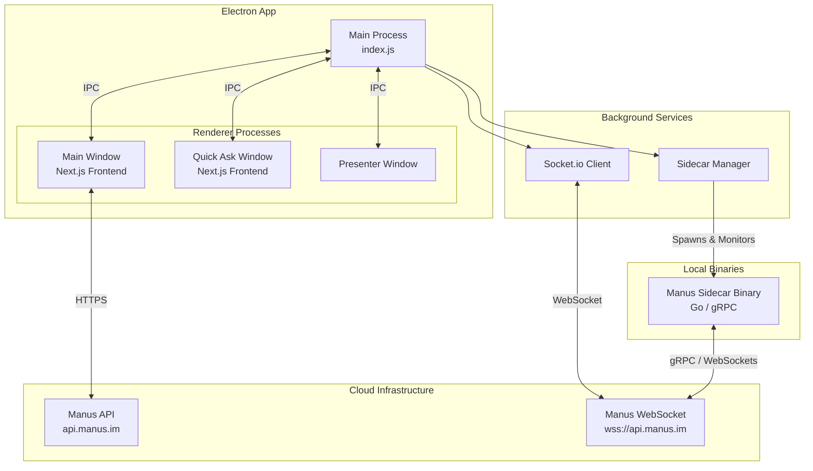
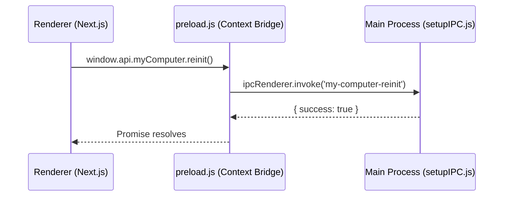
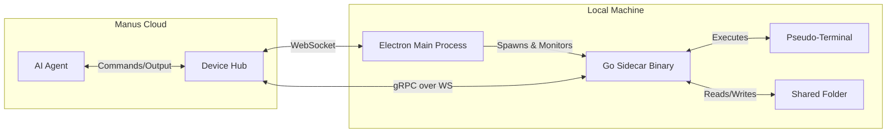

# Manus macOS App Technical Overview

## 1. Introduction

The Manus macOS application is the official desktop client for the Manus AI platform, designed to provide a deeply integrated and seamless user experience. It serves as a sophisticated bridge between the user's local environment and the cloud-based Manus AI infrastructure, enabling features such as agent-driven task execution, workspace integration, and background processing.

This document provides a comprehensive technical overview of the Manus macOS app, based on a static analysis and decompilation of version 1.6.2. It details the app's architecture, key components, inter-process communication (IPC) mechanisms, and the proprietary "sidecar" binary that powers its advanced capabilities.

## 2. High-Level Architecture

The Manus macOS app is built on the **Electron** framework (version 34.5.7), utilizing modern web technologies for the frontend while leveraging native Node.js capabilities and custom binaries for deep system integration. The application follows a multi-process architecture typical of Electron apps, but extends it with a specialized sidecar process for heavy lifting and local environment interaction.

### 2.1 Core Technologies

*   **Framework:** Electron 34.5.7
*   **Frontend:** Next.js (exported as static HTML/JS via `sc-prepare-next`)
*   **Language:** TypeScript / JavaScript (Node.js 20.x environment)
*   **Backend Communication:** Socket.io for real-time events, standard HTTPS for REST APIs.
*   **Native Integration:** A custom Go-based binary (`sidecar`) for local terminal, file system, and sandbox interactions.
*   **Updates:** Squirrel framework and `electron-updater`.

## 3. Application Components

### 3.1 Main Process (`index.js`)

The entry point of the application handles the lifecycle, window management, and deep linking protocol (`manus://`). It initializes the core managers:

*   **WindowManager:** Manages the creation, lifecycle, and state of the `MainWindow` and `QuickAskWindow`.
*   **MyComputer (Device Manager):** Coordinates the connection to the Manus cloud and manages the local `sidecar` processes.
*   **ShortcutManager:** Handles global keyboard shortcuts (e.g., `Cmd+K` for Quick Ask).
*   **TrayManager:** Manages the macOS menu bar icon and long-press interactions.
*   **AutoUpdaterManager:** Handles seamless background updates.

### 3.2 Renderer Processes (Frontend)

The frontend is a pre-compiled Next.js application located in the `frontend/out` directory. It uses a custom `app://manus/` protocol to serve local files securely, bypassing standard `file://` protocol limitations and enabling proper CORS handling.

The frontend is divided into several key views:
*   `index.html` / `app.html`: The primary workspace and chat interface.
*   `quick-ask.html`: A lightweight, always-on-top window for rapid queries.
*   `presenter.html`: A specialized view for presenting slides or documents.
*   `login.html`: The authentication flow.

### 3.3 Inter-Process Communication (IPC)

The `setupIPC.js` module defines the communication channels between the isolated Renderer processes and the Main process. Key IPC channels include:

*   **Window Management:** `open-main-window`, `window-minimize`, `window-toggle-fullscreen`.
*   **Quick Ask:** `quick-ask-resize`, `quick-ask-open-session`.
*   **Storage & Auth:** Synchronous and asynchronous calls for `localStorage` emulation (`storage-get`, `token-set`).
*   **System Integration:** `ask-microphone-permission`, `show-folder-dialog`.
*   **Device Status:** `my-computer-reinit`, `network-online`.

## 4. The "My Computer" Subsystem & Sidecar

The most technically complex part of the Manus app is the "My Computer" feature, which allows the cloud-based AI agent to interact with the user's local machine securely.

### 4.1 Architecture

The `MyComputer` class manages a persistent Socket.io connection to `wss://api.manus.im/device`. It authenticates using the user's session token and a generated device ID.

When the cloud infrastructure requires local execution (e.g., for a specific chat session), it sends a `device_config` payload over the WebSocket. This payload instructs the desktop app to spawn a `sidecar` process.

### 4.2 The Sidecar Binary

The `sidecar` is a standalone executable compiled from Go (`github.com/monica/manus-cli`). It acts as a bridge between the cloud agent and the local operating system.

**Key capabilities of the Sidecar:**
1.  **Terminal Emulation:** It uses a pseudo-terminal (PTY) implementation (`pkg/sidecar/terminal`) to spawn and manage local shells (`/bin/zsh`, `bash`).
2.  **File System Sandbox:** It implements a virtualized file system interface (`sdk/sandbox/v1`) that restricts the AI's access to specific shared folders.
3.  **gRPC/Protobuf Communication:** The sidecar communicates with the Manus infrastructure using Protocol Buffers (`bridge.proto`, `sandbox.proto`, `terminal.proto`).

### 4.3 Protocol Buffer Definitions

Analysis of the sidecar binary reveals the internal API structure used for agent-to-machine communication:

*   **`bridgev1.Envelope`**: The outer wrapper for messages, distinguishing between Sandbox and Terminal operations.
*   **`terminalv1.Request` / `Response`**: Commands for executing shell scripts, managing terminal sessions, and returning standard output/error.
*   **`sandboxv1.Request` / `Response`**: A comprehensive virtual file system API, including operations like `CreateFile`, `ReadFile`, `WriteFile`, `MkDir`, `ReadDir`, `Chmod`, and `Symlink`.

## 5. Security & Isolation

Manus implements several security measures to protect the user's local environment:

1.  **Context Isolation:** Electron's `contextIsolation` is enabled, and `nodeIntegration` is disabled in all renderer processes. A strict `preload.js` script exposes only necessary APIs via `contextBridge`.
2.  **Content Security Policy (CSP):** A strict, nonce-based CSP is dynamically injected into the Next.js HTML files (`cspHelper.js`) to prevent Cross-Site Scripting (XSS).
3.  **CORS Bypass Control:** While the app bypasses CORS to communicate with Manus APIs, it strictly controls the `Access-Control-Allow-Origin` headers based on the referrer (`corsHelper.js`).
4.  **Sidecar Sandboxing:** The Go sidecar binary does not have root access by default and limits file operations to explicitly shared directories defined by the `device_config` payload.

## 6. Conclusion

The Manus macOS application is a robust, well-architected Electron wrapper that effectively integrates web-based AI interfaces with native local capabilities. By offloading complex and potentially dangerous local operations (like PTY management and file I/O) to a dedicated, statically compiled Go binary (`sidecar`), the application maintains a high level of performance and security while enabling powerful agentic workflows.
