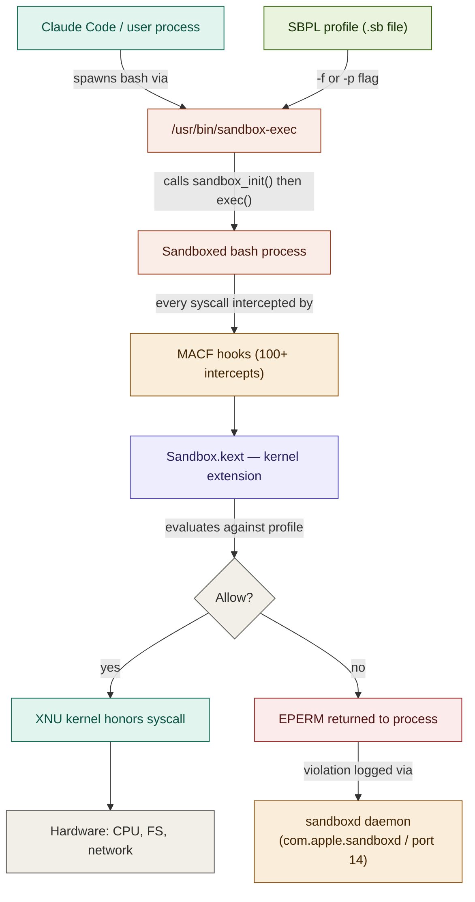
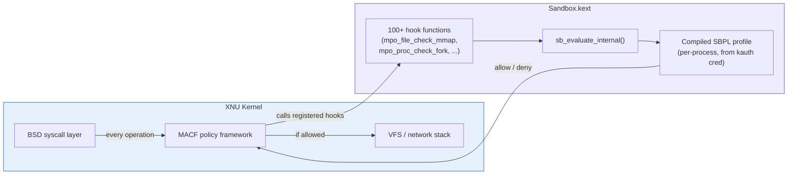
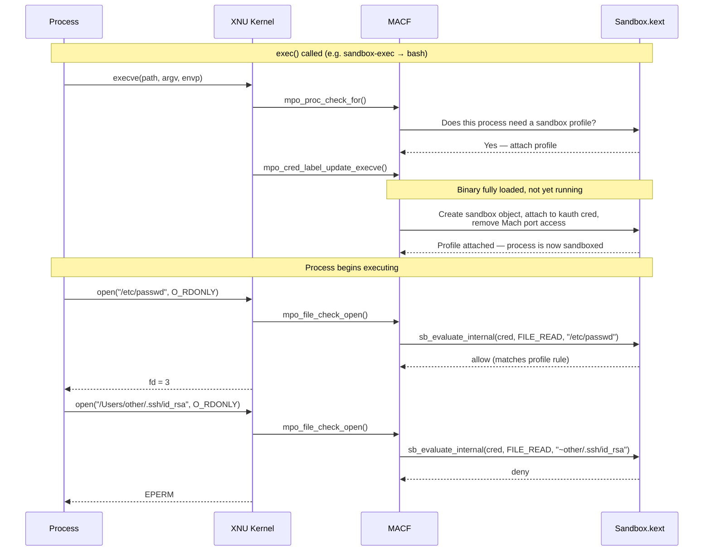
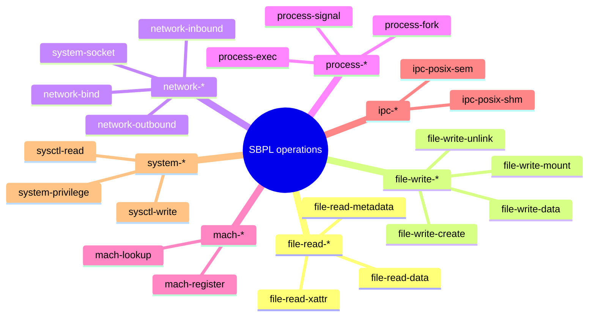
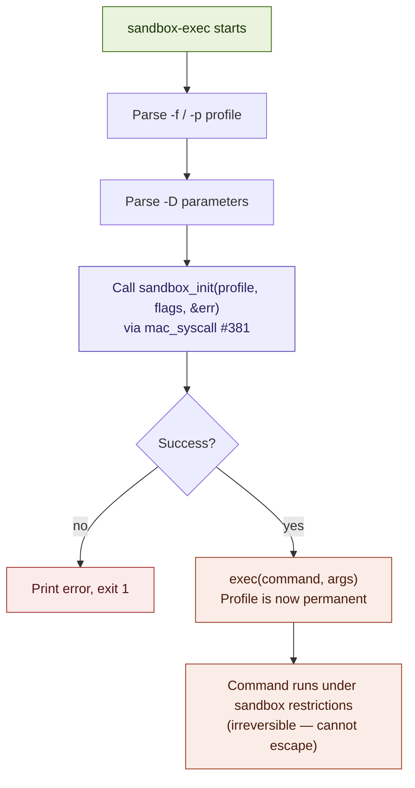
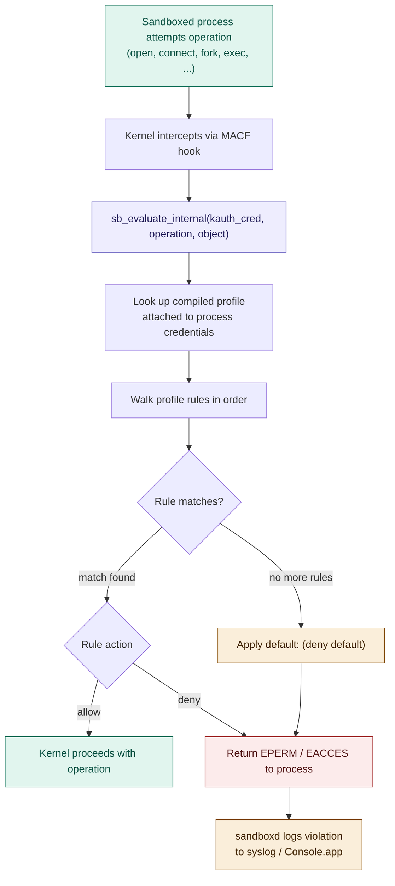
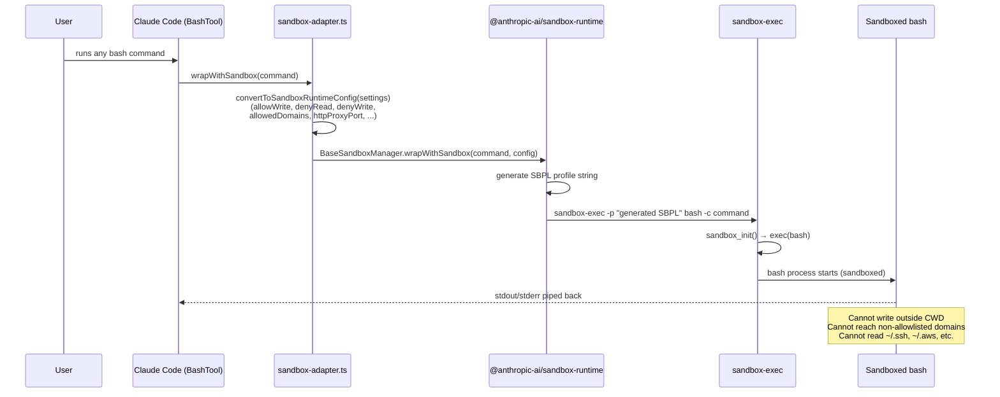
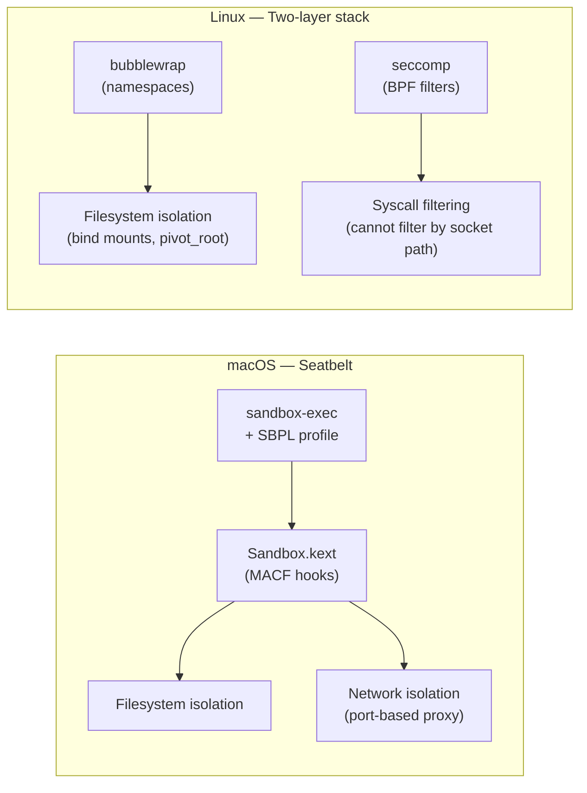

# macOS Seatbelt (Sandbox) — Technical Reference

> **Status:** `sandbox-exec` is officially deprecated by Apple, but remains functional and is used internally by macOS itself, Claude Code's `sandbox-runtime`, and many other security tools. The underlying kernel mechanisms are not going away.

---

## Table of Contents

1. [What is Seatbelt?](#what-is-seatbelt)
2. [Architecture Overview](#architecture-overview)
3. [Kernel Internals: MACF & Sandbox.kext](#kernel-internals-macf--sandboxkext)
4. [The Three Critical Hooks](#the-three-critical-hooks)
5. [SBPL — Sandbox Profile Language](#sbpl--sandbox-profile-language)
6. [sandbox-exec: The User-Space Entry Point](#sandbox-exec-the-user-space-entry-point)
7. [Enforcement Flow](#enforcement-flow)
8. [How Claude Code Uses Seatbelt](#how-claude-code-uses-seatbelt)
9. [Seatbelt vs Linux (bubblewrap + seccomp)](#seatbelt-vs-linux-bubblewrap--seccomp)
10. [Important Gotchas](#important-gotchas)
11. [Debugging Sandbox Violations](#debugging-sandbox-violations)
12. [Profile Reference](#profile-reference)

---

## What is Seatbelt?

Seatbelt (renamed "macOS Sandbox" in later OS versions) is Apple's **kernel-level mandatory access control** framework for processes. It predates containers entirely and works at the syscall boundary — every file open, network connect, process fork, or Mach port access is intercepted before the kernel honors it.

Key properties:

- **Deny-by-default:** Profiles start with `(deny default)` and selectively allow operations.
- **Irreversible:** Once `sandbox_init()` is called, a process cannot escape its profile — not even with a `root` exploit inside the sandbox.
- **Inherited:** All child processes spawned by a sandboxed process inherit the same restrictions.
- **OS-native:** No containers, no VMs, no extra daemons required (beyond `sandboxd`, which is always running).

---

## Architecture Overview



---

## Kernel Internals: MACF & Sandbox.kext

**MACF (Mandatory Access Control Framework)** is the XNU kernel's plugin system for security policy. Sandbox.kext registers itself as a MACF policy module at boot time.



Sandbox.kext is compiled into a KEXT (kernel extension) and communicates with the user-space `sandboxd` daemon via the special Mach port `HOST_SEATBELT_PORT` (port 14) and the XPC service `com.apple.sandboxd`.

---

## The Three Critical Hooks

Of the 100+ MACF hooks Sandbox.kext registers, three drive the core lifecycle:



| Hook | When called | What it does |
|------|-------------|--------------|
| `mpo_proc_check_for` | At `exec()` start | Checks if this process needs a profile applied |
| `mpo_cred_label_update_execve` | Binary loaded, not yet running | Creates sandbox object, attaches to kauth credentials, removes Mach port access. This is the point of no return. |
| `sb_evaluate_internal` | Every intercepted operation | Looks up the process's compiled profile and evaluates the requested operation against it |

---

## SBPL — Sandbox Profile Language

SBPL is a **Scheme-like DSL** — a Lisp-syntax declarative policy language. Profiles are either pre-compiled named profiles or inline strings passed to `sandbox-exec`.

### Basic structure

```scheme
(version 1)
(deny default)              ; deny-all baseline — mandatory first line

; Allow reads of system libraries
(allow file-read*
    (subpath "/usr")
    (subpath "/System")
    (subpath "/Library"))

; Allow writes only in the working directory and /tmp
(allow file-write*
    (subpath (param "WORKING_DIR"))
    (subpath "/private/tmp")
    (literal "/dev/null"))

; Network: allow outbound only
(allow network-outbound)
(deny network-inbound)

; Process operations
(allow process-exec*)
(allow process-fork)
(allow sysctl-read)
```

### Path matchers

| Matcher | Matches |
|---------|---------|
| `(subpath "/foo")` | `/foo` and all descendants |
| `(literal "/foo/bar")` | Exactly `/foo/bar` only |
| `(regex "^/foo/.*\\.js$")` | Regex match |
| `(param "VAR")` | Value of `-D VAR=...` passed to `sandbox-exec` |
| `(string-append (param "HOME") "/.config")` | Concatenation |

### Operation categories



### Important nuance: Unix sockets are classified as `network-outbound`

When a process calls `connect()` on a Unix domain socket (e.g. `/var/run/docker.sock`), Seatbelt classifies this as `network-outbound` — **not** a file operation. A `(deny file-write* ...)` rule on the socket path will not block the connection; you must use `(deny network-outbound)`.

---

## sandbox-exec: The User-Space Entry Point

`/usr/bin/sandbox-exec` is the CLI tool that applies a Seatbelt profile to a process:

```bash
# From a profile file
sandbox-exec -f profile.sb /path/to/command arg1 arg2

# Inline profile string
sandbox-exec -p '(version 1)(deny default)(allow file-read*)' /bin/bash

# With parameters (substituted into profile via (param "KEY"))
sandbox-exec -f profile.sb -D WORKING_DIR=/home/user/project /bin/bash
```

What happens internally:



The key: `sandbox_init()` calls the undocumented `mac_syscall(381, ...)` system call passing the string `"Sandbox"` as the module identifier. After this returns successfully, `exec()` is called — and the new process image inherits the sandbox profile permanently.

---

## Enforcement Flow

Every operation a sandboxed process attempts follows this evaluation path:



Rules are evaluated **first match wins**. Later rules do not override earlier ones (unlike some firewall models). Profiles are compiled from SBPL text into a binary format when `sandbox_init()` is called — evaluation is fast.

---

## How Claude Code Uses Seatbelt

Claude Code delegates all Seatbelt mechanics to the `@anthropic-ai/sandbox-runtime` package. The source code (`src/utils/sandbox/sandbox-adapter.ts`) contains no SBPL generation — it converts settings into a `SandboxRuntimeConfig` struct and hands that to `BaseSandboxManager` from sandbox-runtime, which generates the SBPL profile and invokes `sandbox-exec`.

> **Correction:** The `/sandbox` command opens an **interactive settings menu** — it does not trigger a sandboxed bash session. Sandboxed bash is spawned for **every bash command** when `sandbox.enabled: true`, via `SandboxManager.wrapWithSandbox()` called inside `BashTool`.



The config Claude Code passes to sandbox-runtime is built from merged settings sources (policy → flag → user → project → local). The sandbox config updates **live** — settings changes re-apply via a subscription without restarting (`sandbox-adapter.ts:776-781`).

The generated profile follows this structure (unverifiable from Claude Code source — inside sandbox-runtime):

```scheme
(version 1)
(deny default)

; Always allowed — system essentials
(allow file-read* (subpath "/usr"))
(allow file-read* (subpath "/System"))
(allow process-exec*)
(allow process-fork)
(allow sysctl-read)
(allow file-map-executable)  ; required for dyld

; Working directory — read + write
(allow file-read*  (subpath "/path/to/project"))
(allow file-write* (subpath "/path/to/project"))

; Temp dirs always writable
(allow file-write* (subpath "/tmp"))
(allow file-write* (subpath "/private/tmp"))
(allow file-write* (subpath "/private/var/folders"))

; Extra allowWrite paths from settings.json
(allow file-write* (subpath "/Users/me/.kube"))
(allow file-write* (subpath "/tmp/build"))

; Deny sensitive paths explicitly
(deny file-read* (subpath "/Users/me/.ssh"))
(deny file-read* (subpath "/Users/me/.aws"))

; Network — route through proxy
; macOS: port-based proxy (httpProxyPort / socksProxyPort from settings.json)
; Linux: Unix socket paths (getLinuxHttpSocketPath / getLinuxSocksSocketPath)
(allow network-outbound
    (remote tcp "127.0.0.1:<httpProxyPort>"))
(deny network-outbound)  ; block everything else
```

> **Correction:** Claude Code uses **port-based proxying** on macOS (`httpProxyPort`, `socksProxyPort` in `settings.json`), not a Unix socket. The `(remote unix-socket ...)` form used in the SBPL above is the Linux path. On macOS the proxy is reached via TCP on a local port. See `SandboxNetworkConfigSchema` in `src/entrypoints/sandboxTypes.ts`.

Network traffic from the sandbox is routed through a proxy running outside the sandbox that enforces the domain allowlist from `settings.json`.

---

## Seatbelt vs Linux (bubblewrap + seccomp)

Claude Code uses different mechanisms per OS to achieve the same two-boundary security model:

> **Correction:** Landlock LSM was previously listed here but is **not confirmed** in the Claude Code source. Only bubblewrap (namespaces/bind mounts) and seccomp (BPF syscall filtering) are evidenced. Linux also requires `socat` as a dependency (`apt install bubblewrap socat`).



| Property | macOS Seatbelt | Linux bubblewrap+seccomp |
|----------|---------------|--------------------------|
| Mechanism | Kernel extension (MACF hooks) | Namespaces + BPF |
| Filesystem isolation | SBPL `(allow/deny file-*)` | bubblewrap bind mounts |
| Network isolation | SBPL `(deny network-*)` + port-based proxy | Network namespace (none) + HTTP/SOCKS5 proxy |
| Syscall filtering | Implicit via MACF | Explicit seccomp BPF filter |
| Unix socket filtering | Per-path via `allowUnixSockets` | Not possible — seccomp cannot filter by socket path |
| Nested sandbox | `enableWeakerNestedSandbox` mode | `enableWeakerNestedSandbox` mode |
| Documentation | Undocumented, deprecated API | Well-documented kernel features |
| Overhead | Minimal (kernel evaluation) | Minimal (BPF JIT compiled) |
| Granularity | Very fine (per-path, per-operation) | Coarse (namespaces) |
| Escape resistance | Very high (irreversible at exec) | High (namespace teardown requires CAP_SYS_ADMIN) |
| Extra dependencies | None (Seatbelt is built-in) | `bubblewrap`, `socat` |

---

## Important Gotchas

### 1. Deprecation — but not removal
`sandbox-exec` is deprecated. Apple wants developers to use the App Sandbox (entitlement-based, requires `.app` bundles). However, since Apple's own system daemons use Seatbelt profiles internally (see `/System/Library/Sandbox/Profiles/`), the underlying mechanism is unlikely to be removed anytime soon.

### 2. Unix sockets ≠ files
As noted above, `connect()` to a Unix socket is classified as `network-outbound` by Seatbelt. A `(deny file-write* (literal "/var/run/docker.sock"))` rule does **not** block Docker socket access. You must use:
```scheme
(deny network-outbound (remote unix-socket "/var/run/docker.sock"))
```

### 3. `file-map-executable` must be allowed
Without `(allow file-map-executable)`, `dyld` cannot map shared libraries into memory. This causes even trivial processes to crash. Always include it.

### 4. Computer use runs on the real desktop
When Claude Code uses computer use (controlling your screen on macOS), it runs **outside** the sandbox on your actual desktop. Seatbelt only applies to bash subprocesses.

### 5. Built-in file tools do not use sandbox-exec
Claude Code's `Read`, `Edit`, and `Write` file tools operate at the application layer — they check permissions via `checkReadPermissionForTool` / `checkWritePermissionForTool`, not via the OS sandbox. Only bash commands (and their children) are wrapped with `sandbox-exec`. This is an architectural separation: the sandbox enforces bash-level isolation; the permission system enforces tool-level policy.

### 6. `enableWeakerNestedSandbox` mode
The `enableWeakerNestedSandbox` flag reduces sandbox constraints to allow nested sandboxing scenarios. The source gives no Docker-specific framing — it applies to any context where the outer environment already provides isolation. Use with care.

### 7. `enableWeakerNetworkIsolation` — macOS only, trust store access
`enableWeakerNetworkIsolation: true` allows access to `com.apple.trustd.agent` inside the sandbox. Required for Go-based CLI tools (`gh`, `gcloud`, `terraform`) to verify TLS certificates when using `httpProxyPort` with a MITM proxy and custom CA. **Reduces security** — opens a potential data exfiltration vector through the trustd service. Default: `false`. (`src/entrypoints/sandboxTypes.ts:125-133`)

### 8. Settings files are always write-denied (sandbox escape prevention)
Regardless of user config, `convertToSandboxRuntimeConfig()` unconditionally adds all `settings.json` paths to `denyWrite`. This prevents a sandboxed bash command from modifying Claude Code's permission rules to escape its own sandbox. Similarly, `.claude/skills` is always write-denied. (`src/utils/sandbox/sandbox-adapter.ts:232-255`)

### 9. Git bare-repo escape mitigation
If `HEAD`, `objects`, `refs`, or `hooks` exist in cwd, they are added to `denyWrite` at sandbox init time. If they don't exist, they are scrubbed after each sandboxed command via `scrubBareGitRepoFiles()`. This blocks an attacker from planting a fake bare git repo in cwd with a `core.fsmonitor` hook that would execute outside the sandbox when Claude Code's unsandboxed git process runs. (`src/utils/sandbox/sandbox-adapter.ts:257-413`, issue `#29316`)

---

## Debugging Sandbox Violations

### Watch violations in real time

```bash
# Stream sandbox denials to your terminal
log stream --predicate 'process == "sandboxd"' --info

# Or filter kernel messages
log stream --predicate 'subsystem == "com.apple.sandbox"'
```

Violations look like:
```
sandboxd[1234]: bash(5678) deny file-read-data /Users/me/.ssh/id_rsa
sandboxd[1234]: bash(5678) deny network-outbound tcp 93.184.216.34:80
```

### Test a profile manually

```bash
# Run cat under a deny-all profile — should fail
sandbox-exec -p '(version 1)(deny default)' cat /etc/hosts
# → cat: /etc/hosts: Operation not permitted

# Verify working dir access
sandbox-exec -f profile.sb -D WORKING_DIR=/tmp \
    cat ~/.ssh/id_rsa
# → Operation not permitted  ✓ (blocked as expected)
```

### Iterative profile building

Start with `(deny default)` plus only `process-exec*` and `sysctl-read`, then run your target command and add `allow` rules for each denial logged by `sandboxd` until the application functions correctly.

---

## Profile Reference

### Minimal safe starter profile

```scheme
(version 1)
(deny default)

; Process execution
(allow process-exec*)
(allow process-fork)
(allow sysctl-read)

; Required for dyld (shared libraries)
(allow file-map-executable)

; File metadata (stat, readdir) — does not expose content
(allow file-read-metadata)

; System directories — read only
(allow file-read-data
    (subpath "/usr")
    (subpath "/bin")
    (subpath "/sbin")
    (subpath "/System")
    (subpath "/Library")
    (subpath "/private/etc")
    (subpath "/private/tmp")
    (subpath "/dev"))

; Project directory — full read/write
(allow file-read*  (subpath (param "WORKING_DIR")))
(allow file-write* (subpath (param "WORKING_DIR")))

; Temp always writable
(allow file-write*
    (subpath "/tmp")
    (subpath "/private/tmp")
    (subpath "/private/var/folders")
    (literal "/dev/null")
    (literal "/dev/tty"))

; Network — disable entirely
(deny network*)
```

### Enable outbound network via proxy

```scheme
; Replace (deny network*) with:
(allow network-outbound
    (remote unix-socket "/path/to/proxy.sock"))
(deny network*)
```

### Deny sensitive credential paths

```scheme
; Add after the working-dir allow rules:
(deny file-read* (subpath (string-append (param "HOME") "/.ssh")))
(deny file-read* (subpath (string-append (param "HOME") "/.aws")))
(deny file-read* (subpath (string-append (param "HOME") "/.gnupg")))
(deny file-read* (regex #".*\.env$"))
(deny file-read* (regex #".*secrets.*"))
```

---

*Last updated: April 2026. Based on Claude Code source (`claude-code/src/`), `@anthropic-ai/sandbox-runtime` (bundled, not available as source), Apple Developer documentation, and macOS security research. Inaccuracies corrected against source on 2026-04-03.*
