# Claude.app Architecture Diagram

> See also: [research-claude-desktop-virtualization.md](./research-claude-desktop-virtualization.md) — Detailed virtualization & sandboxing research notes

```mermaid
graph TD
    subgraph MAC["macOS Host (sandbox-exec / Seatbelt)"]

        subgraph ELECTRON["Claude.app — Electron 40.8.5"]

            subgraph MAIN["Main Process (index.js)"]
                PREFS["Preferences / Feature Flags\nsecureVmFeaturesEnabled\nrequireCoworkFullVmSandbox"]
                MCP["MCP Server Manager\n@modelcontextprotocol/sdk"]
                COWORK_MGR["Cowork Session Manager\nVMDiskJanitor · HealthMonitor"]
                CHROME_MGR["Chrome Extension Bridge Manager"]
                IAP["webRequest.onBeforeSendHeaders\nInjects anthropic-client-* headers"]
            end

            subgraph NATIVE["Native Addons (unpacked)"]
                SWIFT["swift_addon.node\n@ant/claude-swift"]
                COMPUSE["computer_use.node\n@ant/computer-use-mcp"]
                CLAUDENATIVE["claude-native-binding.node\n@ant/claude-native"]
                PTY["pty.node\nnode-pty"]
            end

            subgraph WINDOWS["Renderer Windows"]
                MAINWIN["BrowserWindow\nmain_window/index.html"]
                subgraph VIEWS["ContentView children"]
                    CHATVIEW["Chat WebContents\nmainView.js preload\nloads https://claude.ai"]
                    FINDVIEW["FindInPage View"]
                end
            end

        end

        subgraph VZSTACK["Apple Virtualization.framework (Cowork)"]
            VZ["VZVirtualMachine\nUbuntu 22.04 · kernel 6.8.0 · aarch64"]
            subgraph VZDEVICES["Virtio Devices"]
                NVME0["NVMe /dev/nvme0n1p1\nroot ext4 (.img disk image)"]
                NVME1["NVMe /dev/nvme1n1\n/sessions ext4"]
                VIRTIOFS["VirtioFS + FUSE\nHost folders → /Users/kain/…"]
                VSOCK["VZVirtioSocketDevice\nvsock host↔guest RPC"]
                VIRTIONET["VirtioNet NIC"]
            end
            subgraph GUEST["Linux VM Guest"]
                BWRAP["bubblewrap + seccomp\nper-process isolation"]
                OPERON["Operon Runtime\nconda · micromamba · R kernels"]
                CLAUDECODE["Claude Code CLI"]
                GVLOG["/vzgvisor.log"]
            end
        end

        subgraph NETSTACK["Cowork Network Stack"]
            VMNET["vmnet.framework\nNAT · gateway 172.16.10.254"]
            GVISORNET["gVisor userspace TCP/IP\ngvisor-tap-vsock v0.8.5\nper-session allowedDomains"]
        end

        subgraph ARTIFACTS["Artifact Sandbox (local)"]
            IFRAME["sandboxed iframe\nwww.claudeusercontent.com\nCSP: connect-src 'none'"]
        end

    end

    subgraph ANTHROPIC["Anthropic Infrastructure"]
        CLAUDEAI["https://claude.ai\n(Chat UI served from Anthropic CDN)"]
        API["Anthropic API\na-api.anthropic.com"]
        CDN["a-cdn.anthropic.com"]
        DOWNLOADS["downloads.claude.ai\n/vms/linux/{arch}/{sha}/*.zst\nVM image bundles"]

        subgraph GVISOR_CONTAINER["gVisor Container (per Chat session)"]
            RUNSC["runsc (gVisor)\nSynthetic kernel 4.4.0 · x86_64"]
            subgraph MOUNTS_9P["9p Mounts (network-backed)"]
                ROOT9P["/ — 9p rw"]
                TRANSCRIPTS["//mnt/transcripts — 9p ro"]
                SKILLS["//mnt/skills/public — 9p ro"]
                UPLOADS["//mnt/user-data/uploads — 9p ro"]
                OUTPUTS["//mnt/user-data/outputs — 9p rw"]
                TOOLRES["//mnt/user-data/tool_results — 9p ro"]
                CONTINFO["/container_info.json — 9p ro"]
            end
        end
    end

    subgraph BRIDGE_SVC["bridge.claudeusercontent.com"]
        BRIDGEWS["WebSocket Bridge\nwss://bridge.claudeusercontent.com"]
    end

    subgraph CHROME["Chrome Browser"]
        CHROMEEXT["Claude Chrome Extension\nMCP tool host"]
    end

    %% Chat flow
    CHATVIEW -->|"loads (HTTPS)"| CLAUDEAI
    CLAUDEAI -->|"API calls"| API
    IAP -->|"injects headers into all\nclaudeai/claude.com requests"| CHATVIEW
    API -->|"spawns"| RUNSC
    RUNSC --- ROOT9P & TRANSCRIPTS & SKILLS & UPLOADS & OUTPUTS & TOOLRES & CONTINFO

    %% Cowork flow
    COWORK_MGR -->|"JS call"| SWIFT
    SWIFT -->|"NAPI → Swift"| VZ
    VZ --- NVME0 & NVME1 & VIRTIOFS & VSOCK & VIRTIONET
    VZ --> GUEST
    BWRAP --> OPERON
    OPERON --> CLAUDECODE
    VIRTIONET --> VMNET
    VMNET --> GVISORNET
    GVISORNET -->|"allowlisted domains only"| API
    GVISORNET -->|"allowlisted domains only"| CDN

    %% VM image download
    COWORK_MGR -->|"download .zst bundle\nhash verify → promote"| DOWNLOADS

    %% vsock RPC
    VSOCK <-->|"CoworkVMRPCClient\nhost↔guest RPC"| CLAUDECODE

    %% Host folder mounts
    VIRTIOFS <-->|"VirtioFS shares\nro / rw / rwd"| MAC

    %% Chrome bridge
    CHROME_MGR <-->|"OAuth · WebSocket"| BRIDGEWS
    BRIDGEWS <-->|"MCP tool calls"| CHROMEEXT

    %% Artifact sandbox
    CHATVIEW -->|"renders artifacts"| IFRAME

    %% Computer use
    COMPUSE -->|"screen/mouse/keyboard"| MAC

    %% _cc_native_internal bridge
    CHATVIEW <-->|"/_cc_native_internal/\nnative IPC bridge"| MAIN

    %% Native addon links
    SWIFT -.->|"links against"| VZ
    CLAUDENATIVE -.->|"host integration"| MAINWIN
    PTY -.->|"pseudo-terminal"| CLAUDECODE

    %% Styles
    classDef server fill:#2d4a6b,color:#fff,stroke:#4a7ab5
    classDef local fill:#2d5a3d,color:#fff,stroke:#4a9960
    classDef bridge fill:#5a3d2d,color:#fff,stroke:#b57a4a
    classDef sandbox fill:#5a2d5a,color:#fff,stroke:#a04aa0
    classDef native fill:#3d3d2d,color:#fff,stroke:#8a8a4a

    class RUNSC,ROOT9P,TRANSCRIPTS,SKILLS,UPLOADS,OUTPUTS,TOOLRES,CONTINFO,CLAUDEAI,API,CDN,DOWNLOADS server
    class VZ,NVME0,NVME1,VIRTIOFS,VSOCK,VIRTIONET,BWRAP,OPERON,CLAUDECODE,VMNET,GVISORNET local
    class BRIDGEWS,CHROMEEXT bridge
    class IFRAME,IFRAME sandbox
    class SWIFT,COMPUSE,CLAUDENATIVE,PTY native
```

## Legend

| Color | Meaning |
|---|---|
| Blue | Anthropic server-side infrastructure |
| Green | Local VM / local execution (Cowork) |
| Orange | Chrome Extension Bridge |
| Purple | Client-side sandboxed iframe (artifact rendering) |
| Olive | Native addons (.node binaries) |
